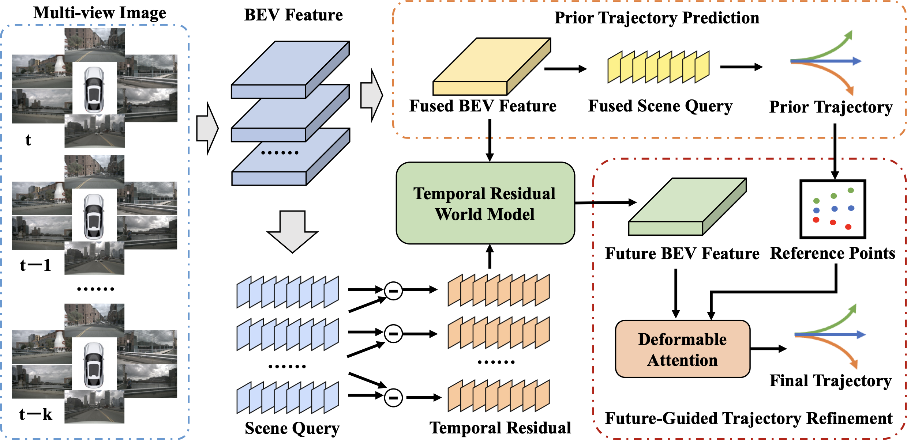
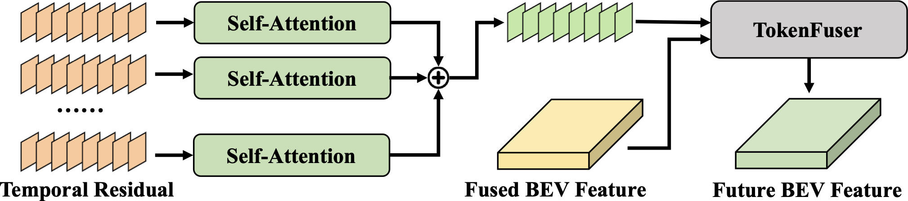
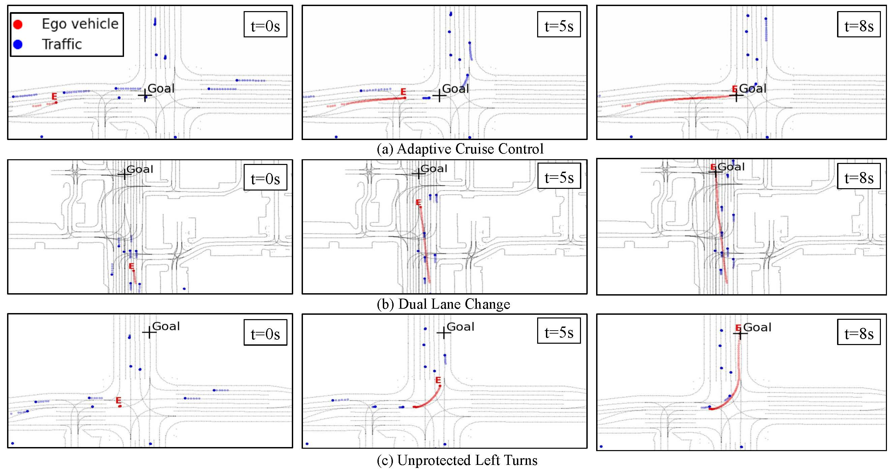
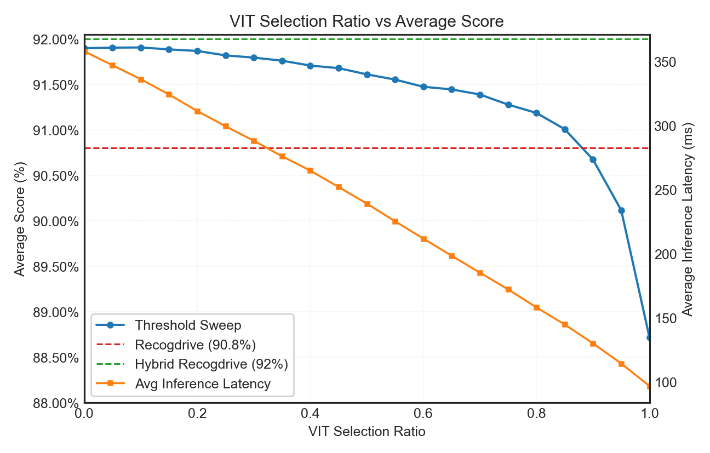
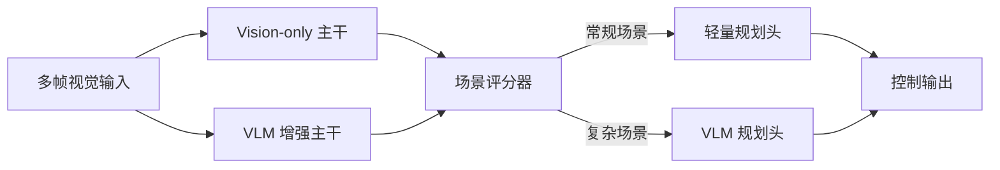
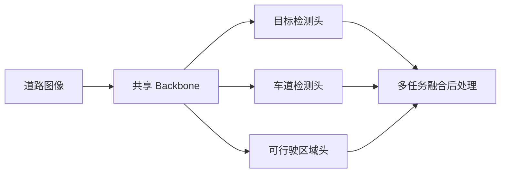
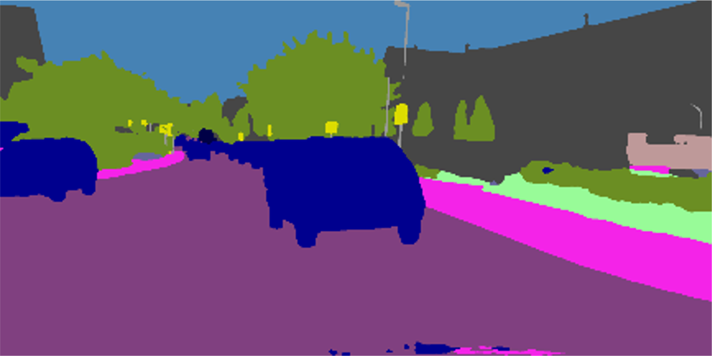
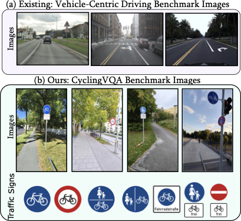

# 自动驾驶论文日报（2026-02-13）

- 数据源：arXiv（`cs.RO` + `cs.CV`）
- 过滤策略：自动驾驶主题筛选 + 关键词黑名单剔除 + 人工复核
- GitHub 链接：https://github.com/zhuyx1995/daily-autonomous-driving-papers/blob/main/reports/2026-02-13.md

## 今日收录（7 篇）

### 1) ResWorld: Temporal Residual World Model for End-to-End Autonomous Driving
- 链接：https://arxiv.org/abs/2602.10884
- 作者：Jinqing Zhang, Zehua Fu, Zelin Xu, Wenying Dai, Qingjie Liu, Yunhong Wang
- 机构：论文署名未在 arXiv 元数据中结构化给出
- 任务设定：端到端自动驾驶规划（世界模型 + 轨迹细化）
- 摘要要点：
  - 提出 Temporal Residual World Model（TR-World）以突出动态体建模。
  - 用残差信号减少静态区域冗余，提升时序表示效率。
  - 结合 FGTR 对先验轨迹进行 future-guided refinement。
  - 在 nuScenes 与 NAVSIM 上报告更优规划效果。
- 核心方法：
  - 输入：历史感知/BEV 表征与规划先验轨迹。
  - 主干：TR-World 时序残差建模主干。
  - 关键模块：未来特征交互模块 + 轨迹细化模块。
  - 损失：世界模型监督 + 规划目标联合优化。
  - 训练要点：稀疏时空监督抑制长期滚动退化。
- 实验结论：
  - 关键指标在公开基准上优于对比方法。
  - 规划稳定性与可执行性提升明显。
  - 局限：多场景泛化与极端角落案例仍需更多证据。
- 创新点评分：9.1/10（世界模型与规划闭环耦合设计完整）

#### 重点图片

> 方法总览图：展示 TR-World 与轨迹细化的主数据流。

> 关键模块图：强调动态目标残差建模路径。

#### 模型架构图（Mermaid）

### 2) Adaptive Time Step Flow Matching for Autonomous Driving Motion Planning
- 链接：https://arxiv.org/abs/2602.10285
- 作者：Ananya Trivedi, Anjian Li, Mohamed Elnoor, Yusuf Umut Ciftci, Avinash Singh, Jovin D'sa, Sangjae Bae, David Isele, Taskin Padir, Faizan M. Tariq
- 机构：论文署名含 Northeastern University 与 Honda Research Institute US
- 任务设定：在线联合预测与运动规划
- 摘要要点：
  - 基于 conditional flow matching 统一预测与规划。
  - 通过方差估计器自适应推理步数，兼顾精度与延迟。
  - 无需重复训练即可动态调整时间步。
  - 结合凸二次规划后处理提升轨迹平滑与可行性。
- 核心方法：
  - 输入：场景上下文 + 交通参与体状态。
  - 主干：Flow Matching 生成式规划骨干。
  - 关键模块：Adaptive Step Controller + 联合预测分支。
  - 损失：流匹配目标 + 规划约束项。
  - 训练要点：离线学习，在线按难度自适应推理深度。
- 实验结论：
  - 在 Waymo Open Motion Dataset 上具备高频在线更新能力。
  - 相比固定步数方案，时延与轨迹质量折中更优。
  - 局限：对场景复杂度估计准确性有依赖。
- 创新点评分：8.9/10（把“推理步数自适应”落到了可部署路径）

#### 重点图片

> Pipeline 图：说明 flow matching 与在线控制的耦合方式。

> 结果可视化：展示不同推理预算下的轨迹行为差异。

#### 模型架构图（Mermaid）

### 3) From Representational Complementarity to Dual Systems: Synergizing VLM and Vision-Only Backbones for End-to-End Driving
- 链接：https://arxiv.org/abs/2602.10719
- 作者：Sining Ang, Yuguang Yang, Chenxu Dang, Canyu Chen, Cheng Chi, Haiyan Liu, Xuanyao Mao, Jason Bao, Xuliang, Bingchuan Sun, Yan Wang
- 机构：论文署名显示 Michigan State University 与 University of Wisconsin-Madison 等
- 任务设定：端到端驾驶中的双系统决策（VLM + Vision-only）
- 摘要要点：
  - 分析 VLM 与视觉骨干在表示空间上的互补性。
  - 提出 HybridDriveVLA 与 DualDriveVLA 两类系统。
  - 通过场景级打分器决定是否调用更重分支。
  - 在有限重分支调用率下保持性能并提升吞吐。
- 核心方法：
  - 输入：前视图像序列与场景语义线索。
  - 主干：Vision-only 主路径 + VLM 增强路径。
  - 关键模块：分支评分器、低置信触发机制。
  - 损失：规划目标损失 + 分支选择相关训练目标。
  - 训练要点：保持主路径高效，难例触发增强路径。
- 实验结论：
  - 在 PDMS 等指标上获得显著提升。
  - 重模型调用占比低时仍保持较高推理吞吐。
  - 局限：双路径协同的稳定性依赖评分器校准。
- 创新点评分：8.8/10（提出了可工程化的成本-性能折中范式）

#### 重点图片

> 总体架构图：展示双系统的协同工作模式。

#### 模型架构图（Mermaid）

### 4) AurigaNet: A Real-Time Multi-Task Network for Enhanced Urban Driving Perception
- 链接：https://arxiv.org/abs/2602.10660
- 作者：Kiarash Ghasemzadeh, Sedigheh Dehghani
- 机构：Michigan State University
- 任务设定：城市道路实时多任务感知
- 摘要要点：
  - 单网络联合目标检测、车道检测与可行驶区域实例分割。
  - 重点追求嵌入式平台实时部署性能。
  - 通过共享特征提升多任务协同收益。
- 核心方法：
  - 输入：单目道路图像。
  - 主干：统一多任务共享 backbone。
  - 关键模块：检测头、车道头、可行驶区域头。
  - 损失：多任务加权联合损失。
  - 训练要点：在精度与时延之间进行任务平衡。
- 实验结论：
  - BDD100K 上多项指标达到较强基线水平。
  - Jetson Orin NX 验证了实时可部署性。
  - 局限：复杂天气/夜间场景鲁棒性待进一步量化。
- 创新点评分：8.5/10（多任务实时化落地导向明确）

#### 重点图片

> 架构图：突出共享主干与多头输出组织方式。

#### 模型架构图（Mermaid）

### 5) Enhancing Predictability of Multi-Tenant DNN Inference for Autonomous Vehicles' Perception
- 链接：https://arxiv.org/abs/2602.11004
- 作者：Liangkai Liu, Kang G. Shin, Jinkyu Lee, Chengmo Yang, Weisong Shi
- 机构：University of Michigan 等
- 任务设定：车端多租户感知推理的可预测性优化
- 摘要要点：
  - 提出 PP-DNN 以降低多模型并发时的时延抖动。
  - 通过关键帧与关键 ROI 筛选减少无效计算。
  - 用 FLOPs 预测与调度协同提升吞吐稳定性。
- 核心方法：
  - 输入：视频帧流与并发感知任务队列。
  - 主干：ROI 生成 + 复杂度预测 + 调度器三段式。
  - 关键模块：关键帧筛选器、资源分配策略。
  - 损失：主要为系统优化目标（延迟/吞吐），非单一监督学习范式。
  - 训练要点：系统级 profiling 与数据驱动调度参数拟合。
- 实验结论：
  - 延迟与延迟波动显著下降，融合效率提升明显。
  - 在 BDD100K 与 nuScenes 流程上显示较强工程收益。
  - 局限：策略迁移到新硬件时需重新标定。
- 创新点评分：8.7/10（系统优化与感知流水线结合得很实用）

#### 重点图片

> 系统框图：展示关键帧/ROI 与调度器协同链路。

> 端到端流程图：强调多租户推理的数据路径。

#### 模型架构图（Mermaid）

### 6) Spatio-Temporal Attention for Consistent Video Semantic Segmentation in Automated Driving
- 链接：https://arxiv.org/abs/2602.10052
- 作者：Serin Varghese, Kevin Ross, Fabian Hueger, Kira Maag
- 机构：Robert Bosch GmbH, University of Tübingen
- 任务设定：自动驾驶视频语义分割的一致性增强
- 摘要要点：
  - 提出可插拔 STA（时空注意力）模块。
  - 在分割 Transformer 中显式建模多帧上下文。
  - 重点提升跨帧一致性而非只追单帧精度。
- 核心方法：
  - 输入：相邻视频帧序列。
  - 主干：分割 backbone + STA 模块。
  - 关键模块：跨帧 attention 交互、时序对齐。
  - 损失：语义分割损失 + 时序一致性约束。
  - 训练要点：兼容轻量与大模型骨干。
- 实验结论：
  - 一致性指标有明显提升，mIoU 也有增益。
  - 在不同骨干下均能稳定收益。
  - 局限：长序列全局依赖建模仍受显存限制。
- 创新点评分：8.4/10（模块轻量、迁移性好，实战价值高）

#### 重点图片

> 方法示意图：突出跨帧信息如何进入分割主干。

> 输入示例图：展示时序帧作为联合建模输入。

#### 模型架构图（Mermaid）

### 7) From Steering to Pedalling: Do Autonomous Driving VLMs Generalize to Cyclist-Assistive Spatial Perception and Planning?
- 链接：https://arxiv.org/abs/2602.10771
- 作者：Krishna Kanth Nakka, Vedasri Nakka
- 机构：Independent / CyclingVQA 项目团队
- 任务设定：评估驾驶 VLM 向骑行辅助感知与规划的迁移
- 摘要要点：
  - 构建 CyclingVQA 评测基准，覆盖空间推理与规划。
  - 系统测试 31+ 模型在骑行视角下的能力。
  - 分析模型错误模式与可迁移边界。
- 核心方法：
  - 输入：骑行视角图像 + 任务问题模板。
  - 主干：多类 VLM 推理评测框架。
  - 关键模块：任务构造、评分协议、误差归因分析。
  - 损失：该工作以评测为主，核心是统一评估指标设计。
  - 训练要点：强调 benchmark 构建与诊断维度覆盖。
- 实验结论：
  - 驾驶场景特化模型在跨视角迁移上存在能力断层。
  - 通用模型在若干子任务上表现更稳健。
  - 局限：数据规模与标注覆盖度仍可扩展。
- 创新点评分：8.2/10（把“迁移评估”做成了可复现实验框架）

#### 重点图片

> 主图：给出任务背景与评测目标。

> 任务图：展示数据构造与空间推理问题设置。

#### 模型架构图（Mermaid）

## 重点推荐（Top 3）
1. **ResWorld**：世界模型与规划联动最完整，技术深度高。
2. **Adaptive Time Step Flow Matching**：在线规划实时性与精度折中做得最好。
3. **DualDriveVLA**：双系统触发策略对工业部署很有启发。
