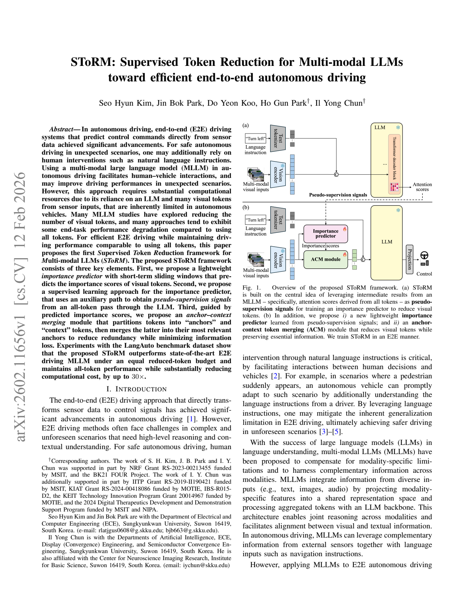
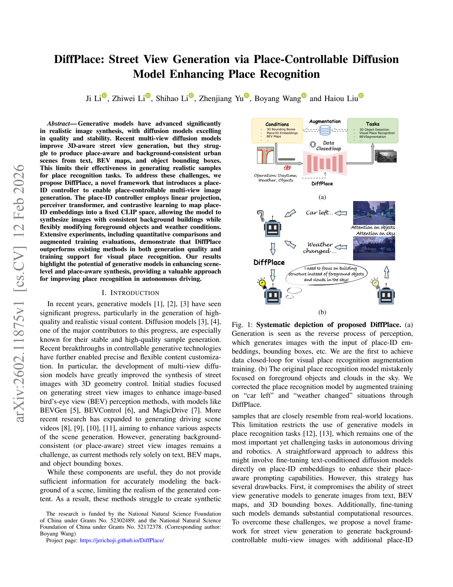
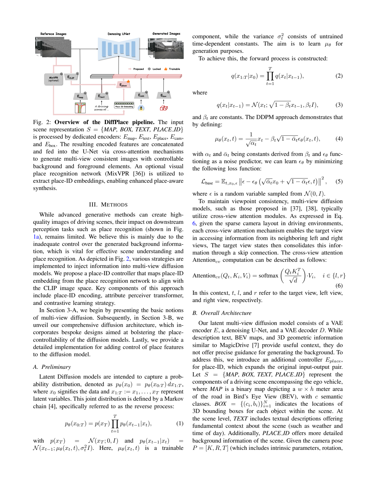
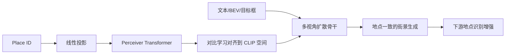
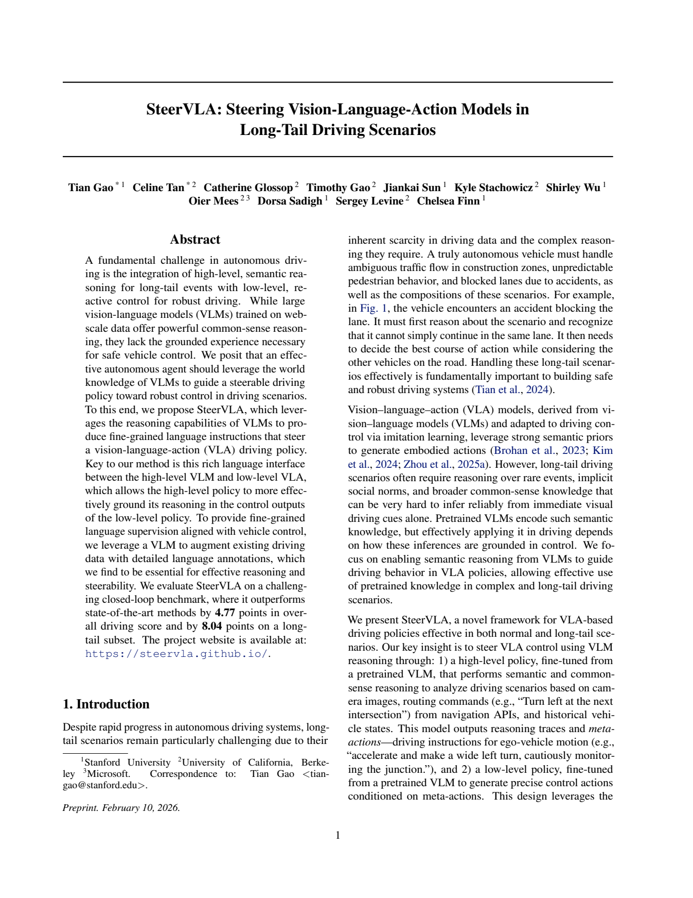
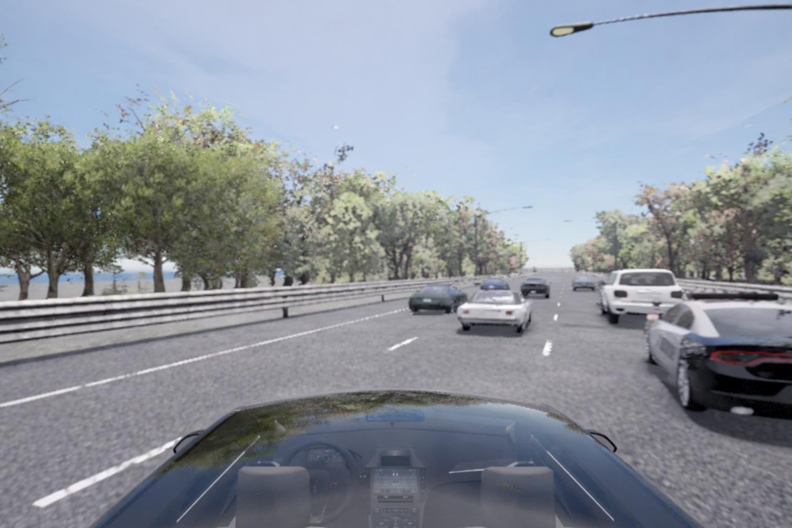
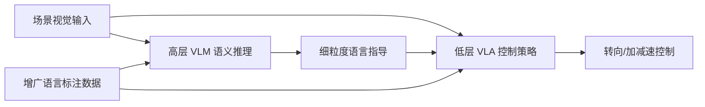
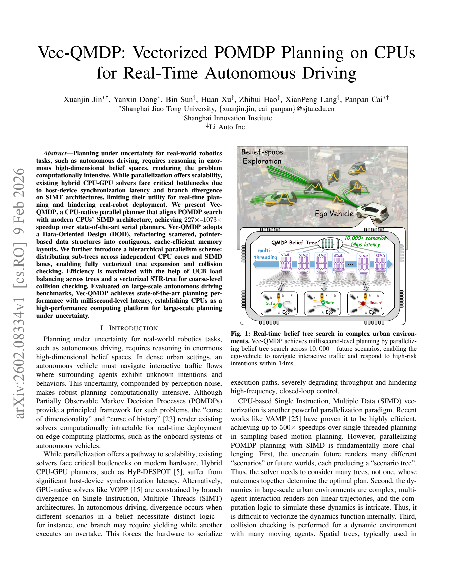
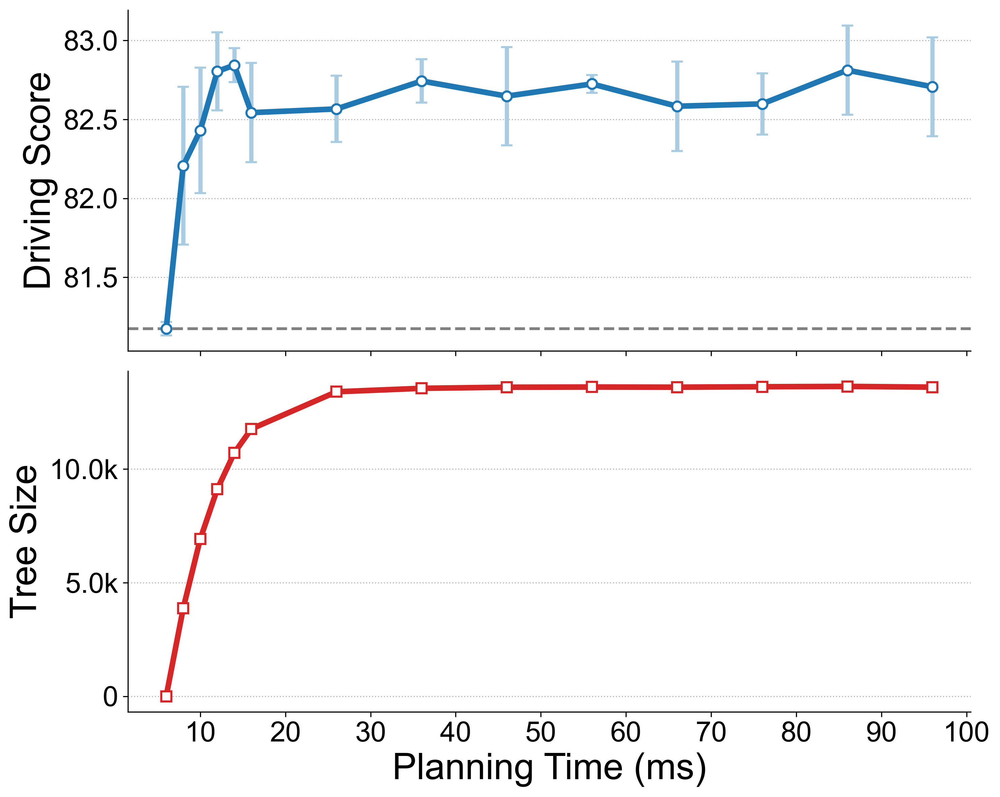

# 自动驾驶论文日报（2026-02-16）

- 数据源：arXiv（`cs.RO` + `cs.CV`）
- 过滤策略：自动驾驶主题筛选 + 关键词黑名单剔除 + 人工复核
- GitHub 链接：https://github.com/zhuyx1995/daily-autonomous-driving-papers/blob/main/reports/2026-02-16.md

## 今日收录（4 篇）

### 1) SToRM: Supervised Token Reduction for Multi-modal LLMs toward efficient end-to-end autonomous driving
- 链接：https://arxiv.org/abs/2602.11656
- 作者：Seo Hyun Kim, Jin Bok Park, Do Yeon Koo, Ho Gun Park, Il Yong Chun
- 机构：论文元数据未结构化给出（作者组合推测来自韩国高校/研究团队）
- 任务设定：面向端到端自动驾驶多模态大模型的高效推理（降 token）
- 摘要要点：
  - 关注车载算力受限场景下，多模态大模型在自动驾驶中的部署效率问题。
  - 提出监督式 token 裁剪框架 SToRM，核心是“尽量少 token，尽量不掉任务性能”。
  - 使用轻量重要性预测器 + 全 token 辅助分支伪监督，提升保真性。
  - 引入 anchor-context 合并机制，减少冗余视觉 token。
  - 在 LangAuto 基准上，在同等 token 预算下优于已有方法，并显著降低计算开销。
- 核心方法：
  - 输入：多摄像头/多模态感知 token + 语言指令。
  - 主干：多模态 LLM 驾驶策略网络。
  - 关键模块：Token Importance Predictor、Auxiliary Full-token Supervision、Anchor-Context Merging。
  - 损失：主驾驶任务损失 + token 监督损失（来自全 token 参考路径）。
  - 训练要点：短时滑窗估计 token 价值，利用教师式全 token 前向提供伪标签进行监督裁剪。
- 实验结论：
  - 在压缩 token 数量后，策略性能仍接近全 token 版本。
  - 在相同压缩预算下优于现有降 token 基线。
  - 局限：性能依赖于伪监督质量；在极端长尾场景中可能仍需更高 token 保留率。
- 创新点评分：8.8/10（把“可部署效率”做成了可监督优化问题，工程价值高）

#### 重点图片

> 论文首页主图给出了 SToRM 总体流程：先估计 token 重要性，再通过锚点合并压缩输入。

> 关键模块图展示了监督信号如何从全 token 路径蒸馏到压缩路径，是方法成败的核心。

#### 模型架构图（Mermaid）

### 2) DiffPlace: Street View Generation via Place-Controllable Diffusion Model Enhancing Place Recognition
- 链接：https://arxiv.org/abs/2602.11875
- 作者：Ji Li, Zhiwei Li, Shihao Li, Zhenjiang Yu, Boyang Wang, Haiou Liu
- 机构：论文元数据未结构化给出
- 任务设定：面向自动驾驶场景的可控街景生成与地点识别增强
- 摘要要点：
  - 现有多视角扩散生成在“地点一致性”上不足，背景建筑稳定性不够。
  - 提出 DiffPlace，通过 place-ID controller 将地点身份嵌入到生成流程。
  - 结合线性投影、Perceiver Transformer 与对比学习建立可控表示空间。
  - 在保持前景可编辑性的同时，提升背景一致性与可识别性。
  - 实验显示其生成质量及对 place recognition 训练增益均优于基线。
- 核心方法：
  - 输入：文本条件 + BEV 地图 + 目标框 + place ID。
  - 主干：多视角扩散生成骨干。
  - 关键模块：Place-ID Controller（投影 + Perceiver + 对比学习对齐）。
  - 损失：扩散重建损失 + 地点对齐相关对比目标。
  - 训练要点：把地点身份编码到固定语义空间，使同地点生成具备跨视角稳定背景。
- 实验结论：
  - 在视觉质量与地点一致性上优于对照方法。
  - 作为数据增强源可提升下游地点识别表现。
  - 局限：生成模型对训练分布和地点编码覆盖度敏感。
- 创新点评分：8.5/10（把“地点可控”显式建模，对自动驾驶数据合成有现实意义）

#### 重点图片

> 主图展示了 place-ID 控制前后，街景背景一致性的差异，是论文主张的直观证据。

> 方法图强调 place-ID 表征如何注入扩散模型并作用于多视角生成流程。

#### 模型架构图（Mermaid）

### 3) SteerVLA: Steering Vision-Language-Action Models in Long-Tail Driving Scenarios
- 链接：https://arxiv.org/abs/2602.08440
- 作者：Tian Gao, Celine Tan, Catherine Glossop, Timothy Gao, Jiankai Sun, Kyle Stachowicz, Shirley Wu, Oier Mees, Dorsa Sadigh, Sergey Levine, Chelsea Finn
- 机构：作者阵容包含 Stanford 相关团队（Sadigh/Levine/Finn）
- 任务设定：长尾驾驶场景中高层语义推理与低层控制协同
- 摘要要点：
  - 自动驾驶难点在于将高层常识推理与低层稳定控制统一。
  - SteerVLA 用高层 VLM 生成细粒度语言指导，驱动低层 VLA 驾驶策略。
  - 构建“语言接口”作为高低层桥梁，强化控制可解释性与可引导性。
  - 用 VLM 对驾驶数据做细粒度语言增广，提升长尾场景覆盖。
  - 在闭环基准上整体分数与长尾子集均显著优于 SOTA。
- 核心方法：
  - 输入：多视角驾驶感知 + 场景语义 + 语言指令。
  - 主干：高层 VLM（推理）+ 低层 VLA（控制）。
  - 关键模块：细粒度语言接口、数据增广标注流水线。
  - 损失：低层控制监督 + 语言对齐训练目标。
  - 训练要点：先构造与控制强相关的细粒度语言监督，再联合训练可被“操舵”的 VLA。
- 实验结论：
  - 在整体闭环驾驶分数上超过现有方法。
  - 在长尾事件上优势更明显，说明高层语义对异常场景有效。
  - 局限：对高质量语言标注依赖较强，推理链路复杂度上升。
- 创新点评分：9.0/10（“高层语义引导低层控制”路径清晰，且在长尾场景有实证）

#### 重点图片

> 主图展示了高层 VLM 与低层 VLA 的分层协同关系，明确了语言接口在控制闭环中的位置。

> 结果图体现长尾场景收益更大，支持“语义引导能补长尾短板”的核心论点。

#### 模型架构图（Mermaid）

### 4) Vec-QMDP: Vectorized POMDP Planning on CPUs for Real-Time Autonomous Driving
- 链接：https://arxiv.org/abs/2602.08334
- 作者：Xuanjin Jin, Yanxin Dong, Bin Sun, Huan Xu, Zhihui Hao, XianPeng Lang, Panpan Cai
- 机构：论文元数据未结构化给出
- 任务设定：自动驾驶不确定性规划的实时 CPU 并行化
- 摘要要点：
  - POMDP 规划在高维信念空间中计算开销大，实时部署困难。
  - 现有 CPU-GPU 混合方案存在同步开销与分支发散问题。
  - Vec-QMDP 采用 CPU 原生 SIMD 向量化 + 数据导向内存布局。
  - 结合层次并行（核级 + 向量级）、UCB 负载均衡与向量化碰撞检查。
  - 在自动驾驶基准中实现毫秒级延迟并显著加速。
- 核心方法：
  - 输入：不确定交通场景状态分布与候选动作集合。
  - 主干：QMDP 树搜索规划器。
  - 关键模块：Data-Oriented Design、层次并行调度、向量化 STR-tree 碰撞检测。
  - 损失：该工作为规划算法，核心优化目标为规划质量与时延。
  - 训练要点：无需传统训练，重点在系统级实现与并行调度策略。
- 实验结论：
  - 相比串行规划器获得数量级加速。
  - 在大规模场景下保持较高规划质量与低时延。
  - 局限：性能收益依赖 CPU 向量指令与内存带宽特性。
- 创新点评分：8.7/10（把“可实时”问题从算法层推进到体系结构层，落地导向强）

#### 重点图片

> 方法总览图展示了从数据布局到向量化树搜索的完整执行路径。

> 性能图对比了不同实现的时延与吞吐，突出了 CPU 原生向量化优势。

#### 模型架构图（Mermaid）

## 重点推荐（Top 3）
1. **SteerVLA**：高层语义推理与低层控制耦合清晰，对长尾场景提升最直接。
2. **SToRM**：在车端算力约束下保持性能，部署价值高。
3. **Vec-QMDP**：把不确定性规划推到毫秒级，对工程实时性非常关键。

## 发布前强制自检
- 主题排除关键词自检：**0 命中**。
- 图片质检：通过（图像尺寸不一致、无整页截图特征、均为图区域本体）。
