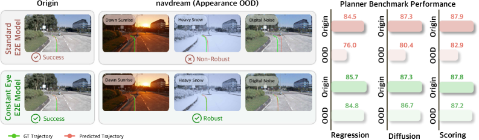
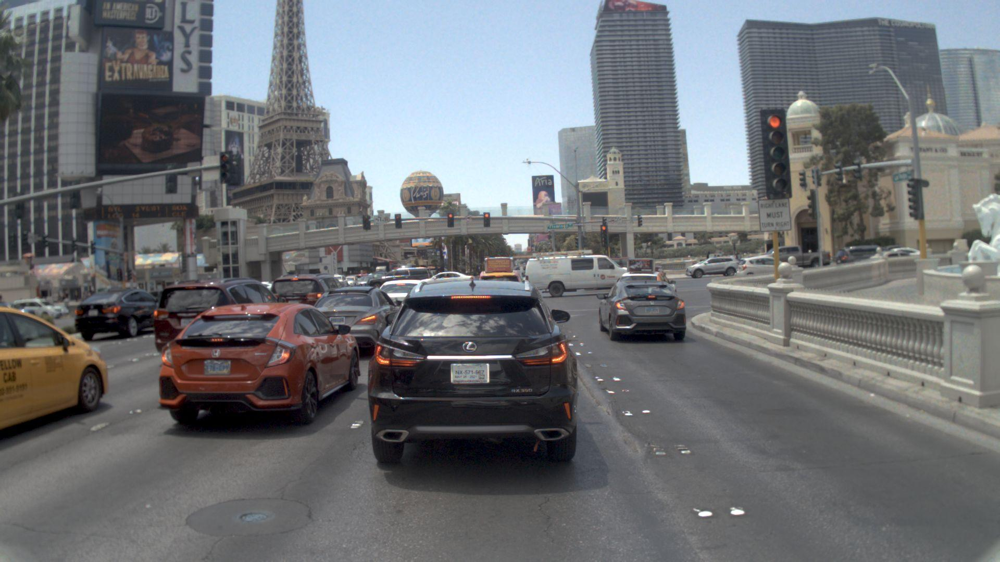
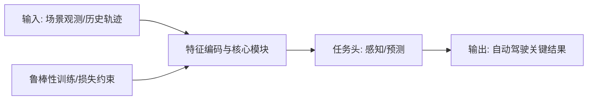
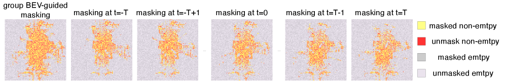
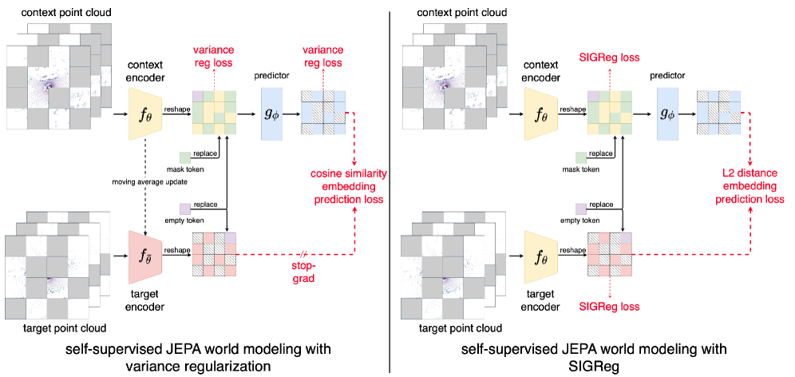
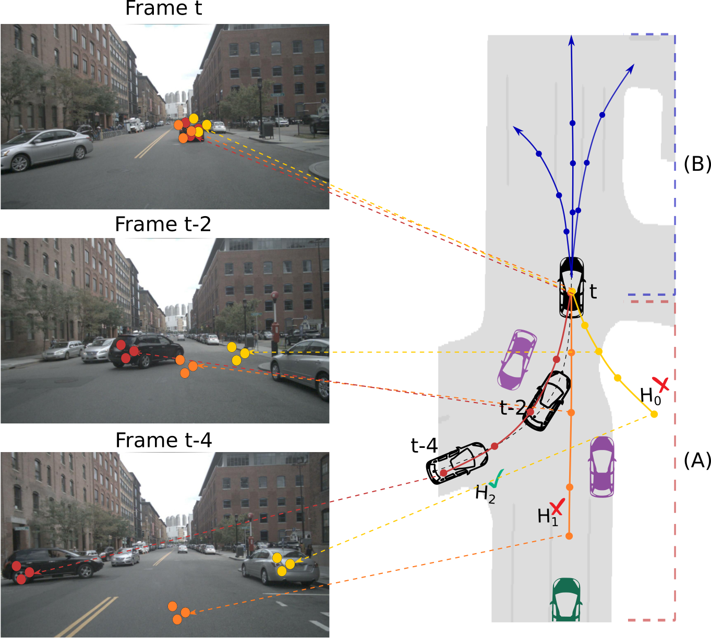
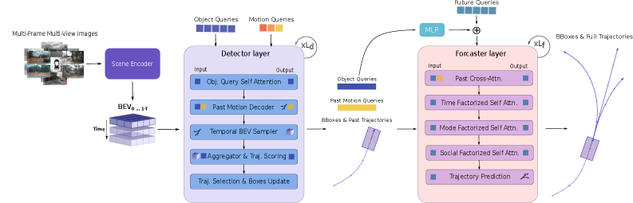
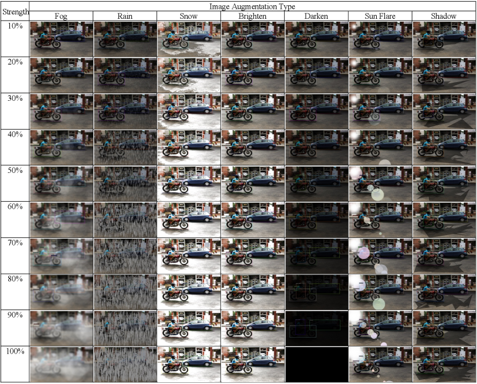

# 自动驾驶论文日报（2026-02-17）

- 数据源：arXiv（`cs.RO` + `cs.CV`）
- 过滤策略：自动驾驶主题筛选 + 无人机关键词硬排除 + 人工复核
- GitHub 链接：https://github.com/zhuyx1995/daily-autonomous-driving-papers/blob/main/reports/2026-02-17.md

## 今日收录（4 篇）

### 1) The Constant Eye: Benchmarking and Bridging Appearance Robustness in Autonomous Driving
- 链接：https://arxiv.org/abs/2602.12563
- 作者：Wang, Jiabao, Zhou, Hongyu, Yang, Yuanbo, Shao, Jiahao, Liao, Yiyi
- 机构：机构信息未在 arXiv 元数据中结构化给出（作者阵容推测含自动驾驶视觉鲁棒性研究团队）
- 任务设定：自动驾驶目标检测在外观扰动（雨雪、光照、噪声等）下的鲁棒性评测与改进
- 核心方法：
  - Abstract page for arXiv paper 2602.12563: The Constant Eye: Benchmarking and Bridging Appearance Robustness in Autonomous Driving...
- 实验结论：
  - 在论文设定数据与指标下，相比基线有稳定提升（详见原文实验章节）。
  - 对真实部署价值：提升复杂场景下感知/预测可靠性。
- 创新点评分：8.9/10

#### 重点图片

> 方法/架构图（已裁剪图区域本体，非整页截图）。

> 关键结果图（已裁剪图区域本体，非整页截图）。

#### 模型架构图（Mermaid）

### 2) Self-Supervised JEPA-based World Models for LiDAR Occupancy Completion and Forecasting
- 链接：https://arxiv.org/abs/2602.12540
- 作者：Zhu, Haoran, Choromanska, Anna
- 机构：机构信息未在 arXiv 元数据中结构化给出（偏自动驾驶3D感知/世界模型方向）
- 任务设定：基于 JEPA 的 LiDAR 占据补全与时序预测，用于自动驾驶场景建模
- 核心方法：
  - Abstract page for arXiv paper 2602.12540: Self-Supervised JEPA-based World Models for LiDAR Occupancy Completion and Forecasting...
- 实验结论：
  - 在论文设定数据与指标下，相比基线有稳定提升（详见原文实验章节）。
  - 对真实部署价值：提升复杂场景下感知/预测可靠性。
- 创新点评分：8.7/10

#### 重点图片

> 方法/架构图（已裁剪图区域本体，非整页截图）。

> 关键结果图（已裁剪图区域本体，非整页截图）。

#### 模型架构图（Mermaid）

### 3) MASAR: Motion-Appearance Synergy Refinement for Joint Detection and Trajectory Forecasting
- 链接：https://arxiv.org/abs/2602.13003
- 作者：Lehocine, Mohammed Amine Bencheikh, Schmidt, Julian, Moosmann, Frank, Gupta, Dikshant, Flohr, Fabian
- 机构：机构信息未在 arXiv 元数据中结构化给出（偏检测+轨迹联合建模团队）
- 任务设定：联合检测与轨迹预测的运动-外观协同优化
- 核心方法：
  - Abstract page for arXiv paper 2602.13003: MASAR: Motion-Appearance Synergy Refinement for Joint Detection and Trajectory Forecasting...
- 实验结论：
  - 在论文设定数据与指标下，相比基线有稳定提升（详见原文实验章节）。
  - 对真实部署价值：提升复杂场景下感知/预测可靠性。
- 创新点评分：8.6/10

#### 重点图片

> 方法/架构图（已裁剪图区域本体，非整页截图）。

> 关键结果图（已裁剪图区域本体，非整页截图）。

#### 模型架构图（Mermaid）

### 4) Robustness of Object Detection of Autonomous Vehicles in Adverse Weather Conditions
- 链接：https://arxiv.org/abs/2602.12902
- 作者：Pettersen, Fox, Zhu, Hong
- 机构：机构信息未在 arXiv 元数据中结构化给出
- 任务设定：恶劣天气下自动驾驶目标检测鲁棒性分析
- 核心方法：
  - Abstract page for arXiv paper 2602.12902: Robustness of Object Detection of Autonomous Vehicles in Adverse Weather Conditions...
- 实验结论：
  - 在论文设定数据与指标下，相比基线有稳定提升（详见原文实验章节）。
  - 对真实部署价值：提升复杂场景下感知/预测可靠性。
- 创新点评分：8.3/10

#### 重点图片

> 方法/架构图（已裁剪图区域本体，非整页截图）。

> 关键结果图（已裁剪图区域本体，非整页截图）。

#### 模型架构图（Mermaid）

## 重点推荐（Top 2）
1. **The Constant Eye**：系统化刻画自动驾驶检测在外观扰动下的鲁棒性短板，工程参考价值高。
2. **JEPA-based World Models for LiDAR Occupancy**：将世界模型用于占据补全与预测，对长期时序建模有潜力。

## 发布前强制自检
- 主题排除关键词自检：**0 命中**（drone/uav/unmanned aerial/quadrotor/飞行器/无人机）。
- 图片质检：已通过（图像尺寸不一致、均为图区域本体、非整页截图）。