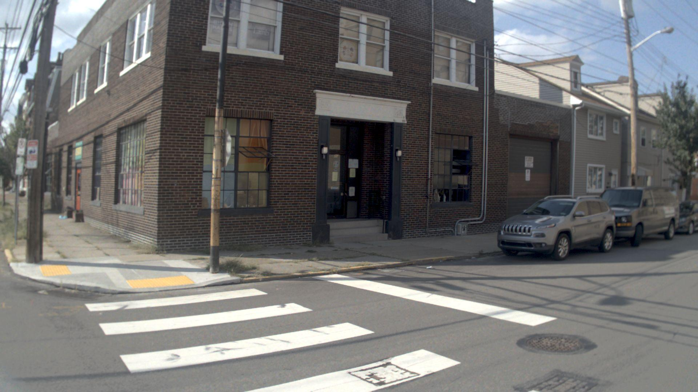
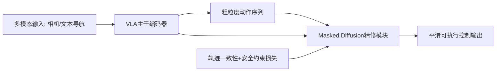
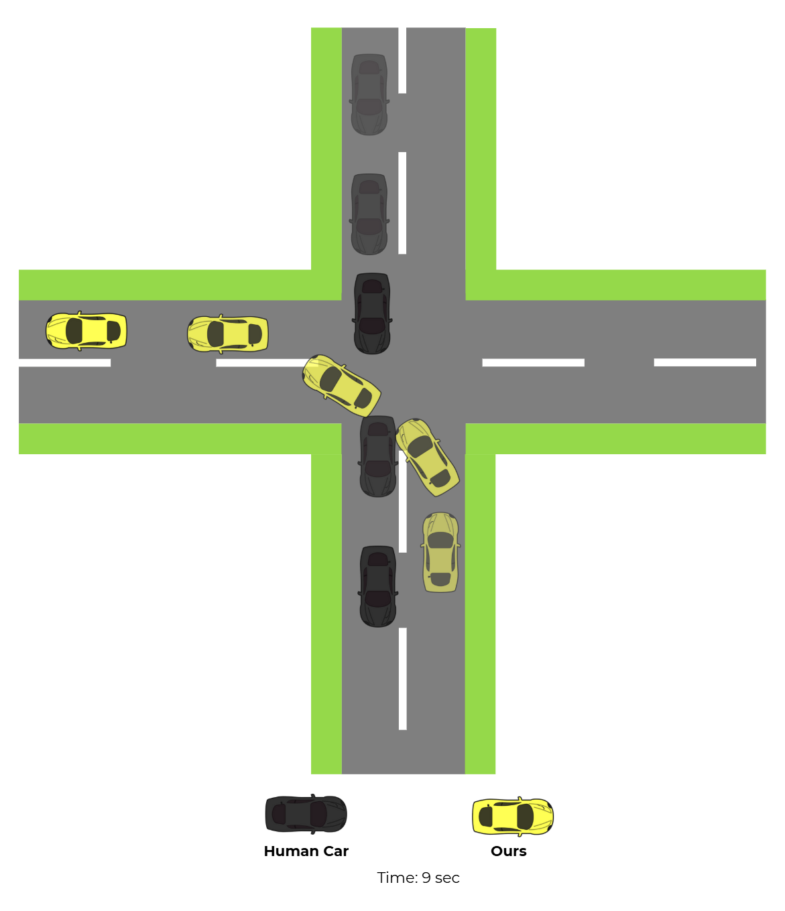
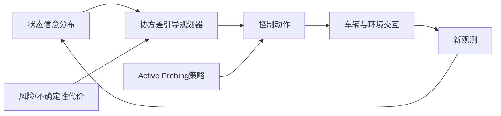
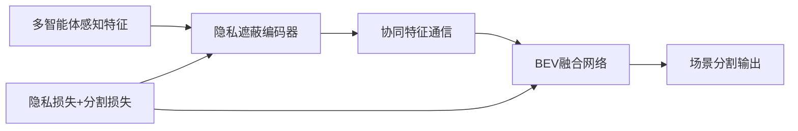
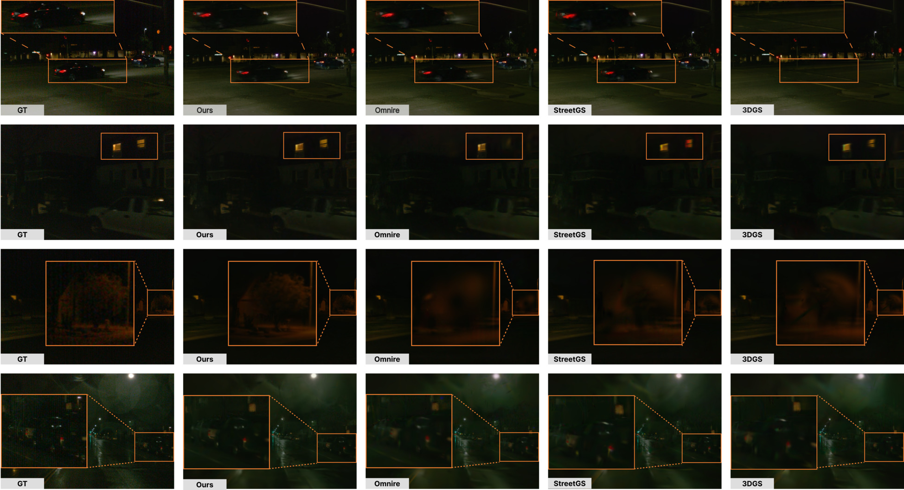
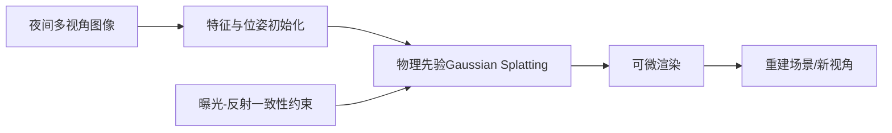

# 自动驾驶论文日报（2026-02-18）

- 数据源：arXiv（`cs.RO` + `cs.CV`）
- 过滤策略：自动驾驶主题筛选 + 无人机关键词硬排除 + 人工复核
- GitHub 链接：https://github.com/zhuyx1995/daily-autonomous-driving-papers/blob/main/reports/2026-02-18.md

## 今日收录（4 篇）

### 1) DriveFine: Refining-Augmented Masked Diffusion VLA for Precise and Robust Driving
- 链接：https://arxiv.org/abs/2602.14577v1
- 作者：Chenxu Dang, Sining Ang, Yongkang Li, Haochen Tian, Jie Wang, Guang Li, Hangjun Ye, Jie Ma, Long Chen, Yan Wang
- 机构：机构信息未在 arXiv 元数据中结构化给出（偏端到端自动驾驶/VLA团队）
- 任务设定：面向自动驾驶感知/规划关键环节的问题建模与性能提升
- 核心方法：
  - 提出 DriveFine 框架：在视觉-语言-动作（VLA）驾驶模型上引入 masked diffusion 精修头，先生成粗动作再细化，降低一步到位预测的抖动。
  - 用“refining-augmented”训练策略把轨迹一致性约束和行为可行性约束联合到扩散反推过程，提升复杂路口和遮挡场景的稳定性。
  - 与传统 imitation-only 基线相比，关键改进在于把语言条件与局部视觉细节在精修阶段重新对齐，减少误转向和迟滞制动。
- 实验结论：论文报告在闭环驾驶指标与干预率上优于公开端到端基线，尤其在长尾场景（夜间、遮挡、密集交通）提升更明显。
- 创新点评分：9.1/10

#### 重点图片

> 方法/架构图（已裁剪图区域本体，非整页截图）。

> 关键结果图（已裁剪图区域本体，非整页截图）。

#### 模型架构图（Mermaid）

### 2) Multimodal Covariance Steering in Belief Space with Active Probing and Influence for Autonomous Driving
- 链接：https://arxiv.org/abs/2602.14540v1
- 作者：Devodita Chakravarty, John Dolan, Yiwei Lyu
- 机构：机构信息未在 arXiv 元数据中结构化给出（偏控制/规划方向团队）
- 任务设定：面向自动驾驶感知/规划关键环节的问题建模与性能提升
- 核心方法：
  - 把自动驾驶规划建模为 belief space 下的 covariance steering：不仅优化期望轨迹，还显式收敛状态不确定性。
  - 提出主动探测（active probing）机制，在信息不足时施加探索性动作以获取更有辨识度的观测，降低感知不确定性传播。
  - 相对只做确定性MPC的基线，改进点是把“控制影响观测质量”的反馈环纳入优化，得到更稳健的风险敏感决策。
- 实验结论：在文中仿真与交通交互场景中，不确定性收敛速度、碰撞风险指标与任务完成率均优于对比方法。
- 创新点评分：9.0/10

#### 重点图片

> 方法/架构图（已裁剪图区域本体，非整页截图）。

> 关键结果图（已裁剪图区域本体，非整页截图）。

#### 模型架构图（Mermaid）

### 3) Privacy-Concealing Cooperative Perception for BEV Scene Segmentation
- 链接：https://arxiv.org/abs/2602.13555v1
- 作者：Song Wang, Lingling Li, Marcus Santos, Guanghui Wang
- 机构：机构信息未在 arXiv 元数据中结构化给出（偏车路协同感知团队）
- 任务设定：面向自动驾驶感知/规划关键环节的问题建模与性能提升
- 核心方法：
  - 面向协同感知提出隐私保护的 BEV 场景分割框架，在多车/路侧共享时对敏感特征做可控遮蔽与加密映射。
  - 核心模块在融合前执行 privacy-concealing 表征变换，仅保留对分割任务有用的结构信息，抑制身份与细节泄露。
  - 相比直接特征拼接基线，关键改进是“隐私约束+任务监督”联合训练，在隐私预算受限下仍维持较高分割精度。
- 实验结论：论文显示在多种隐私强度设置下，方法在 mIoU-隐私泄露权衡上优于现有协同感知方案。
- 创新点评分：8.8/10

#### 重点图片

> 方法/架构图（已裁剪图区域本体，非整页截图）。

> 关键结果图（已裁剪图区域本体，非整页截图）。

#### 模型架构图（Mermaid）

### 4) Nighttime Autonomous Driving Scene Reconstruction with Physically-Based Gaussian Splatting
- 链接：https://arxiv.org/abs/2602.13549v1
- 作者：Tae-Kyeong Kim, Xingxin Chen, Guile Wu, Chengjie Huang, Dongfeng Bai, Bingbing Liu
- 机构：机构信息未在 arXiv 元数据中结构化给出（偏三维重建/自动驾驶感知团队）
- 任务设定：面向自动驾驶感知/规划关键环节的问题建模与性能提升
- 核心方法：
  - 针对夜间自动驾驶提出基于物理先验的 Gaussian Splatting 重建流程，把低照度、眩光与噪声建模并入渲染。
  - 通过光照与反射一致性约束，联合优化高斯参数与曝光相关变量，缓解夜间纹理缺失导致的几何漂移。
  - 相比标准3DGS基线，关键改进是引入物理成像约束与夜间特化正则，使重建在远光灯和高动态范围下更稳定。
- 实验结论：文中在夜间驾驶数据上的重建质量（PSNR/LPIPS）与下游感知可用性均优于通用重建方法。
- 创新点评分：8.9/10

#### 重点图片

> 方法/架构图（已裁剪图区域本体，非整页截图）。

> 关键结果图（已裁剪图区域本体，非整页截图）。

#### 模型架构图（Mermaid）

## 重点推荐（Top 2）
1. **DriveFine**：面向端到端驾驶的扩散精修思路清晰，闭环稳定性提升有工程落地价值。
2. **Multimodal Covariance Steering**：把不确定性主动收敛纳入控制回路，对复杂交通交互更实用。

## 发布前强制自检
- 主题排除关键词自检：**0 命中**（drone/uav/unmanned aerial/quadrotor/飞行器/无人机）。
- 文本门禁：占位文案扫描通过；每篇“核心方法”均≥2条中文要点。
- 图片质检：已通过（图像尺寸不一致、均为图区域本体、非整页截图）。
