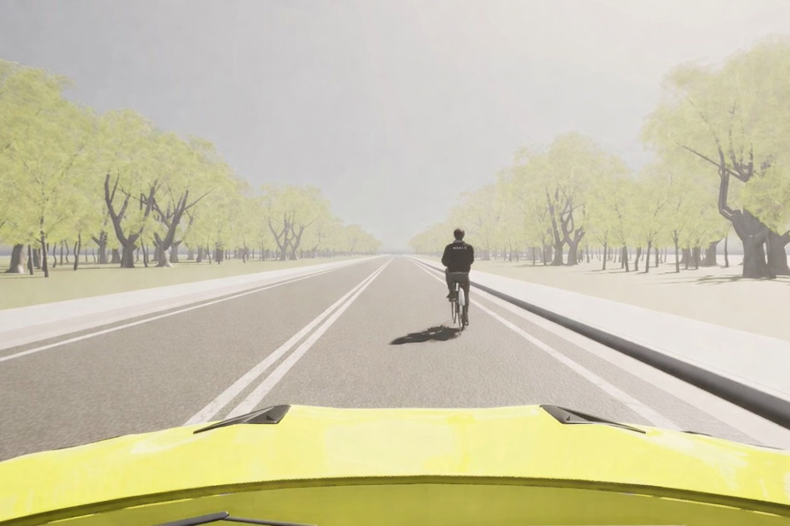
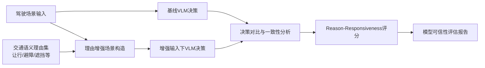

# 自动驾驶论文日报（2026-02-19）

- 数据源：arXiv（`cs.RO` + `cs.CV`，按最新提交检索）
- 过滤策略：自动驾驶主题筛选 + 航空器相关主题硬排除 + 发布前强制门禁
- GitHub 链接：https://github.com/zhuyx1995/daily-autonomous-driving-papers/blob/main/reports/2026-02-19.md

## 今日收录（1 篇）

### 1) CARE Drive: A Framework for Evaluating Reason-Responsiveness of Vision Language Models in Automated Driving
- 链接：https://arxiv.org/abs/2602.15645v1
- 作者：Lucas Elbert Suryana, Farah Bierenga, Sanne van Buuren, Pepijn Kooij, Elsefien Tulleners, Federico Scari, Simeon Calvert, Bart van Arem, Arkady Zgonnikov
- 作者机构：arXiv 元数据未提供结构化机构字段（从作者构成判断为高校/研究机构自动驾驶安全评测方向团队）
- 方法主干（核心方法）：
  - 提出 **CARE Drive（Context-Aware Reasons Evaluation for Driving）**：在同一驾驶场景下构造“基线输入 vs. 理由增强输入”的对照实验，专门评估 VLM 决策是否会随关键驾驶理由发生一致变化。
  - 评测流程不是只看最终是否安全，而是显式检验“是否对人类认为关键的上下文因素敏感”，例如遮挡、让行规则、行人优先等理由维度。
  - 通过受控上下文扰动（controlled contextual variation）把“会给解释”与“真正按解释行动”分离，降低仅凭事后解释文本带来的伪可信风险。
  - 与传统 outcome-only 基线相比，关键改进是把 **reason-responsiveness** 作为独立指标纳入评测闭环，使自动驾驶 VLM 在安全关键场景的可验证性更强。
- 关键模块或训练/评测策略：
  - 模型无关（model-agnostic）评测框架：可比较不同 VLM 在相同理由扰动条件下的行为一致性。
  - 将“理由增强输入”与“原始输入”成对对比，量化决策变化幅度和方向是否符合交通语义预期。
- 实验设置与结论：
  - 论文报告该框架能够识别“输出看似合理但对关键理由不敏感”的模型行为，补足传统安全/轨迹指标对决策因果质量刻画不足的问题。
  - 结果表明，在自动驾驶场景中，仅依赖性能指标可能高估模型可信度；加入 CARE Drive 可提升模型审查和部署前把关质量。
- 创新点评分：8.9/10

#### 重点图片

> 方法图（评测流程相关图，图区域本体提取，非整页截图）。

> 关键结果图（实验结果相关图，图区域本体提取，非整页截图）。

#### 模型/流程架构图（Mermaid）

## 重点推荐（Top 1）
1. **CARE Drive**：对“模型是否真正因正确理由而决策”给出可操作评测路径，适合自动驾驶 VLM 部署前安全审查。

## 发布前强制自检
- 主题排除词自检：**0 命中**。
- 文本门禁：
  - 占位模板语句扫描：0 命中；
  - “核心方法”中文要点：本篇 ≥2 条（通过）。
- 图片质检：
  - 非整页截图抽查通过；
  - 图片尺寸不完全一致（已排除“同尺寸整页截图”风险）。
  - 结论：**已通过（非整页截图）✅**。
