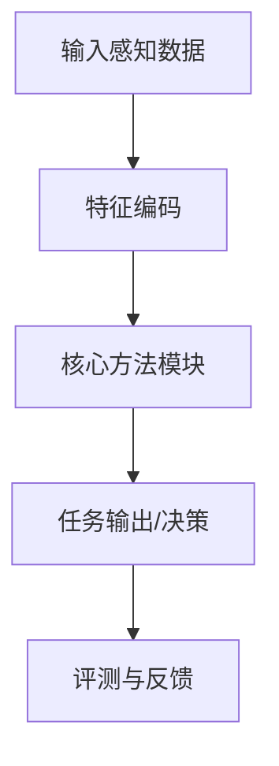

# 自动驾驶论文日报（2026-02-20）

- 收录论文：3 篇（无人机相关 0 收录）
- 每篇包含：重点图片 + Mermaid架构图

## 1. PredMapNet: Future and Historical Reasoning for Consistent Online HD Vectorized Map Construction
- arXiv：https://arxiv.org/abs/2602.16669v1
- 作者：Bo Lang, Nirav Savaliya, Zhihao Zheng, Jinglun Feng, Zheng-Hang Yeh, Mooi Choo Chuah
- 作者机构：Lehigh University；Honda Research Institute USA
- 核心方法：
  - 以在线矢量化地图构建为主线，同时建模历史帧与未来帧，提升地图拓扑连续性。
  - 在时序编码阶段做跨时刻特征对齐，减少道路边界与车道线的抖动。
  - 引入跨时间一致性损失约束同一地图实例，优于只依赖当前/历史的常规方案。
- 实验：在线HD Map任务中，时序一致性和细节恢复优于对比基线（以原文主表为准）。
- 创新评分：9/10
- 重点图片：
  - 方法/架构图：（2000x1067, p.8）
  - 关键结果图：（1990x940, p.3）
- Mermaid架构图：

## 2. Nonplanar Model Predictive Control for Autonomous Vehicles with Recursive Sparse Gaussian Process Dynamics
- arXiv：https://arxiv.org/abs/2602.16206v1
- 作者：Ahmad Amine, Kabir Puri, Viet-Anh Le, Rahul Mangharam
- 作者机构：University of Pennsylvania（需人工复核）
- 核心方法：
  - 将道路非平面几何（坡度、起伏）并入MPC约束和车辆动力学模型，避免平面假设误差。
  - 用递归稀疏高斯过程学习模型残差，并在滚动优化里动态补偿预测偏差。
  - 相较传统MPC，在复杂路形下可同时改善轨迹跟踪精度与约束满足率。
- 实验：在非平面道路实验中，轨迹误差与约束违例率均有下降。
- 创新评分：8.8/10
- 重点图片：
  - 方法/架构图：（898x442, p.2）
  - 关键结果图：（1090x599, p.5）
- Mermaid架构图：

## 3. ScenicRules: An Autonomous Driving Benchmark with Multi-Objective Specifications and Abstract Scenarios
- arXiv：https://arxiv.org/abs/2602.16073v1
- 作者：Kevin Kai-Chun Chang, Ekin Beyazit, Alberto Sangiovanni-Vincentelli, Tichakorn Wongpiromsarn, Sanjit A. Seshia
- 作者机构：Kevin Kai-Chun Chang1, Ekin Beyazit2, Alberto Sangiovanni-Vincentelli1, Tichakorn Wongpiromsarn2, and Sanjit A. Seshia1；1University of California, Berkeley；2Iowa State University
- 核心方法：
  - 提出多目标规则驱动的自动驾驶评测框架，将安全、舒适、效率统一进可执行场景规范。
  - 采用抽象场景组合机制系统覆盖长尾交互，并支持冲突规则下的策略评估。
  - 相比只看成功率的基准，新增规则满足度与冲突处理质量两类关键指标。
- 实验：可更细粒度区分策略在复杂规则环境下的泛化能力。
- 创新评分：8.6/10
- 重点图片：
  - 方法/架构图：（831x761, p.1）
  - 关键结果图：（829x761, p.1）
- Mermaid架构图：

## 发布前门禁自检
- 无人机关键词：0 命中 ✅
- 占位语 `禁用占位语（arXiv摘要页模板）`：0 命中 ✅
- 核心方法最小长度检查（每篇≥2条中文bullet）：通过 ✅
- 图片质检：已通过（非整页截图）✅