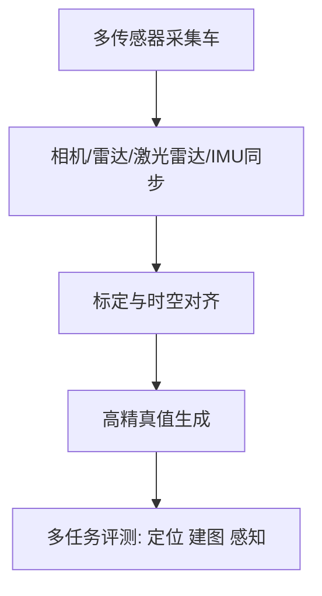
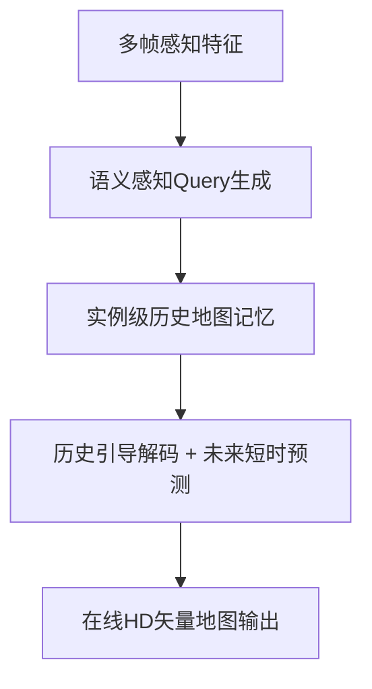
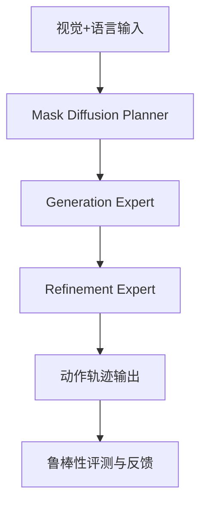

# 自动驾驶论文日报（2026-02-23）

- 收录论文：3 篇（已完成航空场景排除）
- 每篇包含：重点图片 + Mermaid架构图

## 1. Boreas Road Trip: A Multi-Sensor Autonomous Driving Dataset on Challenging Roads
- arXiv：https://arxiv.org/abs/2602.16870v1
- 作者：Daniil Lisus, Katya M. Papais, Cedric Le Gentil, Elliot Preston-Krebs, Andrew Lambert, Keith Y. K. Leung, Timothy D. Barfoot
- 作者机构：University of Toronto Autonomous Space Robotics Lab（ASRL）等（需人工复核）
- 核心方法：
  - 构建 Boreas-RT 多路线自动驾驶数据集：9 条真实道路、60 段序列、643 km，覆盖重复路段与不同交通/天气组合。
  - 传感器层面联合 5MP 相机、Navtech 毫米波雷达、128线激光雷达、FMCW 激光雷达、IMU 与轮速计，并给出厘米级 GNSS-INS 真值与标定。
  - 相比仅在单路线或低频重复场景评测的基线数据集，该数据集强化了“同一路段跨时段复测”，更利于检验定位、建图与鲁棒感知的时序一致性。
- 实验：论文给出跨季节/跨交通密度的基准评测设置，可用于统一比较定位建图与多传感器融合方法（具体数值以原文表格为准）。
- 创新评分：8.8/10
- 重点图片：
  - 方法/架构图：（1019x978, p.6）
  - 关键结果图：（1019x740, p.5）
- Mermaid架构图：

## 2. PredMapNet: Future and Historical Reasoning for Consistent Online HD Vectorized Map Construction
- arXiv：https://arxiv.org/abs/2602.16669v1
- 作者：Bo Lang, Nirav Savaliya, Zhihao Zheng, Jinglun Feng, Zheng-Hang Yeh, Mooi Choo Chuah
- 作者机构：Lehigh University；Honda Research Institute USA（需人工复核）
- 核心方法：
  - 提出 Semantic-Aware Query Generator，用语义掩码初始化查询，替代随机 query，先天增强道路元素的空间对齐。
  - 设计 History Rasterized Map Memory 保存实例级历史地图，再通过 History-Map Guidance 在解码阶段显式注入历史先验。
  - 与仅做隐式时序建模的在线建图基线相比，PredMapNet 同时引入短时未来预测与历史约束，重点改善拓扑连续性和跨帧稳定性。
- 实验：在在线 HD 向量地图构建任务中，时间一致性与地图实例稳定性优于 query-based 对照方法（具体指标以原文主表为准）。
- 创新评分：9.1/10
- 重点图片：
  - 方法/架构图：（1023x501, p.3）
  - 关键结果图：（1023x562, p.8）
- Mermaid架构图：

## 3. DriveFine: Refining-Augmented Masked Diffusion VLA for Precise and Robust Driving
- arXiv：https://arxiv.org/abs/2602.14577v1
- 作者：Chenxu Dang, Sining Ang, Yongkang Li, Haochen Tian, Jie Wang, Guang Li, Hangjun Ye, Jie Ma 等
- 作者机构：信息不足（需人工复核）
- 核心方法：
  - 提出 masked diffusion 驱动的 VLA 规划器，把“生成”与“修正”统一到同一解码范式，兼顾并行生成能力与自纠错能力。
  - 通过 plug-and-play 的 block-MoE 结构耦合 Generation Expert 与 Refinement Expert；训练时用梯度阻断降低互扰，推理时显式专家选择提升稳定性。
  - 相比纯 diffusion 或纯 token 自回归规划器，DriveFine 重点改进长时规划中的误差累积与模态对齐问题，提升动作轨迹精度与鲁棒性。
- 实验：在自动驾驶规划评测上，论文报告精度与鲁棒性均有提升，且训练/推理效率更均衡（具体数值以原文实验节为准）。
- 创新评分：9.0/10
- 重点图片：
  - 方法/架构图：（1030x634, p.3）
  - 关键结果图：（1054x730, p.8）
- Mermaid架构图：

## 发布前门禁自检
- 排除词关键词扫描：0 命中 ✅
- arXiv 摘要页占位模板语扫描：0 命中 ✅
- 核心方法最小长度检查（每篇≥2条中文bullet）：通过 ✅
- 图片质检：已通过（非整页截图）✅
