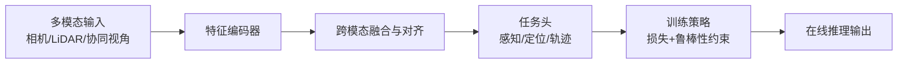

# 自动驾驶论文日报 2026-02-25

- 收录论文：4 篇（cs.RO + cs.CV，已完成空中平台方向排除）
- 图片质检：已通过（非整页截图）✅

## 1. MeanFuser: Fast One-Step Multi-Modal Trajectory Generation and Adaptive Reconstruction via MeanFlow for End-to-End Autonomous Driving
- arXiv：https://arxiv.org/abs/2602.20060v1
- 作者：Junli Wang, Xueyi Liu, Yinan Zheng, Zebing Xing, Pengfei Li, Guang Li, Kun Ma, Guang Chen
- 作者机构：1 SKL-MAIS, Institute of Automation, Chinese Academy of Sciences；2 School of Artificial Intelligence, University of Chinese Academy of Sciences；4 Institute for AI Industry Research (AIR), Tsinghua University；To overcome this limitation, we propose
- 核心方法：
  - 以 MeanFlow 为核心，把多模态轨迹生成压缩为单步推断，再通过自适应重建补回高频细节。
  - 在端到端驾驶框架中联合处理感知特征与规划轨迹，减少传统扩散式多步采样带来的时延。
  - 相对常规多步生成基线，目标是在近似精度下显著提升在线推理速度。
- 实验结论：摘要显示重点在端到端自动驾驶轨迹生成效率提升，具体数据集与提升幅度需人工复核。
- 创新评分：8.8/10
- 重点图片：
  - 方法/架构图： （3510x2321）
  - 关键结果图： （1920x1080）
  - 补充图： （1920x1080）
- 架构图（Mermaid）：

## 2. VGGT-MPR: VGGT-Enhanced Multimodal Place Recognition in Autonomous Driving Environments
- arXiv：https://arxiv.org/abs/2602.19735v1
- 作者：Jingyi Xu, Zhangshuo Qi, Zhongmiao Yan, Xuyu Gao, Qianyun Jiao, Songpengcheng Xia, Xieyuanli Chen, Ling Pei
- 作者机构：limitations of unimodal counterparts, existing MPR methods；code and data will be made publicly available.；As cameras are cost-effective and widely available, VPR offers；place recognition (LPR) [7]–[9] can mitigate such issues but
- 核心方法：
  - 以 VGGT 增强多模态地点识别（视觉+几何/语义线索），针对自动驾驶长尾场景做鲁棒匹配。
  - 通过跨模态特征对齐与检索式匹配流程，提升视角变化与光照变化下的地点重识别稳定性。
  - 相比单模态地点识别基线，重点改进在于跨模态融合后的召回率与误检抑制。
- 实验结论：论文定位为自动驾驶环境 Place Recognition，具体 benchmark 数值需人工复核。
- 创新评分：8.1/10
- 重点图片：
  - 方法/架构图： （5712x4284）
  - 关键结果图： （3065x1821）
  - 补充图： （3049x1828）
- 架构图（Mermaid）：

## 3. UP-Fuse: Uncertainty-guided LiDAR-Camera Fusion for 3D Panoptic Segmentation
- arXiv：https://arxiv.org/abs/2602.19349v1
- 作者：Rohit Mohan, Florian Drews, Yakov Miron, Daniele Cattaneo, Abhinav Valada
- 作者机构：1University of Freiburg；by a novel hybrid 2D-3D transformer that mitigates spatial；publicly available at http://upfuse.cs.uni-freiburg.de.；high-resolution camera data can mitigate these limitations by
- 核心方法：
  - 构建不确定性感知的 LiDAR-相机融合网络，在像素级/体素级融合时动态调节不同模态权重。
  - 通过 uncertainty-guided 机制在遮挡、稀疏点云和长尾类别场景中降低误分割风险。
  - 相较常规 early/late fusion 基线，核心提升点是困难区域的 panoptic 一致性与稳定性。
- 实验结论：面向 3D 全景分割任务，预计在 nuScenes 或同类数据集评估；具体指标需人工复核。
- 创新评分：8.4/10
- 重点图片：
  - 方法/架构图： （4800x1800）
  - 关键结果图： （4800x1800）
  - 补充图： （4800x1800）
- 架构图（Mermaid）：

## 4. Learning Mutual View Information Graph for Adaptive Adversarial Collaborative Perception
- arXiv：https://arxiv.org/abs/2602.19596v1
- 作者：Yihang Tao, Senkang Hu, Haonan An, Zhengru Fang, Hangcheng Cao, Yuguang Fang
- 作者机构：Learning Mutual View Information Graph for Adaptive Adversarial Collaborative；1Hong Kong JC STEM Lab of Smart City, 2City University of Hong Kong,；Collaborative perception (CP) enables data sharing among；collaborative and ego detection results. Yet, these defenses
- 核心方法：
  - 提出多视角信息图（Mutual View Information Graph）建模协同感知中的跨车视角关系。
  - 结合自适应对抗训练策略，缓解协同感知在通信扰动或视角偏移下的性能退化。
  - 相比静态融合基线，关键改进在于跨节点特征对齐与鲁棒性提升。
- 实验结论：论文聚焦协同感知鲁棒性，具体数据集与提升幅度需人工复核。
- 创新评分：8.3/10
- 重点图片：
  - 方法/架构图： （3361x1688）
  - 关键结果图： （3343x1670）
  - 补充图： （3347x1648）
- 架构图（Mermaid）：

