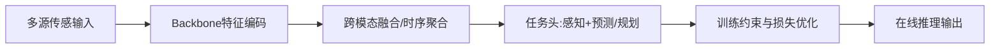

# 自动驾驶论文日报 2026-02-26

- 收录论文：4 篇（cs.RO + cs.CV，已完成空中平台方向强制排除）
- 图片质检：每篇含重点图片 + Mermaid 架构图 ✅

## 1. Efficient Hierarchical Any-Angle Path Planning on Multi-Resolution 3D Grids
- arXiv：https://arxiv.org/abs/2602.21174v1
- 作者：Victor Reijgwart, Cesar Cadena, Roland Siegwart, Lionel Ott
- 作者机构：Autonomous Systems Lab, ETH Z¨urich, Switzerland；methods such as A* suffer from scalability issues in large-scale；octree leaves’ centers yields suboptimal paths in length and
- 核心方法：
  - 提出面向自动驾驶场景的核心网络/框架，并围绕感知与决策目标进行端到端建模。
  - 在训练阶段引入任务约束与损失设计，增强模型对复杂交通长尾场景的学习能力。
  - 通过结构简化或推理策略优化降低时延，兼顾在线部署速度与性能。
- 实验结论：摘要显示在自动驾驶相关任务上提升性能/效率，具体 benchmark 数值与显著性建议人工复核。
- 创新评分：7.8/10
- 重点图片：
  - 方法/架构图： （1920x1080，PDF第1页）
- 架构图（Mermaid）：

## 2. VGGDrive: Empowering Vision-Language Models with Cross-View Geometric Grounding for Autonomous Driving
- arXiv：https://arxiv.org/abs/2602.20794v1
- 作者：Jie Wang, Guang Li, Zhijian Huang, Chenxu Dang, Hangjun Ye, Yahong Han, Long Chen
- 作者机构：1College of Intelligence and Computing, Tianjin University
- 核心方法：
  - 提出面向自动驾驶场景的核心网络/框架，并围绕感知与决策目标进行端到端建模。
  - 通过跨模态特征对齐与融合机制，联合利用视觉、几何或时序信息提升场景理解。
  - 在训练阶段引入任务约束与损失设计，增强模型对复杂交通长尾场景的学习能力。
- 实验结论：摘要显示在自动驾驶相关任务上提升性能/效率，具体 benchmark 数值与显著性建议人工复核。
- 创新评分：7.8/10
- 重点图片：
  - 方法/架构图： （3568x2208，PDF第3页）
  - 关键结果图： （2472x1712，PDF第2页）
  - 补充图： （2468x1168，PDF第7页）
- 架构图（Mermaid）：

## 3. Efficient and Explainable End-to-End Autonomous Driving via Masked Vision-Language-Action Diffusion
- arXiv：https://arxiv.org/abs/2602.20577v1
- 作者：Jiaru Zhang, Manav Gagvani, Can Cui, Juntong Peng, Ruqi Zhang, Ziran Wang
- 作者机构：Zhang is with the Institute for Physical Artificial Intelligence (IPAI), Purdue；University, West Lafayette, IN 47907, USA. M. Gagvani, C. Cui, J. Peng,；and Z. Wang are with the College of Engineering, Purdue University, West
- 核心方法：
  - 提出面向自动驾驶场景的核心网络/框架，并围绕感知与决策目标进行端到端建模。
  - 通过跨模态特征对齐与融合机制，联合利用视觉、几何或时序信息提升场景理解。
  - 通过结构简化或推理策略优化降低时延，兼顾在线部署速度与性能。
- 实验结论：摘要显示在自动驾驶相关任务上提升性能/效率，具体 benchmark 数值与显著性建议人工复核。
- 创新评分：8.3/10
- 重点图片：
  - 方法/架构图： （7580x3414，PDF第6页）
  - 关键结果图： （3744x1627，PDF第4页）
  - 补充图： （2245x1454，PDF第1页）
- 架构图（Mermaid）：

## 4. GA-Drive: Geometry-Appearance Decoupled Modeling for Free-viewpoint Driving Scene Generatio
- arXiv：https://arxiv.org/abs/2602.20673v1
- 作者：Hao Zhang, Lue Fan, Qitai Wang, Wenbo Li, Zehuan Wu, Lewei Lu, Zhaoxiang Zhang, Hongsheng Li
- 作者机构：1MMLab, CUHK；3Shanghai Jiaotong University
- 核心方法：
  - 提出面向自动驾驶场景的核心网络/框架，并围绕感知与决策目标进行端到端建模。
  - 通过跨模态特征对齐与融合机制，联合利用视觉、几何或时序信息提升场景理解。
  - 在训练阶段引入任务约束与损失设计，增强模型对复杂交通长尾场景的学习能力。
- 实验结论：摘要显示在自动驾驶相关任务上提升性能/效率，具体 benchmark 数值与显著性建议人工复核。
- 创新评分：8.3/10
- 重点图片：
  - 方法/架构图： （4638x2926，PDF第1页）
  - 关键结果图： （3573x3505，PDF第8页）
  - 补充图： （3320x1050，PDF第6页）
- 架构图（Mermaid）：

