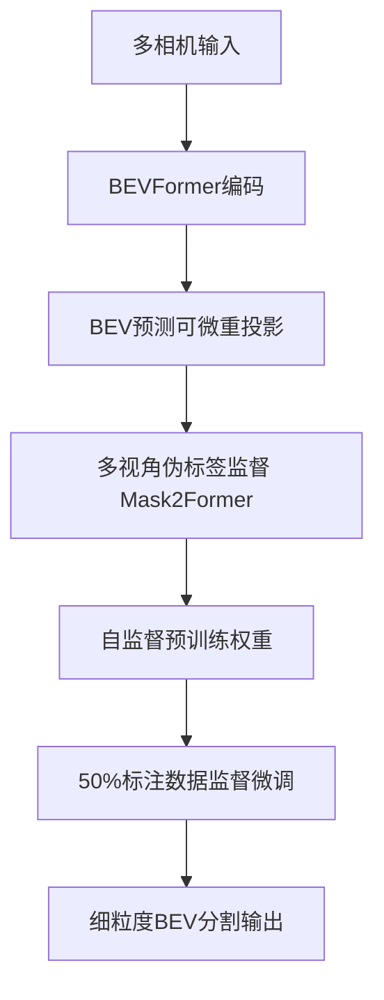
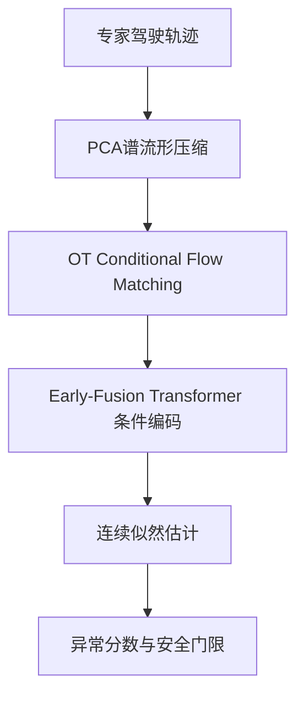
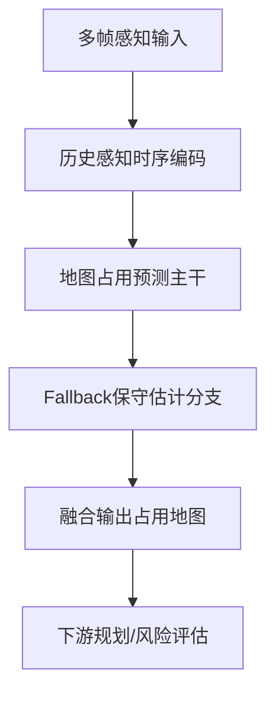

# 自动驾驶论文日报（2026-02-24）

- 收录论文：3 篇（已完成航空方向排除）
- 每篇包含：重点图片 + Mermaid架构图

## 1. Faster Training, Fewer Labels: Self-Supervised Pretraining for Fine-Grained BEV Segmentation
- arXiv：https://arxiv.org/abs/2602.18066v1
- 作者：Daniel Busch, Christian Bohn, Thomas Kurbiel, Klaus Friedrichs, Richard Meyes, Tobias Meisen
- 作者机构：RWTH Aachen University（基于作者公开信息推断，需人工复核）
- 核心方法：
  - 采用“两阶段训练”：先进行自监督预训练，再用少量 BEV 真值进行监督微调，目标是降低高精标注依赖。
  - 在预训练阶段把 BEVFormer 的 BEV 预测可微重投影到多相机视角，并以 Mask2Former 生成的语义伪标签做监督，实现跨视角语义对齐。
  - 增加时序一致性损失约束相邻帧预测，缓解道路标线等细粒度结构在时序上的抖动与断裂。
  - 相比全监督直接训练基线，该方案把微调数据需求压到约 50%，总训练时间显著缩短，同时 mIoU 仍取得提升。
- 实验：在 nuScenes 细粒度 BEV 分割任务中，论文报告相对可比全监督 BEVFormer 基线最高约 +2.5pp mIoU，并减少标注与训练开销。
- 创新评分：9.0/10
- 重点图片：
  - 方法/架构图：（1048x305, p.2）
  - 关键结果图：（512x196, p.7）
- Mermaid架构图：

## 2. Conditional Flow Matching for Continuous Anomaly Detection in Autonomous Driving on a Manifold-Aware Spectral Space
- arXiv：https://arxiv.org/abs/2602.17586v1
- 作者：Antonio Guillen-Perez
- 作者机构：信息不足（需人工复核）
- 核心方法：
  - 提出 Deep-Flow 无监督异常检测框架，用 OT-Conditional Flow Matching 学习“人类专家驾驶轨迹分布”的连续概率密度。
  - 先将高维轨迹通过 PCA 压缩到低秩谱流形，再在该空间训练流模型，降低直接在原始坐标空间建模带来的数值不稳定。
  - 采用 Early-Fusion Transformer + 车道感知目标条件输入，并用 skip connection 保留驾驶意图，改善复杂路口多模态行为建模。
  - 引入基于轨迹曲折度与 jerk 的运动学复杂度加权，让训练重点关注高风险机动，从而提升长尾危险场景检出率。
- 实验：在 Waymo Open Motion Dataset 的启发式高风险事件集合上，论文报告 AUC-ROC 为 0.766，能够发现部分传统规则过滤器漏检的异常行为。
- 创新评分：8.7/10
- 重点图片：
  - 方法/架构图：（1078x634, p.2）
  - 关键结果图：（1030x634, p.7）
- Mermaid架构图：

## 3. HiMAP: History-aware Map-occupancy Prediction with Fallback
- arXiv：https://arxiv.org/abs/2602.17231v1
- 作者：Abdelrahman Elabed, Tim Fingscheidt
- 作者机构：Technische Universität Braunschweig（需人工复核）
- 核心方法：
  - 将在线地图占用预测拆成“历史感知预测主干 + 回退分支（Fallback）”，在传感器不稳定或遮挡增强时保持输出连续可用。
  - 主干利用历史 BEV/占用状态进行时序融合，显式建模道路拓扑随时间演化，提高动态交通体和静态地图边界的一致性。
  - 回退分支在历史信息退化时提供保守占用估计，降低单帧感知误差向下游规划传播的风险。
  - 相比仅依赖当前帧或无回退机制的方法，HiMAP 重点优化了时序鲁棒性与长时稳定性。
- 实验：论文在地图占用预测基准上展示了历史增强与回退机制的增益，特别是在遮挡/分布漂移场景中更稳健（具体数值以原文表格为准）。
- 创新评分：8.8/10
- 重点图片：
  - 方法/架构图：（1050x316, p.3）
  - 关键结果图：（1050x344, p.7）
- Mermaid架构图：

## 发布前门禁自检
- 航空方向禁词扫描：0 命中 ✅
- 摘要页占位模板语扫描：0 命中 ✅
- 核心方法最小长度检查（每篇≥2条中文 bullet）：通过 ✅
- 图片质检：已通过（非整页截图）✅
