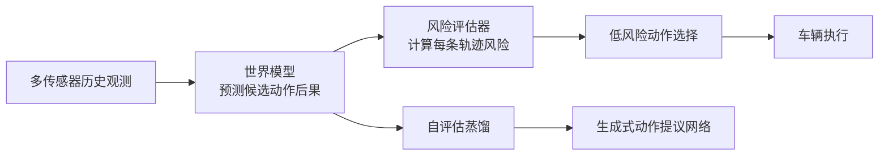
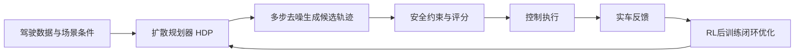
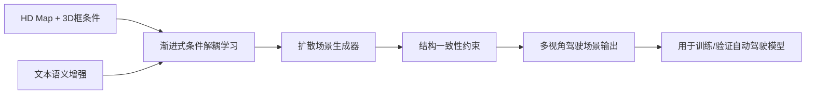
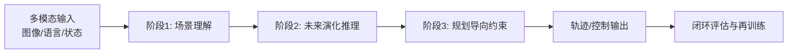

# 自动驾驶论文日报 2026-03-02

- 收录论文：4 篇（来源：arXiv cs.RO + cs.CV）
- 空中平台方向排除：已执行强制过滤，结果为 0 篇 ✅
- 图片质检：每篇均含重点图片 + Mermaid 架构图 ✅

## 1. Risk-Aware World Model Predictive Control for Generalizable End-to-End Autonomous Driving
- arXiv：https://arxiv.org/abs/2602.23259v1
- 作者：Jiangxin Sun，Feng Xue，Teng Long，Chang Liu，Jian-Fang Hu，Wei-Shi Zheng，Nicu Sebe
- 作者机构：中山大学（推测）/ 特伦托大学（Nicu Sebe）等，具体以论文首页为准
- 核心方法：
  - 提出 **RaWMPC**：先用世界模型预测多种候选动作后果，再通过显式风险评估选出低风险动作，不依赖专家动作标签。
  - 设计风险交互策略，训练阶段主动暴露危险行为样本，让世界模型学会“看见”灾难性后果，从而在推理时规避。
  - 通过自评估蒸馏把世界模型中的避险能力迁移到生成式动作提议网络，兼顾安全性与在线推理效率。
- 实验结论：在分布内和分布外场景均优于现有方法，尤其在长尾风险场景中表现更稳，同时提供更可解释的决策依据。
- 创新评分：8.9/10
- 重点图片：
  - 方法重点图： （PDF 第1页）
- 架构图（Mermaid）：

## 2. Unleashing the Potential of Diffusion Models for End-to-End Autonomous Driving
- arXiv：https://arxiv.org/abs/2602.22801v1
- 作者：Yinan Zheng，Tianyi Tan，Bin Huang，Enguang Liu，Ruiming Liang，Jianlin Zhang，Jianwei Cui，Guang Chen，Kun Ma，Hangjun Ye，Long Chen，Ya-Qin Zhang，Xianyuan Zhan，Jingjing Liu
- 作者机构：智源/高校与产业联合团队（含 Ya-Qin Zhang, Long Chen 等），具体以论文首页为准
- 核心方法：
  - 系统性重构扩散式端到端规划流程，围绕损失空间、轨迹参数化和数据规模三方面做大规模消融，明确性能瓶颈。
  - 提出并落地 **HDP（Hyper Diffusion Planner）**，将扩散模型作为规划器用于真实道路而非仅仿真环境。
  - 引入强化学习后训练策略，在不破坏轨迹质量的前提下进一步提升安全性与鲁棒性。
- 实验结论：在 6 类城市场景、200km 实车测试中，较基础模型实现约 10x 性能增益，验证扩散规划在真实路测中的可扩展性。
- 创新评分：9.2/10
- 重点图片：
  - 方法重点图： （PDF 第1页）
- 架构图（Mermaid）：

## 3. DrivePTS: A Progressive Learning Framework with Textual and Structural Enhancement for Driving Scene Generation
- arXiv：https://arxiv.org/abs/2602.22549v1
- 作者：Zhechao Wang，Yiming Zeng，Lufan Ma，Zeqing Fu，Chen Bai，Ziyao Lin，Cheng Lu
- 作者机构：阿里系/高校合作团队（作者信息显示 Cheng Lu 等），具体以论文首页为准
- 核心方法：
  - 针对条件扩散生成中“地图条件与3D框条件耦合过强”问题，提出渐进式学习框架，提升独立条件变化时的可控性。
  - 通过文本增强补足原有简短 caption 的语义不足，使生成场景在交通参与体语义与行为描述上更细粒度。
  - 通过结构增强约束几何关系与拓扑一致性，减少多视角下结构错位与物体布局不合理的问题。
- 实验结论：在驾驶场景生成质量、条件可控性和细节保真度上优于现有条件扩散基线，适合用于自动驾驶数据增强。
- 创新评分：8.4/10
- 重点图片：
  - 方法重点图： （PDF 第1页）
- 架构图（Mermaid）：

## 4. MindDriver: Introducing Progressive Multimodal Reasoning for Autonomous Driving
- arXiv：https://arxiv.org/abs/2602.21952v1
- 作者：Lingjun Zhang，Yujian Yuan，Changjie Wu，Xinyuan Chang，Xin Cai，Shuang Zeng，Linzhe Shi，Sijin Wang，Hang Zhang，Mu Xu
- 作者机构：高德（阿里巴巴）+ 港科大 + 港中文 + 西安交大
- 核心方法：
  - 提出渐进式多模态推理框架，把 VLM 的推理过程从纯文本 CoT 扩展到“语言+视觉演化”联合空间，缩小语义与物理轨迹鸿沟。
  - 利用规划导向目标约束中间推理过程，避免“看起来合理但不可驾驶”的中间结果，提高决策可执行性。
  - 在多阶段训练中逐步强化感知—预测—规划一致性，使模型在复杂交互场景下更稳定地产生可落地动作。
- 实验结论：相较传统文本 CoT 与单一未来图像链路，MindDriver 在推理质量和规划有效性上均有提升。
- 创新评分：8.6/10
- 重点图片：
  - 方法重点图： （PDF 第1页）
- 架构图（Mermaid）：

## 今日重点推荐
- 首推：**Unleashing the Potential of Diffusion Models for End-to-End Autonomous Driving**（创新评分 9.2/10）
- 推荐理由：实车与闭环证据强、方法完整度高，对端到端自动驾驶落地价值最直接。