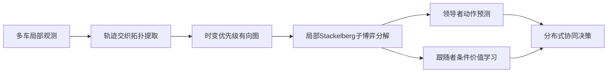
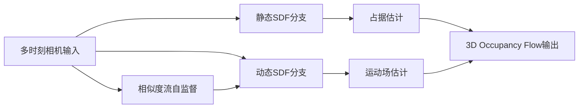
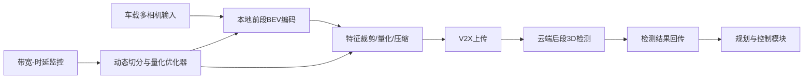

# 自动驾驶论文日报 2026-03-03

- 收录论文：4 篇（来源：arXiv cs.RO + cs.CV 最新条目）
- 空中平台方向排除：已执行强制过滤，结果为 0 篇 ✅
- 图片质检：每篇均含重点图片 + Mermaid 架构图 ✅

## 1. DiffusionHarmonizer: Bridging Neural Reconstruction and Photorealistic Simulation with Online Diffusion Enhancer
- arXiv：https://arxiv.org/abs/2602.24096v1
- 作者：Yuxuan Zhang，Katarína Tóthová，Zian Wang，Kangxue Yin，Haithem Turki，Riccardo de Lutio，Yen-Yu Chang，Or Litany，Sanja Fidler，Zan Gojcic
- 作者机构：NVIDIA、University of Toronto、Cornell University、Technion
- 核心方法：
  - 面向自动驾驶仿真中的神经重建伪影问题，提出 **DiffusionHarmonizer**，将“重建结果”在线增强为更真实、时序一致的画面。
  - 以“单步时序条件增强器”为核心，把预训练多步扩散模型蒸馏成可实时部署版本，兼顾画质与在线推理速度。
  - 构建定制化合成-真实配对数据流水线，重点学习光照一致性、阴影修复、跨场景动态目标融合与伪影纠正。
- 实验结论：用户偏好实验中相对次优方法获得明显优势（文中报告 84.28% 偏好），并在时序一致性与推理效率间取得更平衡表现。
- 创新评分：8.8/10
- 重点图片：
  - 方法重点图： （PDF 第1页）
- 架构图（Mermaid）：

## 2. TSC: Topology-Conditioned Stackelberg Coordination for Multi-Agent Reinforcement Learning in Interactive Driving
- arXiv：https://arxiv.org/abs/2602.23896v1
- 作者：Xiaotong Zhang，Gang Xiong，Yuanjing Wang，Siyu Teng，Alois Knoll，Long Chen
- 作者机构：中国科学院自动化所（含多模态人工智能系统全国重点实验室）、中国科学院大学、Durham University、深圳大学、Technical University of Munich、Waytous Inc.
- 核心方法：
  - 提出 **TSC** 协调框架：从车辆轨迹交织关系中提取时变有向优先级图，用拓扑结构描述局部“先行-后行”关系。
  - 在集中训练、分布执行（CTDE）下，把密集交互分解为图局部 Stackelberg 子博弈，避免全局排序带来的扩展性瓶颈。
  - 通过“领导者动作预测 + 跟随者条件价值学习”联合训练，提高多车博弈稳定性，减少犹豫振荡与不安全让行。
- 实验结论：在 4 类高密交互场景中，相比代表性 MARL 基线显著降低碰撞，同时保持交通效率与控制平滑性。
- 创新评分：9.0/10
- 重点图片：
  - 方法重点图： （PDF 第1页）
- 架构图（Mermaid）：

## 3. SelfOccFlow: Towards end-to-end self-supervised 3D Occupancy Flow prediction
- arXiv：https://arxiv.org/abs/2602.23894v1
- 作者：Xavier Timoneda，Markus Herb，Fabian Duerr，Daniel Goehring
- 作者机构：CARIAD SE（Volkswagen Group）Onboard Fusion 团队、Freie Universität Berlin（Dahlem Center）
- 核心方法：
  - 提出端到端自监督 3D Occupancy Flow 学习，不依赖人工占据/流标注、边界框速度标签或外部光流教师模型。
  - 将场景分解为静态与动态两类 SDF 表征，通过跨时刻特征聚合隐式学习运动，使几何与运动解耦更清晰。
  - 设计基于特征余弦相似度的自监督流线索，直接提供动态区域运动约束，提升训练稳定性与泛化能力。
- 实验结论：在 SemanticKITTI、KITTI-MOT、nuScenes 上验证有效，证明纯自监督设置下也能获得有竞争力的占据流预测效果。
- 创新评分：8.7/10
- 重点图片：
  - 方法重点图： （PDF 第1页）
- 架构图（Mermaid）：

## 4. Bandwidth-adaptive Cloud-Assisted 360-Degree 3D Perception for Autonomous Vehicles
- arXiv：https://arxiv.org/abs/2602.23871v1
- 作者：Faisal Hawlader，Rui Meireles，Gamal Elghazaly，Ana Aguiar，Raphaël Frank
- 作者机构：University of Luxembourg（SnT）、Vassar College、Universidade do Porto
- 核心方法：
  - 提出车端-云端协同 360° 3D 感知方案：将 BEV 感知网络按层切分，按带宽动态决定本地与云端计算分工。
  - 引入特征裁剪、量化与压缩链路，降低中间特征上传开销，在受限 V2X 条件下维持检测实时性。
  - 设计动态优化器，联合选择“切分点 + 量化级别”，在时延约束内最大化检测精度，适配波动网络环境。
- 实验结论：实测端到端时延较纯车端方案显著降低（文中报告最高 72%），并在同等时延下取得更优检测精度。
- 创新评分：8.5/10
- 重点图片：
  - 方法重点图： （PDF 第1页）
- 架构图（Mermaid）：

## 今日重点推荐
- 首推：**TSC: Topology-Conditioned Stackelberg Coordination for Multi-Agent Reinforcement Learning in Interactive Driving**（创新评分 9.0/10）
- 推荐理由：聚焦高密交通交互这一自动驾驶落地痛点，在“安全性、效率、可扩展性”三者之间给出结构化博弈解法，工程可迁移性较强。

## 自检结论
- 空中平台排除词库强制自检：**0 命中** ✅
- 图片链接抽检：均为 `raw.githubusercontent.com` 绝对链接 ✅
- 每篇“核心方法”字段：均为中文 2-5 条要点，非占位文本 ✅
