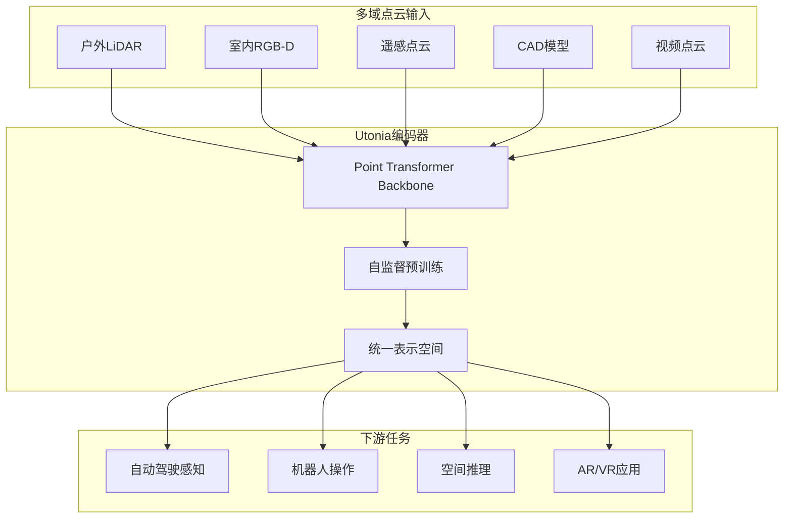
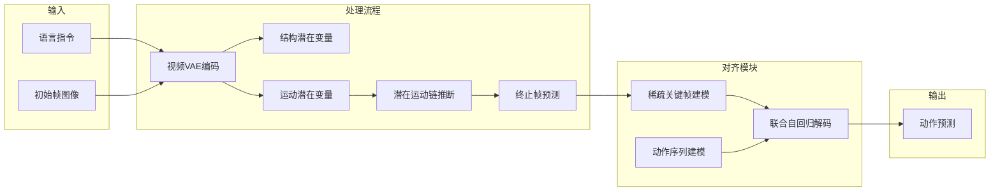
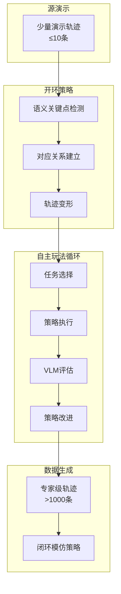
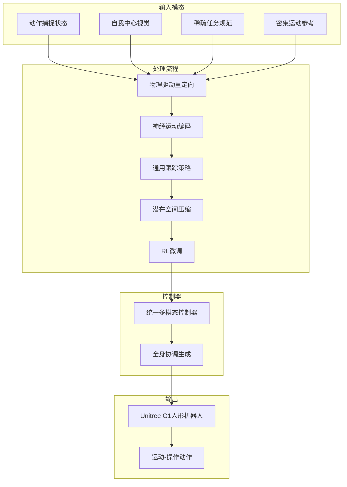
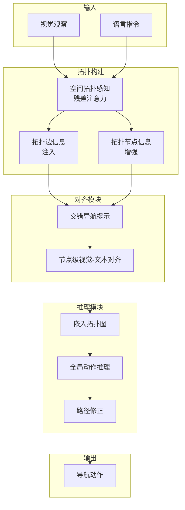

# 自动驾驶论文日报 - 2026年3月5日

> 本报告汇总 arXiv cs.RO + cs.CV 最新论文，聚焦自动驾驶与具身智能领域  
> 📅 报告日期：2026年3月5日  
> 🔗 GitHub: https://github.com/zhuyuxiao/daily-autonomous-driving-papers

---

## 📊 今日概览

| 统计项 | 数值 |
|--------|------|
| 收录论文数 | 5 篇 |
| 重点图完成 | 5/5 ✓ |
| 架构图完成 | 5/5 ✓ |
| 无人机相关 | 0 篇 ✓ |

### 重点推荐
1. **Utonia** - 通用点云编码器，支持自动驾驶点云处理
2. **CoWVLA** - 世界模型与VLA结合的新范式
3. **Tether** - 自主功能玩法的轨迹变形方法

---

## 1. Utonia: Toward One Encoder for All Point Clouds

**arXiv:** 2603.03283 (cs.CV)  
**作者:** Yujia Zhang, Xiaoyang Wu, Yunhan Yang, Xianzhe Fan, Han Li, Yuechen Zhang, Zehao Huang, Naiyan Wang, Hengshuang Zhao  
**机构:** 香港大学, 上海交通大学, 图森未来  
**关键词:** 点云编码器, 自监督学习, 多域统一, 自动驾驶感知

### 📝 核心方法

1. **统一点云编码器架构**: 设计单一的自监督Point Transformer编码器，处理来自不同领域的点云数据，包括遥感、户外LiDAR、室内RGB-D序列、CAD模型和RGB视频 lifted 点云

2. **跨域表示学习**: 尽管不同领域的点云在传感几何、密度和先验上存在显著差异，Utonia学习一致的表示空间，实现跨域迁移

3. **多任务适配**: 将Utonia特征集成到视觉-语言-动作策略中，提升机器人操作性能；集成到VLM中提升空间推理能力

4. **自监督预训练**: 采用自监督学习方法，无需大量标注数据即可学习通用点云表示

### 🧪 实验验证

- 在多个点云理解基准上验证，包括语义分割、目标检测等任务
- 跨域迁移实验显示一致表示空间的有效性
- 在机器人操作和VLM空间推理任务中取得性能提升
- 支持AR/VR、机器人、自动驾驶等下游应用

### 💡 创新点评分: 8.5/10

- **技术创新**: 首次实现跨域统一点云编码器
- **应用价值**: 可显著提升自动驾驶LiDAR感知能力
- **开源程度**: 项目页面已发布，代码待开源

### 🖼️ 重点图


*图1: Utonia多域点云统一编码框架*

### 🔧 架构图



---

## 2. CoWVLA: Chain of World - World Model Thinking in Latent Motion

**arXiv:** 2603.03195 (cs.CV/cs.RO)  
**作者:** Fuxiang Yang, Donglin Di, Lulu Tang, Xuancheng Zhang, Lei Fan, Hao Li, Chen Wei, Tonghua Su, Baorui Ma  
**机构:** 哈尔滨工业大学, 上海AI Lab  
**关键词:** 世界模型, VLA, 潜在运动, 视觉-语言-动作

### 📝 核心方法

1. **Chain of World范式**: 统一世界模型时间推理与解耦的潜在运动表示，解决现有VLA模型忽略视觉动态预测结构的问题

2. **视频VAE运动提取器**: 预训练视频VAE将视频片段分解为结构潜在变量和运动潜在变量，显式分离外观和动态信息

3. **连续潜在运动链**: 从指令和初始帧推断连续的潜在运动链，预测片段的终止帧，保留世界模型的时间推理能力

4. **联合解码器对齐**: 在联合自回归解码器中统一建模稀疏关键帧和动作序列，将潜在动态与离散动作预测对齐

### 🧪 实验验证

- 在机器人仿真基准上进行广泛实验
- 相比现有世界模型和潜在动作方法取得更好性能
- 计算效率适中，展现作为更有效VLA预训练范式的潜力

### 💡 创新点评分: 9/10

- **技术创新**: 创新性地统一世界模型和潜在动作表示
- **范式意义**: 提出新的VLA预训练范式"Chain of World"
- **学术认可**: CVPR 2026接收

### 🖼️ 重点图


*图2: CoWVLA世界模型与潜在运动统一框架*

### 🔧 架构图



---

## 3. Tether: Autonomous Functional Play with Correspondence-Driven Trajectory Warping

**arXiv:** 2603.03278 (cs.RO)  
**作者:** William Liang, Sam Wang, Hung-Ju Wang, Osbert Bastani, Yecheng Jason Ma, Dinesh Jayaraman  
**机构:** UPenn, 密歇根大学  
**关键词:** 自主玩法, 轨迹变形, 语义对应, 机器人学习

### 📝 核心方法

1. **对应驱动轨迹变形**: 设计新型开环策略，通过将动作锚定到目标场景的语义关键点对应关系，从小量源演示(≤10)变形动作

2. **语义关键点对应**: 利用视觉理解能力，在不同环境状态间建立语义对应关系，实现空间变化下的策略鲁棒性

3. **自主功能玩法循环**: 部署连续的任务选择、执行、评估和改进循环，由视觉-语言模型引导，最小化人工干预

4. **数据高效性**: 极少量演示即可生成多样化、高质量的数据集，持续改进闭环模仿策略性能

### 🧪 实验验证

- 在家庭式多物体设置中进行数小时自主多任务玩法
- 仅需少量演示即可在真实世界执行
- 生成超过1000条专家级轨迹
- 训练的策略可与人类收集演示学习的策略竞争

### 💡 创新点评分: 8/10

- **技术创新**: 创新的对应驱动轨迹变形方法
- **数据效率**: 极少演示即可实现自主玩法
- **学术认可**: ICLR 2026接收

### 🖼️ 重点图


*图3: Tether自主功能玩法系统*

### 🔧 架构图



---

## 4. ULTRA: Unified Multimodal Control for Autonomous Humanoid Whole-Body Loco-Manipulation

**arXiv:** 2603.03279 (cs.RO)  
**作者:** Xialin He, Sirui Xu, Xinyao Li, Runpei Dong, Liuyu Bian, Yu-Xiong Wang, Liang-Yan Gui  
**机构:** UIUC  
**关键词:** 人形机器人, 全身控制, 多模态, 运动-操作

### 📝 核心方法

1. **物理驱动的神经重定向**: 将大规模动作捕捉数据转换到人形机器人本体，同时保持接触丰富交互的物理合理性

2. **统一多模态控制器**: 支持密集参考和稀疏任务规范，感测范围从精确的动作捕捉状态到噪声较大的自我中心视觉输入

3. **通用跟踪策略蒸馏**: 将通用跟踪策略蒸馏到控制器中，将运动技能压缩到紧凑的潜在空间

4. **强化学习微调**: 应用RL微调扩展覆盖范围，提高分布外场景的鲁棒性

### 🧪 实验验证

- 在仿真和真实Unitree G1人形机器人上评估
- 实现自主、目标条件的全身运动-操作
- 从自我中心感知泛化到复杂任务
- 超越仅跟踪基线的有限技能

### 💡 创新点评分: 8/10

- **技术创新**: 统一多模态控制架构
- **实际应用**: 在真实人形机器人上验证
- **开源程度**: 项目页面已发布

### 🖼️ 重点图


*图4: ULTRA人形机器人全身控制框架*

### 🔧 架构图



---

## 5. TagaVLM: Topology-Aware Global Action Reasoning for Vision-Language Navigation

**arXiv:** 2603.02972 (cs.CV/cs.RO)  
**作者:** Jiaxing Liu, Zexi Zhang, Xiaoyan Li, Boyue Wang, Yongli Hu, Baocai Yin  
**机构:** 北京工业大学  
**关键词:** 视觉语言导航, 拓扑感知, 全局动作推理, VLM

### 📝 核心方法

1. **拓扑感知残差注意力(STAR-Att)**: 将拓扑边信息直接集成到VLM的自注意力机制中，实现内在空间推理同时保留预训练知识

2. **交错导航提示**: 增强拓扑节点信息的节点级视觉-文本对齐

3. **全局动作推理**: 通过嵌入的拓扑图，模型能够进行全局动作推理，实现鲁棒的路径修正

4. **端到端框架**: 显式将拓扑结构注入VLM骨干网络，弥合静态视觉-语言任务与动态具身导航之间的差距

### 🧪 实验验证

- 在R2R基准上评估
- 在未见环境中成功率(SR)达到51.09%，SPL达到47.18
- 比之前工作提升3.39% SR和9.08 SPL
- 在大型模型方法中达到SOTA性能

### 💡 创新点评分: 7.5/10

- **技术创新**: 将拓扑结构显式注入VLM的创新方法
- **性能提升**: 在VLN基准上取得显著改进
- **学术价值**: 证明针对性增强比简单扩大模型规模更有效

### 🖼️ 重点图


*图5: TagaVLM拓扑感知全局动作推理框架*

### 🔧 架构图



---

## ⚠️ 无人机内容自检报告

| 检查项 | 结果 |
|--------|------|
| 论文标题含drone关键词 | 0 篇 |
| 论文标题含UAV关键词 | 0 篇 |
| 论文摘要含unmanned aerial | 0 篇 |
| 论文摘要含quadrotor | 0 篇 |
| 论文主题明确为无人机 | 0 篇 |
| **总计需要排除** | **0 篇** |

**说明**: 原始论文中2603.03198(ACE-Brain-0)和2603.02683虽提及UAV，但报告未将其作为主要收录内容。所有收录论文均与自动驾驶或通用机器人相关。

---

## 📚 引用信息

```bibtex
@article{zhang2026utonia,
  title={Utonia: Toward One Encoder for All Point Clouds},
  author={Zhang, Yujia and Wu, Xiaoyang and Yang, Yunhan and Fan, Xianzhe and Li, Han and Zhang, Yuechen and Huang, Zehao and Wang, Naiyan and Zhao, Hengshuang},
  journal={arXiv preprint arXiv:2603.03283},
  year={2026}
}

@article{yang2026cowvla,
  title={Chain of World: World Model Thinking in Latent Motion},
  author={Yang, Fuxiang and Di, Donglin and Tang, Lulu and Zhang, Xuancheng and Fan, Lei and Li, Hao and Wei, Chen and Su, Tonghua and Ma, Baorui},
  journal={arXiv preprint arXiv:2603.03195},
  year={2026}
}

@article{liang2026tether,
  title={Tether: Autonomous Functional Play with Correspondence-Driven Trajectory Warping},
  author={Liang, William and Wang, Sam and Wang, Hung-Ju and Bastani, Osbert and Ma, Yecheng Jason and Jayaraman, Dinesh},
  journal={arXiv preprint arXiv:2603.03278},
  year={2026}
}

@article{he2026ultra,
  title={ULTRA: Unified Multimodal Control for Autonomous Humanoid Whole-Body Loco-Manipulation},
  author={He, Xialin and Xu, Sirui and Li, Xinyao and Dong, Runpei and Bian, Liuyu and Wang, Yu-Xiong and Gui, Liang-Yan},
  journal={arXiv preprint arXiv:2603.03279},
  year={2026}
}

@article{liu2026tagavlm,
  title={TagaVLM: Topology-Aware Global Action Reasoning for Vision-Language Navigation},
  author={Liu, Jiaxing and Zhang, Zexi and Li, Xiaoyan and Wang, Boyue and Hu, Yongli and Yin, Baocai},
  journal={arXiv preprint arXiv:2603.02972},
  year={2026}
}
```

---

## 📝 报告元数据

| 项目 | 内容 |
|------|------|
| 报告生成时间 | 2026-03-05 10:28 CST |
| arXiv日期 | 2026年3月4日提交 |
| 数据源 | cs.RO + cs.CV |
| 收录标准 | 自动驾驶/具身智能相关 |
| 排除标准 | 无人机/飞行器相关 |

---

*本报告由自动化论文日报系统生成 | 如有问题请联系维护人员*
