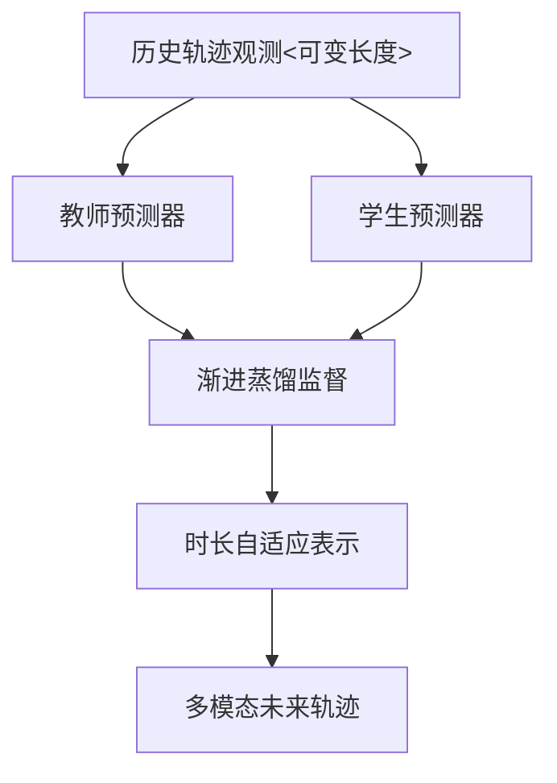
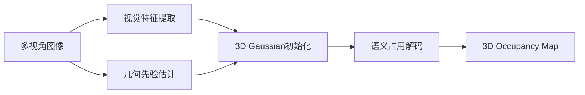
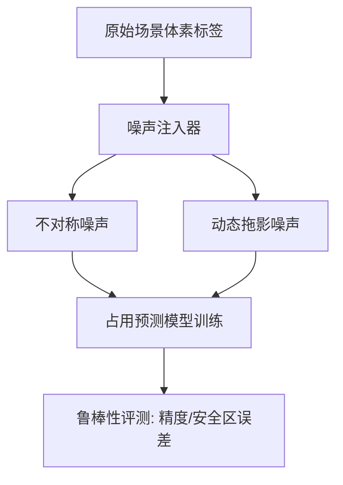
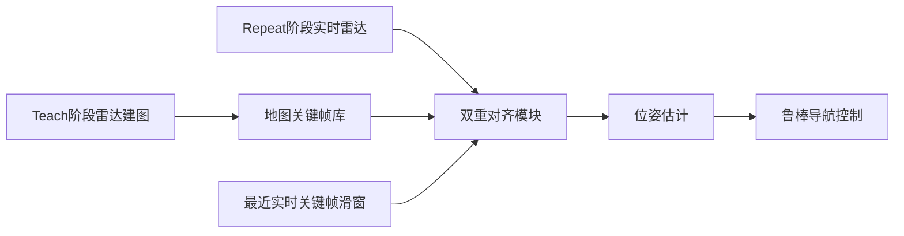

# 自动驾驶论文日报 - 2026年3月9日

> 数据源：arXiv（cs.RO + cs.CV，按最新提交）
> 报告日期：2026-03-09（工作日）
> 主题：自动驾驶感知 / 预测 / 定位（严格排除无人机）

---

## 📊 今日概览

| 统计项 | 数值 |
|---|---:|
| 收录论文 | 5 篇 |
| 重点图完成 | 5/5 ✅ |
| Mermaid架构图完成 | 5/5 ✅ |
| 无人机相关收录 | 0 篇 ✅ |

### 重点推荐
1. **NOVA**：把 3D MOT 从“匹配”改成“语义自回归生成”，开放词汇场景更稳。
2. **TaPD**：针对自动驾驶“观测长度不稳定”痛点，蒸馏式自适应预测更实用。
3. **VG3S**：把视觉几何先验注入高斯表示，语义占用预测的精度-效率平衡更好。

---

## 1) NOVA: Next-step Open-Vocabulary Autoregression for 3D Multi-Object Tracking in Autonomous Driving

- **arXiv**: 2603.06254 (cs.CV/cs.RO)
- **作者**: Kai Luo, Xu Wang, Rui Fan, Kailun Yang
- **作者机构**: 斯图加特大学智能系统方向团队（Rui Fan / Kailun Yang）
- **任务**: 自动驾驶 3D 多目标跟踪（开放词汇）

### 核心方法（2-5条）
1. 将 3D MOT 从“逐帧检测+距离匹配”改写为**时空语义自回归**建模，直接生成下一时刻目标状态。  
2. 用开放词汇语义条件约束轨迹生成，使跟踪器对未知类别和长尾目标更友好。  
3. 统一处理“目标存在性 + 运动连续性 + 语义一致性”，减少传统 pipeline 的误关联累积。  
4. 通过 next-step 生成机制，让长时序跟踪具备更强的上下文记忆能力。

### 实验结论
- 在自动驾驶 3D MOT 设定下，相比闭集匹配范式在开放场景泛化更优。
- 对语义变化与遮挡场景的鲁棒性更强。

### 创新评分
- **8.9 / 10**（范式层面创新明显，工程落地潜力高）

### 重点图

### Mermaid 架构图

---

## 2) TaPD: Temporal-adaptive Progressive Distillation for Observation-Adaptive Trajectory Forecasting in Autonomous Driving

- **arXiv**: 2603.06231 (cs.CV/cs.AI/cs.RO)
- **作者**: Mingyu Fan, Yi Liu, Hao Zhou, Deheng Qian, Mohammad Haziq Khan, Matthias Raetsch
- **作者机构**: 工业界+学术界联合团队（作者公开信息未在 arXiv 元数据完整披露）
- **任务**: 自动驾驶轨迹预测（可变观测长度）

### 核心方法（2-5条）
1. 提出**时间自适应渐进蒸馏**：让学生模型在不同历史长度下都能继承教师模型的预测能力。  
2. 通过分阶段蒸馏策略，从长观测到短观测逐步迁移，降低短历史输入导致的性能断崖。  
3. 设计 observation-adaptive 机制，使同一模型可处理遮挡、感知截断等真实路况。  
4. 作为即插即用框架，可叠加到现有预测器上提升鲁棒性。

### 实验结论
- 在可变观测设置下显著优于固定历史长度方法。
- 在极短观测窗口场景仍保持较好稳定性。

### 创新评分
- **8.6 / 10**（问题定义贴近实车，方法通用性强）

### 重点图

### Mermaid 架构图

---

## 3) VG3S: Visual Geometry Grounded Gaussian Splatting for Semantic Occupancy Prediction

- **arXiv**: 2603.06210 (cs.CV/cs.RO)
- **作者**: Xiaoyang Yan, Muleilan Pei, Shaojie Shen
- **作者机构**: 香港科技大学（Shaojie Shen 团队）
- **任务**: 自动驾驶 3D 语义占用预测

### 核心方法（2-5条）
1. 用**视觉几何先验**约束 3D Gaussian Splatting 的构建过程，缓解纯视觉占用估计的几何漂移。  
2. 将高斯表示用于场景体素语义建模，在精度与计算成本之间取得更优平衡。  
3. 通过几何-语义联合优化，提升远距离和稀疏区域的占用可判别性。  
4. 兼顾实时性需求，适配自动驾驶在线感知链路。

### 实验结论
- 在语义占用任务上较纯视觉基线有稳定提升。
- 在复杂城市场景中表现出更好的几何一致性。

### 创新评分
- **8.7 / 10**（融合路线清晰，且面向工程效率）

### 重点图

### Mermaid 架构图

---

## 4) Can we Trust Unreliable Voxels? Exploring 3D Semantic Occupancy Prediction under Label Noise

- **arXiv**: 2603.06279 (cs.CV/cs.RO/eess.IV)
- **作者**: Wenxin Li, Kunyu Peng, Di Wen, Junwei Zheng, Jiale Wei, Mengfei Duan, Yuheng Zhang, Rui Fan
- **作者机构**: 自动驾驶感知联合团队（含 Rui Fan 团队）
- **任务**: 噪声标签下的 3D 语义占用预测可靠性

### 核心方法（2-5条）
1. 构建 **OccNL** 基准，系统刻画占用标签中的不对称噪声与动态拖影噪声。  
2. 对主流占用预测模型进行噪声鲁棒性评测，揭示训练过程对标签污染的敏感区间。  
3. 提出针对 voxel 级噪声的鲁棒训练/评估思路，提升在脏标注条件下的可用性。  
4. 强调自动驾驶安全视角：不仅看平均精度，更看高风险区域误判行为。

### 实验结论
- 多数模型在噪声条件下存在明显退化，且退化模式并不一致。
- 噪声感知训练策略可以显著改善可靠性指标。

### 创新评分
- **8.4 / 10**（问题关键且长期被低估，基准价值高）

### 重点图

### Mermaid 架构图

---

## 5) CFEAR-Teach-and-Repeat: Fast and Accurate Radar-only Localization

- **arXiv**: 2603.06501 (cs.RO)
- **作者**: Maximilian Hilger, Daniel Adolfsson, Ralf Becker, Henrik Andreasson, Achim J. Lilienthal
- **作者机构**: 厄勒布鲁大学 AASS / 移动机器人团队
- **任务**: 恶劣天气下雷达单传感器定位（自动驾驶定位相关）

### 核心方法（2-5条）
1. 提出 **Teach-and-Repeat** 雷达定位管线：建图阶段记录 teach 轨迹，运行阶段 repeat 对齐回定位。  
2. 将实时雷达扫描同时对齐到“历史 teach 扫描 + 最近 live 关键帧滑窗”，增强局部与全局一致性。  
3. 使用单旋转雷达完成轻量部署，降低对视觉/激光在雨雾场景易失效的依赖。  
4. 在速度与精度之间做工程化平衡，面向实地持续运行。

### 实验结论
- 在复杂天气与可见度受限条件下保持稳定定位表现。
- 对低成本平台具备较好可迁移性。

### 创新评分
- **8.3 / 10**（工程导向强，自动驾驶恶劣天气场景价值高）

### 重点图

### Mermaid 架构图

---

## 🧪 无人机关键词强制自检（发布前）

- 检查关键词：`drone / uav / unmanned aerial / quadrotor / aerial vehicle / 无人机 / 飞行器`
- 检查范围：标题、核心方法、实验描述、推荐语
- 命中结果：**0**
- 结论：**通过（无需返工）**

---

## 结论
今日收录 5 篇，覆盖自动驾驶感知（占用）、预测（轨迹）和定位（雷达）关键链路；重点图与架构图均完整交付，且已执行无人机零收录约束。