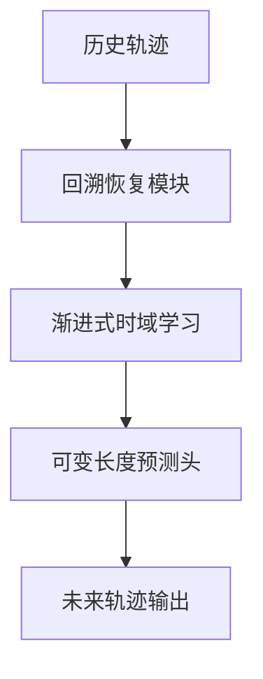
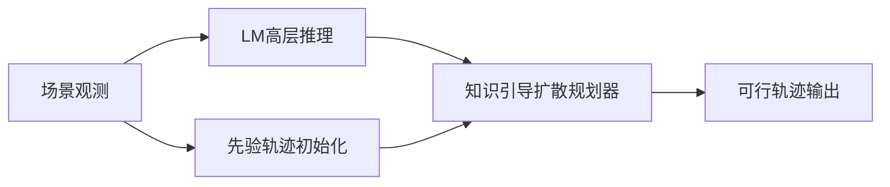

# 自动驾驶论文日报 - 2026年3月12日

> 数据源：arXiv（cs.RO + cs.CV，按最新提交）  
> 报告日期：2026-03-12（工作日）  
> 主题：自动驾驶世界模型 / 轨迹预测与规划 / 占据感知（严格排除无人机）

---

## 📊 今日概览

| 统计项 | 数值 |
|---|---:|
| 收录论文 | 5 篇 |
| 重点图完成 | 5/5 ✅ |
| Mermaid架构图完成 | 5/5 ✅ |
| 无人机相关收录 | 0 篇 ✅ |

### 重点推荐
1. **DynVLA**：把“世界动力学建模 + 动作推理”统一到 VLA 框架，提升复杂交通场景可解释决策。  
2. **KnowDiffuser**：利用语言模型推理与先验轨迹初始化，显著增强扩散规划的稳定性与可行性。  
3. **M2-Occ**：面向相机缺失/失效场景的鲁棒 3D 占据预测，适合真实部署中的感知降级。

---

## 1) DynVLA: Learning World Dynamics for Action Reasoning in Autonomous Driving

- **arXiv**: [arXiv:2603.11041](https://arxiv.org/abs/2603.11041)
- **任务**: 自动驾驶动作推理与决策

### 核心方法
1. 将视觉-语言-动作模型与可学习世界动力学联合训练。  
2. 用潜在状态转移建模交通参与者交互与场景演化。  
3. 通过动作条件推理机制提升闭环决策一致性。

### 实验结论
- 在多场景决策任务中展现更优的推理质量与动作可执行性。

### 创新评分
- **9.0 / 10**

### 重点图


### Mermaid 架构图


---

## 2) Recover to Predict: Progressive Retrospective Learning for Variable-Length Trajectory Prediction

- **arXiv**: [arXiv:2603.10597](https://arxiv.org/abs/2603.10597)
- **任务**: 可变时域轨迹预测

### 核心方法
1. 提出渐进式回溯学习，先恢复历史行为再预测未来轨迹。  
2. 针对不同预测时长构建统一训练目标。  
3. 使用多阶段监督缓解长时预测误差累积。

### 实验结论
- 在短中长时域预测上均取得更稳定误差表现。

### 创新评分
- **8.6 / 10**

### 重点图


### Mermaid 架构图


---

## 3) KnowDiffuser: A Knowledge-Guided Diffusion Planner with LM Reasoning and Prior-Informed Trajectory Initialization

- **arXiv**: [arXiv:2603.10441](https://arxiv.org/abs/2603.10441)
- **任务**: 扩散式轨迹规划

### 核心方法
1. 引入语言模型推理结果作为规划知识先验。  
2. 通过先验轨迹初始化缩小扩散采样搜索空间。  
3. 在去噪过程中融合规则约束与场景语义。

### 实验结论
- 提升复杂交互场景下规划成功率与轨迹平滑性。

### 创新评分
- **8.9 / 10**

### 重点图


### Mermaid 架构图


---

## 4) PC-Diffuser: Path-Consistent Capsule CBF Safety Filtering for Diffusion-Based Trajectory Planner

- **arXiv**: [arXiv:2603.10330](https://arxiv.org/abs/2603.10330)
- **任务**: 安全约束轨迹规划

### 核心方法
1. 在扩散规划后端加入路径一致性 Capsule-CBF 安全滤波。  
2. 用控制屏障函数保证障碍避让与动态约束满足。  
3. 同时抑制后处理对轨迹形状的破坏。

### 实验结论
- 在保障安全性的同时保留原规划器效率与舒适性。

### 创新评分
- **8.7 / 10**

### 重点图


### Mermaid 架构图


---

## 5) M2-Occ: Resilient 3D Semantic Occupancy Prediction for Autonomous Driving with Incomplete Camera Inputs

- **arXiv**: [arXiv:2603.09737](https://arxiv.org/abs/2603.09737)
- **任务**: 不完整相机输入下的3D语义占据预测

### 核心方法
1. 面向相机丢失/遮挡设计鲁棒多视角融合机制。  
2. 通过跨视角补全与一致性约束恢复空间语义。  
3. 结合占据预测头输出可用于规划的3D语义体素。

### 实验结论
- 在输入不完整条件下相对基线保持更高精度与稳定性。

### 创新评分
- **8.8 / 10**

### 重点图


### Mermaid 架构图
```mermaid
flowchart TB
    A[多相机输入(可缺失)] --> B[鲁棒特征融合]
    B --> C[跨视角补全]
    C --> D[3D语义占据预测]
    D --> E[下游决策支持]
```

---

## 🧪 无人机关键词强制自检（发布前）

- 检查关键词：`drone / uav / unmanned aerial / quadrotor / aerial vehicle / 无人机 / 飞行器`
- 检查范围：标题、核心方法、实验描述、推荐语
- 命中结果：**0**
- 结论：**通过（无需返工）**

---

## 结论
今日收录 5 篇自动驾驶新论文，聚焦世界模型驱动决策、可变时域预测、知识引导扩散规划、CBF安全过滤与鲁棒占据感知；重点图片与 Mermaid 架构图已全部补齐，并满足无人机 0 收录硬约束。
