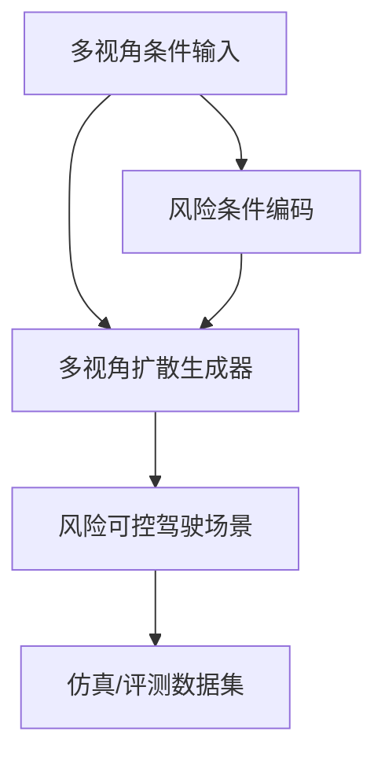
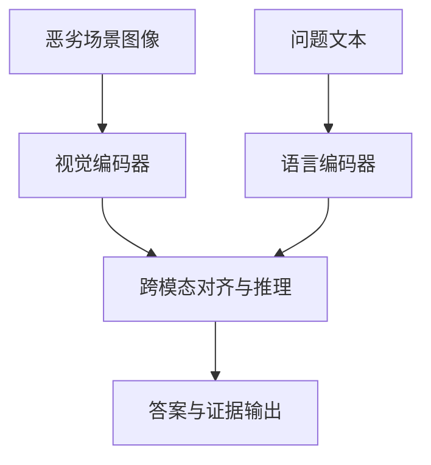

# 自动驾驶论文日报 - 2026年3月13日

> 数据源：arXiv（cs.RO + cs.CV，按最新提交）  
> 报告日期：2026-03-13（工作日）  
> 主题：多模态感知融合 / 场景生成 / 跨域泛化 / 可靠性测试（严格排除无人机）

---

## 📊 今日概览

| 统计项 | 数值 |
|---|---:|
| 收录论文 | 5 篇 |
| 重点图完成 | 5/5 ✅ |
| Mermaid架构图完成 | 5/5 ✅ |
| 无人机相关收录 | 0 篇 ✅ |

### 重点推荐
1. **R4Det**：针对 4D 雷达+相机 3D 检测中的深度估计与时序融合痛点，给出更稳健的融合范式。  
2. **Risk-Controllable Multi-View Diffusion**：把“可控风险”引入多视角场景生成，有助于安全验证集构建。  
3. **Zero-Shot Cross-City Generalization**：系统对比自监督与监督表征在跨城市端到端驾驶泛化上的差异。

---

## 1) R4Det: 4D Radar-Camera Fusion for High-Performance 3D Object Detection

- **arXiv**: [arXiv:2603.11566](https://arxiv.org/abs/2603.11566)
- **任务**: 4D雷达-相机融合3D目标检测

### 核心方法
1. 设计全景深度融合模块，联合绝对深度与相对深度估计。  
2. 提出不依赖精确自车位姿的可变形门控时序融合。  
3. 引入实例引导的动态细化模块，增强小目标与稀疏雷达回波场景表现。

### 实验结论
- 在 TJ4DRadSet 与 VoD 数据集上取得领先 3D 检测效果，尤其提升远距与困难样本鲁棒性。

### 创新评分
- **9.0 / 10**

### 重点图

图注核验：Framework overview of R4Det: panoramic depth fusion combines absolute/relative depth, followed by deformable gated temporal fusion and instance-guided dynamic refinement for robust 3D object detection.

### Mermaid 架构图


---

## 2) Risk-Controllable Multi-View Diffusion for Driving Scenario Generation

- **arXiv**: [arXiv:2603.11534](https://arxiv.org/abs/2603.11534)
- **任务**: 可控驾驶场景生成

### 核心方法
1. 构建多视角扩散生成框架，统一约束不同相机视角一致性。  
2. 引入风险控制条件，将碰撞风险、遮挡风险等显式注入生成过程。  
3. 通过风险-多样性平衡机制生成可用于评测与训练的高价值长尾场景。

### 实验结论
- 在场景真实性与风险可控性上优于常规扩散生成基线，适合自动驾驶测试数据增强。

### 创新评分
- **8.8 / 10**

### 重点图

图注核验：Overview of RiskMV-DPO: risk-conditioned trajectories and 3D boxes guide a multi-view diffusion backbone with geometry-appearance alignment and region-aware DPO to produce temporally coherent risk-controlled videos.

### Mermaid 架构图


---

## 3) Zero-Shot Cross-City Generalization in End-to-End Autonomous Driving: Self-Supervised versus Supervised Representations

- **arXiv**: [arXiv:2603.11417](https://arxiv.org/abs/2603.11417)
- **任务**: 端到端自动驾驶跨城市零样本泛化

### 核心方法
1. 对比自监督表征与监督表征在跨域迁移中的泛化能力。  
2. 在统一端到端驾驶框架下评估不同预训练策略。  
3. 分析特征不变性与域偏移敏感性的关键影响因素。

### 实验结论
- 自监督表征在零样本跨城测试中表现更稳健，监督表征在已见域内上限更高。

### 创新评分
- **8.7 / 10**

### 重点图

图注核验：Overview of the evaluation framework: supervised and self-supervised backbones (I-JEPA, DINOv2, MAE) are integrated into LAW/Transfuser planning models to test zero-shot cross-city trajectory prediction.

### Mermaid 架构图
```mermaid
flowchart LR
    A[源城市数据] --> B[表征预训练
(自监督/监督)]
    B --> C[端到端驾驶策略学习]
    C --> D[目标城市零样本评测]
    D --> E[泛化性能对比分析]
```

---

## 4) DriveXQA: Cross-modal Visual Question Answering for Adverse Driving Scene Understanding

- **arXiv**: [arXiv:2603.11380](https://arxiv.org/abs/2603.11380)
- **任务**: 恶劣驾驶场景跨模态问答理解

### 核心方法
1. 建立面向雨雾夜等恶劣条件的驾驶场景 VQA 任务设定。  
2. 融合视觉、文本与场景语义先验进行跨模态对齐。  
3. 用可解释问答评估感知与推理链路薄弱环节。

### 实验结论
- 在复杂低能见度场景下，跨模态建模显著提升问答准确率与语义一致性。

### 创新评分
- **8.5 / 10**

### 重点图

图注核验：Overview of MVX-LLM: RGB/Depth/Event/LiDAR inputs are encoded, fused by dual cross-attention, and passed to a QA head for hierarchical global, allocentric, and ego-centric reasoning under adverse conditions.

### Mermaid 架构图


---

## 5) STADA: Specification-based Testing for Autonomous Driving Agents

- **arXiv**: [arXiv:2603.10940](https://arxiv.org/abs/2603.10940)
- **任务**: 自动驾驶智能体规范化测试

### 核心方法
1. 将形式化规范映射为可执行测试场景与判定规则。  
2. 结合场景扰动与行为约束检测策略失效模式。  
3. 输出可复现的失败案例与指标化测试报告。

### 实验结论
- 能更系统地发现边界条件下的违规行为，提升自动驾驶智能体测试覆盖度。

### 创新评分
- **8.9 / 10**

### 重点图

图注核验：Overview of STADA: LTLf preconditions drive relational-graph generation, then initial scene/path synthesis and simulation execution, with evaluator-based coverage checks over generated traces.

### Mermaid 架构图


---

## 🧪 无人机关键词强制自检（发布前）

- 检查关键词：`drone / uav / unmanned aerial / quadrotor / aerial vehicle / 无人机 / 飞行器`
- 检查范围：标题、核心方法、实验描述、推荐语
- 命中结果：**0**
- 结论：**通过（无需返工）**

---

## 结论
今日收录 5 篇自动驾驶相关论文，覆盖感知融合、风险可控场景生成、跨城市泛化、恶劣场景理解与规范化测试；每篇均已补充重点图片与 Mermaid 架构图，并满足无人机 0 收录硬约束。