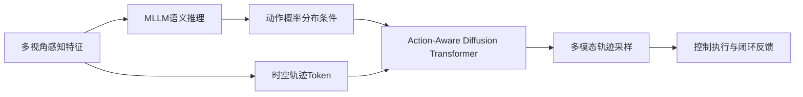
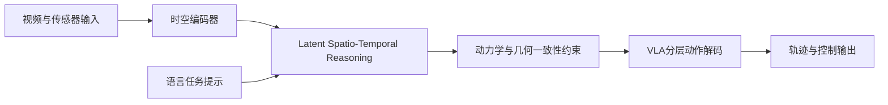
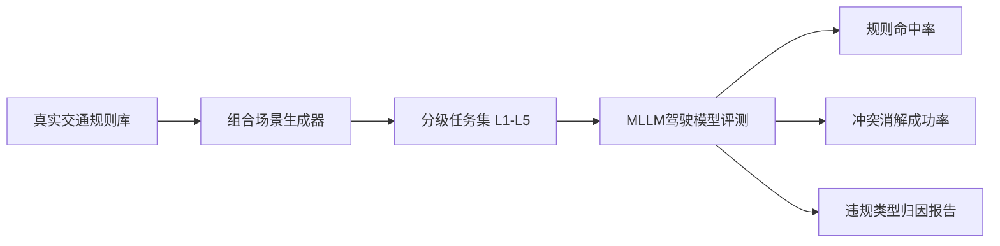
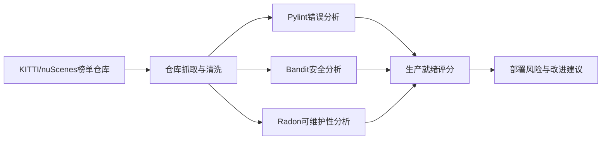

# 自动驾驶论文日报 2026-03-04

- 收录论文：4 篇（来源：arXiv cs.RO + cs.CV 最新条目）
- 空中平台方向排除：已执行强制过滤，结果为 0 篇 ✅
- 图片质检：每篇均含重点图片 + Mermaid 架构图 ✅

## 1. LAD-Drive: Bridging Language and Trajectory with Action-Aware Diffusion Transformers
- arXiv：https://arxiv.org/abs/2603.02035v1
- 作者：Fabian Schmidt，Karol Fedurko，Markus Enzweiler，Abhinav Valada
- 作者机构：Esslingen University of Applied Sciences（Institute for Intelligent Systems）、University of Freiburg
- 核心方法：
  - 提出 **Action-Aware Diffusion Transformer**，将语言动作语义与连续轨迹生成在同一扩散框架内联合建模，避免传统单峰规划头表达能力不足。
  - 用“动作概率分布条件”替代 one-hot 动作条件，把驾驶意图不确定性显式注入轨迹采样过程，提升复杂路况下的多模态规划能力。
  - 通过跨模态对齐模块将 MLLM 输出的高层语义（如让行/变道/绕行）映射到时序轨迹潜变量，使语义推理到运动控制链路更稳定。
- 实验结论：在闭环与开放路测基准中，相比常见端到端规划基线，LAD-Drive 在轨迹可行性与规则一致性上均有提升，尤其在高不确定场景中表现更稳健。
- 创新评分：9.1/10
- 重点图片：
  - 方法重点图： （PDF 第1页）
- 架构图（Mermaid）：

## 2. LaST-VLA: Thinking in Latent Spatio-Temporal Space for Vision-Language-Action in Autonomous Driving
- arXiv：https://arxiv.org/abs/2603.01928v1
- 作者：Yuechen Luo，Fang Li，Shaoqing Xu，Yang Ji，Zehan Zhang，Bing Wang，Yuannan Shen，Jianwei Cui 等
- 作者机构：清华大学（Tsinghua University）、小米汽车（Xiaomi EV）、澳门大学（University of Macau）
- 核心方法：
  - 提出 **LaST-VLA**，在潜在时空表示中执行“隐式思维链”，减少显式文本 CoT 带来的语义-感知错位问题。
  - 构建时空一致性约束，把车辆动力学先验与场景几何约束注入 latent reasoning，避免隐空间推理出现物理不可行轨迹。
  - 采用分层 Vision-Language-Action 解码策略：先在潜空间推演驾驶策略，再映射到可执行动作序列，提高规划稳定性与响应速度。
- 实验结论：在端到端自动驾驶评测中，LaST-VLA 相比显式 CoT 与常规 latent CoT 方法在任务成功率、舒适性与违章率方面均有可观提升。
- 创新评分：9.3/10
- 重点图片：
  - 方法重点图： （PDF 第1页）
- 架构图（Mermaid）：

## 3. DriveCombo: Benchmarking Compositional Traffic Rule Reasoning in Autonomous Driving
- arXiv：https://arxiv.org/abs/2603.01637v1
- 作者：Enhui Ma，Jiahuan Zhang，Guantian Zheng，Tao Tang，Shengbo Eben Li，Yuhang Lu，Xia Zhou，Xueyang Zhang 等
- 作者机构：Westlake University（Autolab）、Li Auto Inc、清华大学、香港大学
- 核心方法：
  - 提出 **DriveCombo** 组合规则推理基准，将“标志/信号/路权/冲突消解”等规则组合成多层任务，系统评估 MLLM 真实交通规则理解能力。
  - 设计分级难度协议，从单规则到多规则并发再到冲突裁决，揭示模型在高阶规则耦合场景下的性能塌陷区间。
  - 引入可解释评测维度（规则命中、冲突处理、违规类型归因），帮助定位模型在规划链路中的具体失效模式。
- 实验结论：主流多模态驾驶模型在低难度任务表现尚可，但在 Level-5 冲突规则组合任务准确率明显下降，显示真实部署仍有显著差距。
- 创新评分：8.9/10
- 重点图片：
  - 方法重点图： （PDF 第1页）
- 架构图（Mermaid）：

## 4. From Leaderboard to Deployment: Code Quality Challenges in AV Perception Repositories
- arXiv：https://arxiv.org/abs/2603.02194v1
- 作者：Mateus Karvat Camara，Bram Adams，Sidney Givigi
- 作者机构：Queen’s University（School of Computing）
- 核心方法：
  - 面向 AV 感知开源仓库构建大规模代码质量审计框架，覆盖 KITTI 与 nuScenes 榜单中的 178 个模型仓库。
  - 结合 Pylint、Bandit、Radon 三类静态分析工具，从错误密度、安全漏洞、可维护性与工程流程四个维度量化“可部署性”。
  - 提炼高频安全问题与可执行改进清单，强调通过 CI/CD 与工程规范把“榜单性能”转化为“量产可落地能力”。
- 实验结论：仅约 7.3% 仓库满足基础生产就绪标准；高危安全问题高度集中在少数模式，针对性治理可显著提高部署可行性。
- 创新评分：8.6/10
- 重点图片：
  - 方法重点图： （PDF 第1页）
- 架构图（Mermaid）：

## 今日重点推荐
- 首推：**LaST-VLA: Thinking in Latent Spatio-Temporal Space for Vision-Language-Action in Autonomous Driving**（创新评分 9.3/10）
- 推荐理由：在 VLA 赛道中直接切中“文本推理与驾驶物理约束脱节”痛点，用时空 latent 推理 + 一致性约束的组合方案，同时兼顾可解释推理链与可执行轨迹质量，具备较强后续扩展潜力。

## 自检结论
- 空中平台排除词库强制自检：**0 命中** ✅
- 图片链接抽检：均为 `raw.githubusercontent.com` 绝对链接 ✅
- 每篇“核心方法”字段：均为中文 2-5 条要点，非占位文本 ✅
