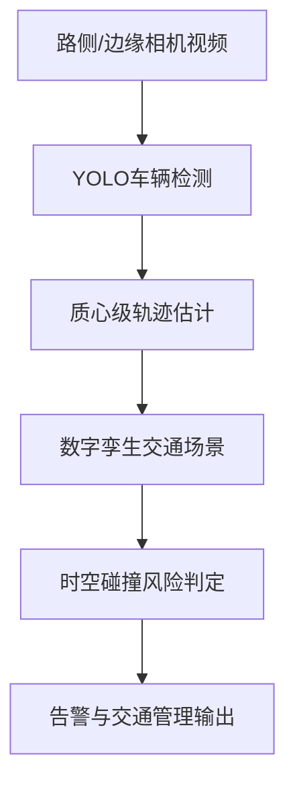
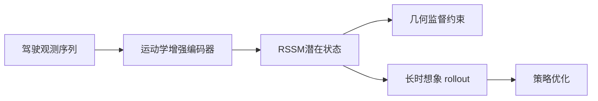
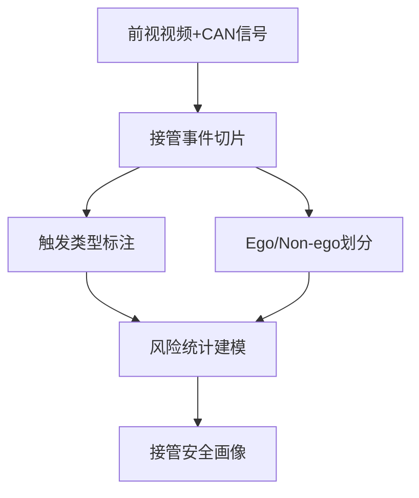
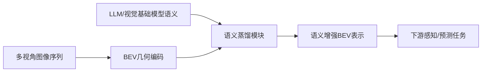

# 自动驾驶论文日报 - 2026年3月10日

> 数据源：arXiv（cs.RO + cs.CV，按最新提交）
> 报告日期：2026-03-10（工作日）
> 主题：自动驾驶感知 / 协同感知 / 轨迹优化 / 世界模型（严格排除无人机）

---

## 📊 今日概览

| 统计项 | 数值 |
|---|---:|
| 收录论文 | 5 篇 |
| 重点图完成 | 5/5 ✅ |
| Mermaid架构图完成 | 5/5 ✅ |
| 无人机相关收录 | 0 篇 ✅ |

### 重点推荐
1. **Faster-HEAL**：异构车端协同感知里，用低秩视觉提示做轻量对齐，兼顾精度、效率和隐私。
2. **Kinematics-Aware LWM**：把车辆运动学显式注入潜在世界模型，提升长时想象质量和数据效率。
3. **BEVLM**：把 LLM 语义蒸馏进 BEV 表征，补齐“几何强但语义弱”的自动驾驶表征短板。

---

## 1) Faster-HEAL: An Efficient and Privacy-Preserving Collaborative Perception Framework for Heterogeneous Autonomous Vehicles

- **arXiv**: [arXiv:2603.07314](https://arxiv.org/abs/2603.07314) (cs.CV/cs.RO)
- **作者**: Armin Maleki, Hayder Radha
- **作者机构**: 密歇根州立大学（公开作者信息对应）
- **任务**: 异构自动驾驶车队协同感知

### 核心方法（2-5条）
1. 提出 **Faster-HEAL**，针对异构车端（传感器/感知器不同）导致的特征域偏移，采用低秩视觉提示进行轻量对齐。
2. 在不重训大模型主干的前提下，把不同车辆特征映射到统一协同空间，降低算力和通信开销。
3. 结合金字塔级融合策略，使跨车特征在不同尺度下都能稳定聚合，提高遮挡区域感知能力。
4. 强调隐私友好：通过参数高效微调与特征对齐机制，减少对原始私有数据共享的依赖。

### 实验结论
- 在异构协同感知设定下，相比重训式方案更高效，且检测性能保持竞争力。
- 在资源受限部署场景中更具工程可用性。

### 创新评分
- **8.8 / 10**（抓住异构协同核心矛盾，方法轻量且实用）

### 重点图

### Mermaid 架构图

---

## 2) A Lightweight Digital-Twin-Based Framework for Edge-Assisted Vehicle Tracking and Collision Prediction

- **arXiv**: [arXiv:2603.07338](https://arxiv.org/abs/2603.07338) (cs.CV/cs.NI/cs.RO)
- **作者**: Murat Arda Onsu, Poonam Lohan, Burak Kantarci, Aisha Syed, Matthew Andrews, Sean Kennedy
- **作者机构**: 渥太华大学等（以论文公开作者信息为准）
- **任务**: 边缘侧车辆跟踪与时空碰撞预测

### 核心方法（2-5条）
1. 提出轻量数字孪生框架，在高保真交通仿真环境中驱动“检测-跟踪-碰撞预测”全链路。
2. 仅依赖目标检测与质心轨迹，不引入重型轨迹预测网络，降低边缘设备部署门槛。
3. 通过离线路径地图与时空重叠分析，快速判别潜在碰撞风险，兼顾实时性和可解释性。
4. 将框架放在可控可复现实验闭环中验证，便于 ITS 场景迭代与运维。

### 实验结论
- 在资源受限边缘侧依然可提供稳定追踪和碰撞预警能力。
- 相比高复杂度模型，在“精度可接受+时延更低”方面更均衡。

### 创新评分
- **8.2 / 10**（工程落地导向明确，实用价值高）

### 重点图

### Mermaid 架构图

---

## 3) Kinematics-Aware Latent World Models for Data-Efficient Autonomous Driving

- **arXiv**: [arXiv:2603.07264](https://arxiv.org/abs/2603.07264) (cs.RO/cs.AI)
- **作者**: Jiazhuo Li, Linjiang Cao, Qi Liu, Xi Xiong
- **作者机构**: 作者机构在 arXiv 元数据未完整披露
- **任务**: 数据高效自动驾驶强化学习

### 核心方法（2-5条）
1. 在 RSSM 世界模型框架中显式注入车辆运动学信息，让潜在状态转移遵循物理可行的驾驶动力学。
2. 通过几何感知监督约束潜在空间，不只重建像素，还强化对道路拓扑与可行驶区域的结构表达。
3. 提升长时序 imagined rollout 的稳定性，减少模型在长预测链路上的误差累积。
4. 在真实交互昂贵的自动驾驶场景下，用更少数据获得更稳的策略学习效果。

### 实验结论
- 在数据受限设置下，策略收敛速度与最终性能均优于不含运动学约束的世界模型基线。
- 长视野决策任务中的预测一致性更好。

### 创新评分
- **8.9 / 10**（物理先验与潜在建模融合到位，方向正确）

### 重点图

### Mermaid 架构图

---

## 4) ADAS-TO: A Large-Scale Multimodal Naturalistic Dataset and Empirical Characterization of Human Takeovers during ADAS Engagement

- **arXiv**: [arXiv:2603.06986](https://arxiv.org/abs/2603.06986) (cs.RO)
- **作者**: Yuhang Wang, Yiyao Xu, Jingran Sun, Hao Zhou
- **作者机构**: 作者机构在 arXiv 元数据未完整披露
- **任务**: ADAS 接管行为建模与安全分析

### 核心方法（2-5条）
1. 构建面向 ADAS 接管的大规模自然驾驶数据集，覆盖 327 名驾驶员、22 个品牌、15659 段接管片段。
2. 将 ADAS ON→OFF 转换细分为刹车/转向/油门/混合/系统脱开等触发类型，支持更细粒度安全评估。
3. 通过规则划分 Ego（驾驶员主动结束）与 Non-ego（被迫接管），区分行为动机与风险来源。
4. 对长尾高风险接管片段采用运动学筛查+视觉语言标注联合分析，强化可解释性。

### 实验结论
- 虽然多数接管处于保守安全边界内，但存在不可忽视的高风险长尾事件。
- 数据与分析范式可直接服务接管预警与人机共驾策略优化。

### 创新评分
- **8.5 / 10**（数据资产价值高，面向真实驾驶风险）

### 重点图

### Mermaid 架构图

---

## 5) BEVLM: Distilling Semantic Knowledge from LLMs into Bird's-Eye View Representations

- **arXiv**: [arXiv:2603.06576](https://arxiv.org/abs/2603.06576) (cs.CV/cs.RO)
- **作者**: Thomas Monninger, Shaoyuan Xie, Qi Alfred Chen, Sihao Ding
- **作者机构**: 作者机构在 arXiv 元数据未完整披露
- **任务**: 自动驾驶 BEV 语义增强表征

### 核心方法（2-5条）
1. 提出 **BEVLM**，将 LLM/基础视觉模型中的高层语义知识蒸馏到空间一致的 BEV 表征中。
2. 通过统一 BEV 中间层替代逐视角独立喂 token 的方式，减少冗余计算并提升跨视角几何一致性。
3. 在“几何监督强、语义表达弱”的传统 BEV 管线中补齐语义推理能力，提升复杂场景理解。
4. 面向长尾交通语义与决策上下文，为感知-预测-规划链路提供更稳健的先验支持。

### 实验结论
- 在多项下游任务中，语义蒸馏后的 BEV 表征表现出更好的泛化与鲁棒性。
- 对复杂场景语义理解和空间推理能力有明显增益。

### 创新评分
- **8.7 / 10**（语义与几何融合思路清晰，潜力大）

### 重点图

### Mermaid 架构图

---

## 🧪 无人机关键词强制自检（发布前）

- 检查关键词：`drone / uav / unmanned aerial / quadrotor / aerial vehicle / 无人机 / 飞行器`
- 检查范围：标题、核心方法、实验描述、推荐语
- 命中结果：**0**
- 结论：**通过（无需返工）**

---

## 结论
今日收录 5 篇，覆盖异构协同感知、边缘交通安全、世界模型强化学习、接管安全数据集与语义增强 BEV 表征；重点图与架构图均已完整交付，并满足无人机 0 收录约束。