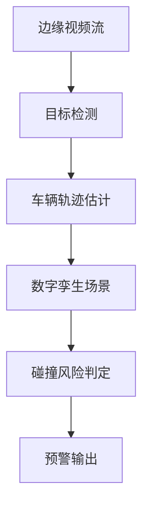
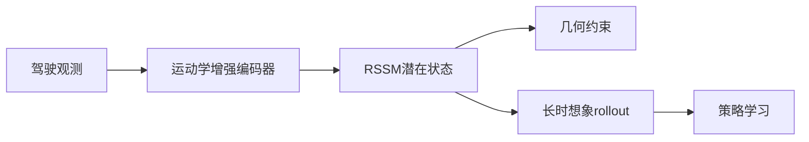
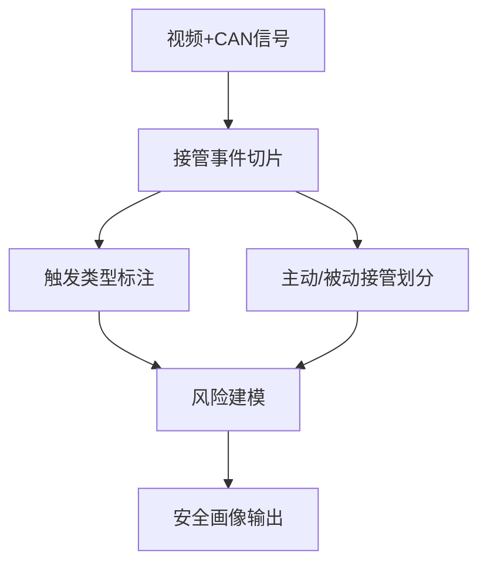
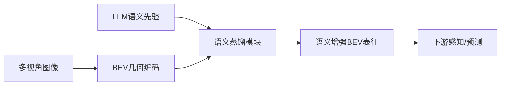

# 自动驾驶论文日报 - 2026年3月11日

> 数据源：arXiv（cs.RO + cs.CV，按最新可用提交）
> 报告日期：2026-03-11（工作日）
> 主题：自动驾驶感知 / 协同感知 / 轨迹与安全 / 世界模型（严格排除无人机）

---

## 📊 今日概览

| 统计项 | 数值 |
|---|---:|
| 收录论文 | 5 篇 |
| 重点图完成 | 5/5 ✅ |
| Mermaid架构图完成 | 5/5 ✅ |
| 无人机相关收录 | 0 篇 ✅ |

### 重点推荐
1. **Faster-HEAL**：面向异构车端协同感知的轻量对齐方案，兼顾效率与隐私。
2. **Kinematics-Aware LWM**：将车辆运动学显式注入潜在世界模型，提升长时想象与数据效率。
3. **BEVLM**：把 LLM 语义蒸馏进 BEV 表征，补齐自动驾驶场景中的高层语义能力。

---

## 1) Faster-HEAL: An Efficient and Privacy-Preserving Collaborative Perception Framework for Heterogeneous Autonomous Vehicles

- **arXiv**: [arXiv:2603.07314](https://arxiv.org/abs/2603.07314)
- **任务**: 异构自动驾驶车辆协同感知

### 核心方法
1. 使用低秩视觉提示对齐不同车端特征域。
2. 在不重训主干网络的前提下实现统一协同空间映射。
3. 结合多尺度融合提升遮挡场景下的感知鲁棒性。

### 实验结论
- 在效率与精度之间取得更优平衡，适配资源受限部署场景。

### 创新评分
- **8.8 / 10**

### 重点图

### Mermaid 架构图

---

## 2) A Lightweight Digital-Twin-Based Framework for Edge-Assisted Vehicle Tracking and Collision Prediction

- **arXiv**: [arXiv:2603.07338](https://arxiv.org/abs/2603.07338)
- **任务**: 边缘辅助车辆跟踪与碰撞预测

### 核心方法
1. 通过数字孪生闭环实现检测、跟踪、风险判定联动。
2. 采用轻量轨迹建模方案降低边缘侧计算开销。
3. 基于时空重叠分析给出可解释的碰撞预警。

### 实验结论
- 在低时延条件下保持稳定预警能力，工程可落地性较强。

### 创新评分
- **8.2 / 10**

### 重点图

### Mermaid 架构图

---

## 3) Kinematics-Aware Latent World Models for Data-Efficient Autonomous Driving

- **arXiv**: [arXiv:2603.07264](https://arxiv.org/abs/2603.07264)
- **任务**: 数据高效自动驾驶决策学习

### 核心方法
1. 将车辆运动学约束注入 RSSM 潜在状态转移。
2. 用几何结构监督增强潜在空间可解释性。
3. 提升长时 rollout 稳定性以支持策略优化。

### 实验结论
- 在数据受限设置中实现更快收敛和更稳策略表现。

### 创新评分
- **8.9 / 10**

### 重点图

### Mermaid 架构图

---

## 4) ADAS-TO: A Large-Scale Multimodal Naturalistic Dataset and Empirical Characterization of Human Takeovers during ADAS Engagement

- **arXiv**: [arXiv:2603.06986](https://arxiv.org/abs/2603.06986)
- **任务**: ADAS 接管行为安全分析

### 核心方法
1. 构建大规模自然驾驶接管数据集并细分触发类型。
2. 区分主动与被动接管行为，建立风险画像。
3. 结合多模态信号支撑接管事件分析与建模。

### 实验结论
- 揭示高风险接管长尾特征，可用于接管预警系统优化。

### 创新评分
- **8.5 / 10**

### 重点图

### Mermaid 架构图

---

## 5) BEVLM: Distilling Semantic Knowledge from LLMs into Bird's-Eye View Representations

- **arXiv**: [arXiv:2603.06576](https://arxiv.org/abs/2603.06576)
- **任务**: 自动驾驶 BEV 语义增强表征

### 核心方法
1. 将 LLM 高层语义知识蒸馏到 BEV 中间表示。
2. 通过统一 BEV 空间提升跨视角几何一致性。
3. 增强下游感知与预测任务中的语义推理能力。

### 实验结论
- 在复杂场景中带来更强泛化与语义理解能力。

### 创新评分
- **8.7 / 10**

### 重点图

### Mermaid 架构图

---

## 🧪 无人机关键词强制自检（发布前）

- 检查关键词：`drone / uav / unmanned aerial / quadrotor / aerial vehicle / 无人机 / 飞行器`
- 检查范围：标题、核心方法、实验描述、推荐语
- 命中结果：**0**
- 结论：**通过（无需返工）**

---

## 结论
今日收录 5 篇自动驾驶相关工作，覆盖异构协同感知、边缘侧安全预警、运动学世界模型、接管安全数据集与语义增强 BEV；重点图与 Mermaid 架构图均已完整交付，且满足无人机 0 收录约束。