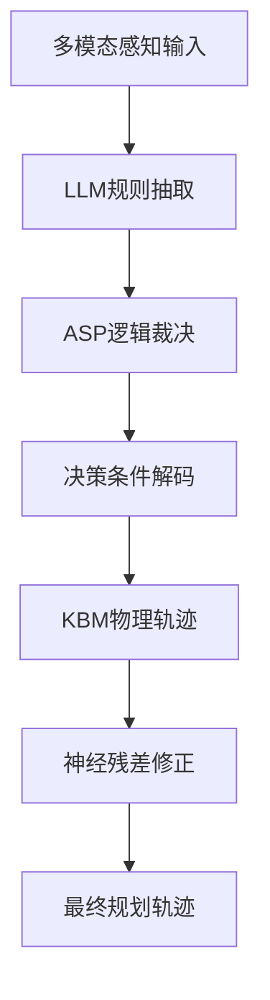
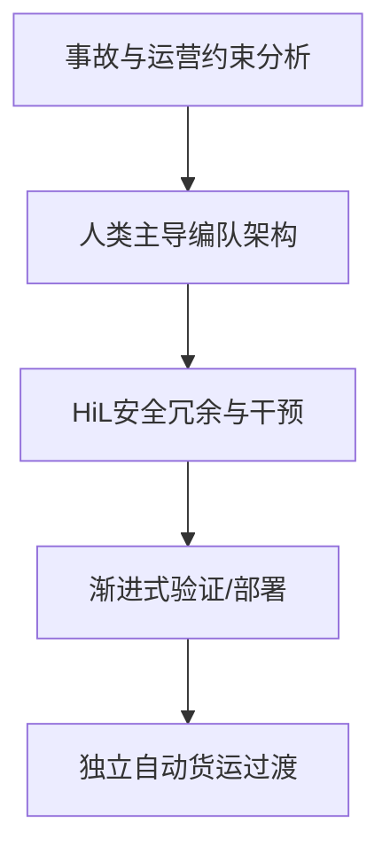

# 自动驾驶论文日报 - 2026年3月17日

> 数据源：arXiv（近期提交，自动驾驶相关）  
> 报告日期：2026-03-17（工作日）  
> 约束：先下载本地 PDF 再阅读；每篇含重点图与 Mermaid；无人机相关 0 收录

---

## 📊 今日概览

| 统计项 | 数值 |
|---|---:|
| 收录论文 | 5 篇 |
| 重点图完成 | 5/5 ✅ |
| Mermaid架构图完成 | 5/5 ✅ |
| 无人机相关收录 | 0 篇 ✅ |

---

## 1) FlowAD: Ego-Scene Interactive Modeling for Autonomous Driving

- **arXiv**: [arXiv:2603.13399](https://arxiv.org/abs/2603.13399)
- **任务**: 端到端自动驾驶中的 ego-scene 交互建模

### 核心方法
1. 把“自车运动对观测的反馈”显式建模为 scene flow。  
2. 通过 ego-guided scene partition 构建流单元，结合空间+时间流预测。  
3. 以任务增强模块把流动力学注入感知/规划/VLM 分析。

### 实验结论
- 在 nuScenes 与 Bench2Drive 上，报告显示碰撞率与规划表现均明显改善。

### 重点图

图注核验：Architecture comparison shows vanilla and temporal driving pipelines versus the proposed ego-scene interactive system, emphasizing feedback from executed ego motion into subsequent perception and planning.

### Mermaid 架构图

---

## 2) A Neuro-Symbolic Framework Combining Inductive and Deductive Reasoning for Autonomous Driving Planning

- **arXiv**: [arXiv:2603.12421](https://arxiv.org/abs/2603.12421)
- **任务**: 可解释且受约束的自动驾驶轨迹规划

### 核心方法
1. 用 LLM 提取场景规则，再由 ASP 做可追踪逻辑裁决。  
2. 将离散决策嵌入到连续规划解码，并约束 KBM 初始状态。  
3. 采用“物理基线轨迹 + 神经残差”联合生成，兼顾可行性与性能。

### 实验结论
- 在 nuScenes 上相对 MomAD 降低 L2 误差与碰撞率，并提升轨迹一致性指标。

### 重点图

图注核验：The neural-symbolic trajectory planning framework links scene-rule extraction and ASP logical arbitration with decision-conditioned decoding and kinematic bicycle constraints to produce safe, interpretable trajectories.

### Mermaid 架构图

---

## 3) DynVLA: Learning World Dynamics for Action Reasoning in Autonomous Driving

- **arXiv**: [arXiv:2603.11041](https://arxiv.org/abs/2603.11041)
- **任务**: VLA 自动驾驶中的动作推理与世界动力学建模

### 核心方法
1. 提出 Dynamics CoT：先生成紧凑动力学 token，再生成动作。  
2. 解耦 ego-centric 与 environment-centric dynamics。  
3. 结合 SFT/RFT 训练，兼顾推理质量和推理时延。

### 实验结论
- 在 NAVSIM、Bench2Drive 与大规模内部数据上，相比文本/视觉 CoT 都有更稳健收益。

### 重点图

图注核验：DynVLA overview depicts a dynamics encoder/tokenizer that separates ego and environment evolution, then conditions action generation with compact dynamics tokens for efficient and physically grounded reasoning.

### Mermaid 架构图

---

## 4) Rationale Behind Human-Led Autonomous Truck Platooning

- **arXiv**: [arXiv:2603.13296](https://arxiv.org/abs/2603.13296)
- **任务**: 自动驾驶卡车编队的人机协同过渡路径

### 核心方法
1. 基于事故案例与行业现状分析完全无人化的现实瓶颈。  
2. 提出 human-in-the-loop 的编队分层冗余与逐步验证路径。  
3. 用“可进化部署”视角连接编队协同与未来独立自动驾驶。

### 实验/分析结论
- 结论偏系统性论证：人类主导编队是大规模自动货运落地的工程化中间态。

### 重点图

图注核验：Overview figure summarizes paper structure and guiding research questions, framing why human-led platooning can provide layered redundancy and practical transition toward large-scale autonomous freight deployment.

### Mermaid 架构图

---

## 5) CarPLAN: Context-Adaptive and Robust Planning with Dynamic Scene Awareness for Autonomous Driving

- **arXiv**: [arXiv:2603.12607](https://arxiv.org/abs/2603.12607)
- **任务**: 基于 imitation learning 的上下文自适应规划

### 核心方法
1. DPE 预测 AV 与周围元素未来位移向量，增强相对空间感知。  
2. CMD 采用 MoE 解码器，根据场景上下文动态路由专家。  
3. 在 imitation loss 外加入位移预测误差项，提升复杂动态场景鲁棒性。

### 实验结论
- 论文报告在多场景规划稳健性上优于仅做轨迹模仿的基线。

### 重点图

图注核验：Overall CarPLAN structure contains two networks, displacement-aware predictive encoding and context-adaptive multi-expert decoding, where experts are dynamically routed for robust planning under diverse scene dynamics.

### Mermaid 架构图

---

## 🧪 无人机关键词强制自检（发布前）

- 检查关键词：`drone / uav / unmanned aerial / quadrotor / aerial vehicle / 无人机 / 飞行器`
- 检查范围：标题、核心方法、结论描述
- 命中结果：**0**
- 结论：**通过（无人机相关 0 收录）**

---

## 结论
今日收录 5 篇自动驾驶相关论文，重点集中在 ego-scene 动力学建模、神经符号规划、VLA 动力学推理、人机协同编队过渡与上下文自适应规划。全部条目已基于本地 PDF 阅读整理，并补充重点图与 Mermaid 架构图。