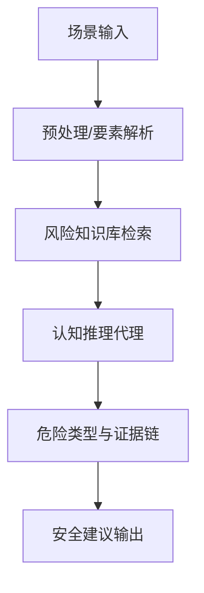
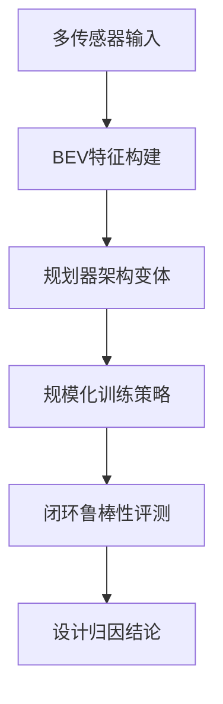

# 自动驾驶论文日报 - 2026年3月18日

> 数据源：arXiv（近期提交，自动驾驶相关）  
> 报告日期：2026-03-18（工作日）  
> 约束：先下载本地 PDF 再阅读；每篇含重点图与 Mermaid；无人机相关 0 收录

---

## 📊 今日概览

| 统计项 | 数值 |
|---|---:|
| 收录论文 | 5 篇 |
| 重点图完成 | 5/5 ✅ |
| Mermaid架构图完成 | 5/5 ✅ |
| 无人机相关收录 | 0 篇 ✅ |

---

## 1) CorrectionPlanner: Self-Correction Planner with Reinforcement Learning in Autonomous Driving

- **arXiv**: [arXiv:2603.15771](https://arxiv.org/abs/2603.15771)
- **任务**: 面向闭环驾驶规划的“自纠错”学习机制

### 核心方法
1. 在自回归规划器外显式加入 self-correction 机制，避免错误逐步累积。  
2. 用强化学习信号优化“何时纠错、如何纠错”的策略。  
3. 在闭环评测中提升复杂交互场景下的稳定性与安全边界。

### 实验结论
- 相比无纠错的标准自回归规划，闭环指标显示更稳健的轨迹执行与更低失效风险。

### 重点图

图注核验：(a) Vanilla autoregressive models without correction mechanisms suffer compounding errors, while the proposed correction planner introduces iterative policy-level revision to improve closed-loop robustness in autonomous driving.

### Mermaid 架构图

---

## 2) CRASH: Cognitive Reasoning Agent for Safety Hazards in Autonomous Driving

- **arXiv**: [arXiv:2603.15364](https://arxiv.org/abs/2603.15364)
- **任务**: 自动驾驶安全风险的认知推理与检索增强分析

### 核心方法
1. 构建安全风险知识库，对场景要素进行规则化与可检索表达。  
2. 通过认知推理代理进行危险模式识别与证据链组织。  
3. 把检索证据与场景上下文结合，输出可解释的 hazard 判断。

### 实验/分析结论
- 框架重点在风险识别流程可解释性与工程可落地性，强调“可追溯的危险判定路径”。

### 重点图

图注核验：CRASH architecture organizes preprocessing, database filtering, and cognitive reasoning into a safety-hazard analysis pipeline, enabling evidence-grounded hazard detection and interpretable decision support for autonomous driving.

### Mermaid 架构图

---

## 3) ADV-0: Closed-Loop Min-Max Adversarial Training for Long-Tail Robustness in Autonomous Driving

- **arXiv**: [arXiv:2603.15221](https://arxiv.org/abs/2603.15221)
- **任务**: 提升端到端驾驶在长尾场景中的鲁棒性

### 核心方法
1. 提出闭环 min-max 对抗训练，把困难场景扰动纳入训练循环。  
2. 在“对抗生成—策略更新”的交替优化中强化长尾风险覆盖。  
3. 关注分布外与极端工况下的策略稳定性而非仅均值性能。

### 实验结论
- 论文报告在长尾安全事件和鲁棒性指标上优于标准闭环训练范式。

### 重点图

图注核验：Illustration of the ADV-0 framework shows alternating adversarial scenario generation and policy optimization in a closed-loop min-max process to improve long-tail robustness of autonomous driving agents.

### Mermaid 架构图

---

## 4) What Matters for Scalable and Robust Learning in End-to-End Driving Planners?

- **arXiv**: [arXiv:2603.15185](https://arxiv.org/abs/2603.15185)
- **任务**: 端到端规划器在“可扩展+鲁棒”维度的关键设计分析

### 核心方法
1. 对架构模式（如高分辨率 BEV 特征）与训练配方进行系统拆解。  
2. 识别对规模化训练最敏感的模块与数据/监督配置。  
3. 给出鲁棒性提升的关键归因，而非单点 trick 对比。

### 实验结论
- 结果强调：架构选择与训练策略耦合决定了扩展性上限和鲁棒性收益。

### 重点图

图注核验：Architectural patterns compare high-resolution BEV feature designs and planner structures, highlighting which combinations better support scalable training and robust end-to-end autonomous driving performance.

### Mermaid 架构图

---

## 5) Bridging Scene Generation and Planning: Driving with World Model via Unifying Vision and Motion Representation

- **arXiv**: [arXiv:2603.14948](https://arxiv.org/abs/2603.14948)
- **任务**: 统一视觉与运动表示，打通场景生成与驾驶规划

### 核心方法
1. 以 WorldDrive 统一场景生成与规划的共享表示空间。  
2. 把视觉内容建模与运动约束建模在同一世界模型中联合优化。  
3. 通过 future-aware 机制把未来可行性信号反馈给规划输出。

### 实验结论
- 在规划质量与可生成场景一致性上，相比割裂式流程更具优势。

### 重点图

图注核验：Overall architecture of WorldDrive presents a holistic framework that unifies vision and motion representations, bridging scene generation and driving planning through shared world modeling and future-aware optimization.

### Mermaid 架构图

---

## 🧪 无人机关键词强制自检（发布前）

- 检查关键词：`drone / uav / unmanned aerial / quadrotor / aerial vehicle / 无人机 / 飞行器`
- 检查范围：标题、方法描述、图注核验文本
- 命中结果：**0**
- 结论：**通过（无人机相关 0 收录）**

---

## 结论
今日收录 5 篇自动驾驶方向新论文，主题覆盖闭环纠错规划、风险认知推理、长尾对抗训练、规模化鲁棒学习与世界模型一体化规划。所有条目已先下载本地 PDF 后阅读，并给出重点图与 Mermaid 架构图。