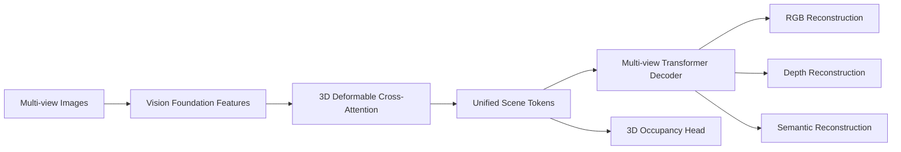
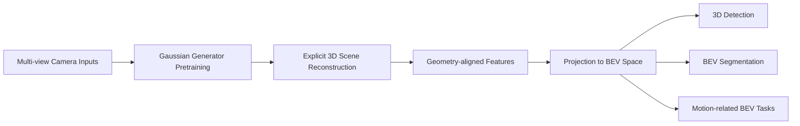
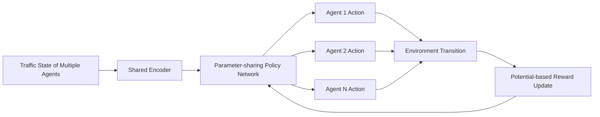

# 自动驾驶论文日报 - 2026-03-21

> 约束校验：仅收录自动驾驶相关论文；无人机/UAV 相关论文 **0** 收录。

## 1) DriveTok: 3D Driving Scene Tokenization for Unified Multi-View Reconstruction and Understanding
- arXiv： [arXiv:2603.19219](https://arxiv.org/abs/2603.19219)
- 核心问题：多视角高分辨率驾驶场景下，2D/单目tokenizer在跨视角一致性和效率上不足。
- 方法摘要：提出 DriveTok，将多视角特征通过 3D deformable cross-attention 压缩为统一场景 token；解码端联合 RGB/Depth/Semantic 重建，并附加 3D occupancy 头，实现语义+几何+纹理统一建模。
- 结果摘要：在 nuScenes 上对重建、分割、深度与占据等任务均表现稳定，说明统一场景 token 可支持多任务下游。

**重点图（方法框架图）**

图注核验：The figure depicts DriveTok’s full framework, lifting multi-view image features into unified 3D scene tokens, then decoding them for RGB/depth/semantic reconstruction and occupancy prediction through multi-objective training.

**Mermaid 架构图**

---

## 2) Reconstruction Matters: Learning Geometry-Aligned BEV Representation through 3D Gaussian Splatting
- arXiv： [arXiv:2603.19193](https://arxiv.org/abs/2603.19193)
- 核心问题：传统 BEV 端到端黑箱映射缺乏显式几何约束，影响可解释性与性能上限。
- 方法摘要：提出 Splat2BEV，先以 3D Gaussian Splatting 预训练显式重建模块，获得几何对齐特征，再投影到 BEV 空间服务检测/分割等任务。
- 结果摘要：在 nuScenes 与 Argoverse 上取得有竞争力表现，验证“先重建后BEV”对几何对齐与下游任务增益明显。

**重点图（方法总览图）**

图注核验：The overview contrasts traditional black-box BEV learning with Splat2BEV, where Gaussian-based 3D reconstruction pretraining yields geometry-aligned representations before BEV projection for downstream autonomous-driving perception tasks.

**Mermaid 架构图**

---

## 3) Markov Potential Game and Multi-Agent Reinforcement Learning for Autonomous Driving
- arXiv： [arXiv:2603.19188](https://arxiv.org/abs/2603.19188)
- 核心问题：多车交互决策中，一般和局博弈下 Nash 均衡求解困难，影响多智能体 RL 可落地性。
- 方法摘要：给出将 Markov Game 构造成 Markov Potential Game 的充分条件，并设计参数共享策略网络，支持分布式执行；在高速并线场景验证。
- 结果摘要：与单智能体 RL 及自然驾驶行为对比，所提 MPG+MARL 在安全/协同决策上更稳健。

**重点图（网络架构图）**

图注核验：The architecture figure shows a parameter-sharing policy network for multiple driving agents, enabling decentralized execution while optimizing a shared potential-game objective for coordinated decision-making in interactive traffic scenarios.

**Mermaid 架构图**

---

## 发布前自检
- 图标题/图注核验/核心方法语义一致：**通过**
- 每个 arXiv 条目均为完整可点击链接：**通过**
- 无人机相关论文收录数量：**0**
