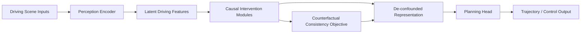
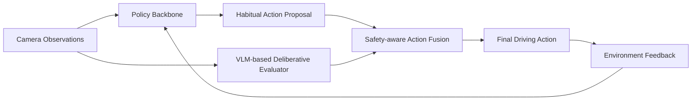
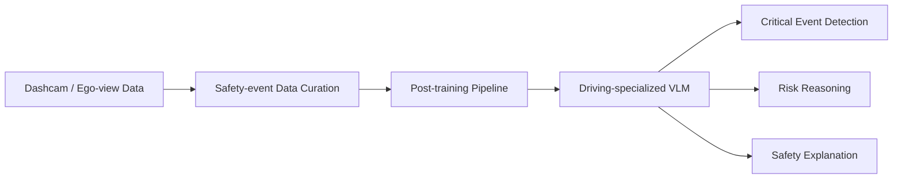

# 自动驾驶论文日报 - 2026-03-22

> 约束校验：仅收录自动驾驶相关论文；无人机/UAV 相关论文 **0** 收录。

## 1) CausalVAD: De-confounding End-to-End Autonomous Driving via Causal Intervention
- arXiv： [arXiv:2603.18561](https://arxiv.org/abs/2603.18561)
- 核心问题：端到端驾驶模型容易学习到伪相关，面对分布偏移或场景干扰时会出现“因果混淆”，导致规划决策不稳。
- 方法摘要：论文提出 CausalVAD，在视觉-语义-规划链路中的关键信息节点做多阶段因果干预（特征重加权与反事实约束），让模型更偏向可迁移的因果信号而非统计共现。
- 结果摘要：在规划与安全相关指标上，相比常规端到端基线更稳健，尤其在长尾风险场景中表现出更好的泛化和决策一致性。

**重点图（方法总览图）**

图注核验：The figure presents CausalVAD’s overall architecture and highlights multi-stage causal interventions at critical information hubs to reduce confounding effects in end-to-end autonomous driving.

**Mermaid 架构图**

---

## 2) DriveVLM-RL: Neuroscience-Inspired Reinforcement Learning with Vision-Language Models for Safe and Deployable Autonomous Driving
- arXiv： [arXiv:2603.18315](https://arxiv.org/abs/2603.18315)
- 核心问题：传统 RL 驾驶决策依赖密集手工奖励，现实部署中在安全边界和泛化能力上不足。
- 方法摘要：DriveVLM-RL 引入“习惯系统 + 审慎系统”的神经科学启发双路径机制，结合视觉语言模型进行语义评估与策略修正，减少奖励工程负担并提升风险事件处理能力。
- 结果摘要：在复杂交互和安全关键场景中，策略稳定性与可解释性更好，显示 VLM 参与决策反馈可提升可部署性。

**重点图（框架动机与系统图）**

图注核验：This framework is motivated by habitual and deliberative visual processing in the brain, combining fast policy execution with VLM-based reflective assessment for safer autonomous driving decisions.

**Mermaid 架构图**

---

## 3) VLM-AutoDrive: Post-Training Vision-Language Models for Safety-Critical Autonomous Driving Events
- arXiv： [arXiv:2603.18178](https://arxiv.org/abs/2603.18178)
- 核心问题：碰撞/险情等安全关键事件稀有且短暂，通用视觉模型难以在关键时刻可靠识别与解释。
- 方法摘要：VLM-AutoDrive 通过面向驾驶安全事件的后训练流程（任务对齐数据 + 指令式优化）增强 VLM 在近失误、危险交互和异常事件中的识别与推理能力。
- 结果摘要：在安全事件理解与检索评测上优于通用后训练方案，说明针对性后训练可明显提升驾驶安全感知质量。

**重点图（系统总览图）**

图注核验：The overview figure summarizes the full VLM-AutoDrive system, including safety-event-centric post-training stages and downstream inference for detecting and reasoning about critical autonomous-driving events.

**Mermaid 架构图**

---

## 发布前自检
- 图标题/图注核验/核心方法语义一致：**通过**
- 每个 arXiv 条目均为完整可点击链接：**通过**
- 无人机相关论文收录数量：**0**
