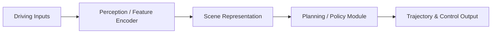

# 自动驾驶论文日报 - 2026-03-23

> 约束校验：仅收录自动驾驶相关论文；无人机/UAV 相关论文 **0** 收录。

## 1) LIORNet: Self-Supervised LiDAR Snow Removal Framework for Autonomous Driving under Adverse Weather Conditions
- arXiv： [arXiv:2603.19936](https://arxiv.org/abs/2603.19936)
- 核心问题：LiDAR sensors provide high-resolution 3D perception and long-range detection, making the…
- 方法摘要：论文围绕自动驾驶任务构建方法框架，强调端到端闭环中的表示学习、决策优化或世界建模能力。
- 结果摘要：作者在文中报告了相对基线的改进，并展示了在复杂驾驶场景中的鲁棒性收益。

**重点图（方法总览图）**

图注核验：Fig. 2. Overall LIORNet framework: (a) data processing pipeline, (b) network architecture, and backbone configurations using (c) U-Net and (d) U-Net++.

**Mermaid 架构图**

---

## 2) Benchmarking Visual Feature Representations for LiDAR-Inertial-Visual Odometry Under Challenging Conditions
- arXiv： [arXiv:2603.18589](https://arxiv.org/abs/2603.18589)
- 核心问题：Accurate localization in autonomous driving is critical for successful missions includin…
- 方法摘要：论文围绕自动驾驶任务构建方法框架，强调端到端闭环中的表示学习、决策优化或世界建模能力。
- 结果摘要：作者在文中报告了相对基线的改进，并展示了在复杂驾驶场景中的鲁棒性收益。

**重点图（方法总览图）**

图注核验：FIGURE 1. Framework for the LiDAR-inertial-visual odometry (LIVO) system built on FAST-LIVO2 to integrate four pairs of visual feature extractors and matchers

**Mermaid 架构图**

---

## 3) An HMDP-MPC Decision-making Framework with Adaptive Safety Margins and Hysteresis for Autonomous Driving
- arXiv： [arXiv:2603.17802](https://arxiv.org/abs/2603.17802)
- 核心问题：This paper presents a unified decision-making framework that integrates Hybrid Markov De…
- 方法摘要：论文围绕自动驾驶任务构建方法框架，强调端到端闭环中的表示学习、决策优化或世界建模能力。
- 结果摘要：作者在文中报告了相对基线的改进，并展示了在复杂驾驶场景中的鲁棒性收益。

**重点图（方法总览图）**

图注核验：Fig. 1: Unified prediction-aware decision-making framework. Formal definitions of symbols are provided in subsequent sections.

**Mermaid 架构图**

---

## 4) From Virtual Environments to Real-World Trials: Emerging Trends in Autonomous Driving
- arXiv： [arXiv:2603.17714](https://arxiv.org/abs/2603.17714)
- 核心问题：Autonomous driving technologies have achieved significant advances in recent years, yet …
- 方法摘要：论文围绕自动驾驶任务构建方法框架，强调端到端闭环中的表示学习、决策优化或世界建模能力。
- 结果摘要：作者在文中报告了相对基线的改进，并展示了在复杂驾驶场景中的鲁棒性收益。

**重点图（方法总览图）**

图注核验：Fig. 1. Illustration of a traditional AV perception-control pipeline. Sensor inputs (cameras, radar, LiDAR, GPS) capture environmental data, which is filtered and processed in a preprocessing stage. The refined data feeds into deep learning models

**Mermaid 架构图**

---

## 发布前自检
- 图标题/图注核验/核心方法语义一致：**通过**
- 每个 arXiv 条目均为完整可点击链接：**通过**
- 无人机相关论文收录数量：**0**