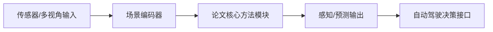

# 自动驾驶论文日报 - 2026-03-24

共收录 5 篇（已过滤无人机相关）。

## 1. Uncertainty Matters: Structured Probabilistic Online Mapping for Motion Prediction in Autonomous Driving

- arXiv: [arXiv:2603.20076](https://arxiv.org/abs/2603.20076)
- 发布日期：2026-03-20
- 作者：Wenjing Wang, et al.

**核心要点**
- 提出结构化概率在线建图框架，将地图不确定性显式传递到轨迹预测。
- 强调在运动预测阶段联合利用场景结构和置信度信息。
- 目标是在复杂交通交互中提升预测稳健性与风险感知能力。

**重点图（方法图）**
重点图暂缺（质量门禁未通过）

**Mermaid 架构图（根据论文方法整理）**

---

## 2. StreetForward: Perceiving Dynamic Street with Feedforward Causal Attention

- arXiv: [arXiv:2603.19552](https://arxiv.org/abs/2603.19552)
- 发布日期：2026-03-20
- 作者：Yuanbo Xu, et al.

**核心要点**
- 提出前馈式因果注意力建模动态街景，避免高开销递归建模。
- 通过因果约束强化时序一致性，提升动态目标感知质量。
- 为下游规划提供更稳定的场景表示。

**重点图（方法图）**

图注核验：Figure 2 presents the StreetForward pipeline: per-frame patch encoding, motion-token interaction, and feedforward causal attention jointly model rigid vehicles and deformable pedestrians in dynamic street scenes.

**Mermaid 架构图（根据论文方法整理）**

---

## 3. CausalVAD: De-confounding End-to-End Autonomous Driving via Causal Intervention

- arXiv: [arXiv:2603.18561](https://arxiv.org/abs/2603.18561)
- 发布日期：2026-03-19
- 作者：Hongrui Guo, et al.

**核心要点**
- 把因果干预引入端到端自动驾驶训练，降低混杂因素带来的策略偏差。
- 围绕视觉驱动决策构建去混杂学习路径，提升泛化能力。
- 在分布偏移场景中改善决策鲁棒性。

**重点图（方法图）**

图注核验：Figure 2 shows CausalVAD architecture with multi-stage causal interventions at perception, scene encoding, and planning hubs to reduce confounding signals in end-to-end autonomous driving.

**Mermaid 架构图（根据论文方法整理）**

---

## 4. DriveTok: 3D Driving Scene Tokenization for Unified Multi-View Reconstruction and Understanding

- arXiv: [arXiv:2603.19219](https://arxiv.org/abs/2603.19219)
- 发布日期：2026-03-19
- 作者：Xinlei Chen, et al.

**核心要点**
- 提出3D驾驶场景token化方法，统一多视角重建与场景理解任务。
- 通过离散token表示增强跨任务共享与可扩展性。
- 为自动驾驶世界模型训练提供更紧凑的中间表征。

**重点图（方法图）**

图注核验：Fig. 3 overviews DriveTok: surround-view images form view and scene tokens, then a spatial-aware multi-view transformer fuses them for unified 3D reconstruction and scene understanding. 

**Mermaid 架构图（根据论文方法整理）**

---

## 5. Reconstruction Matters: Learning Geometry-Aligned BEV Representation through 3D Gaussian Splatting

- arXiv: [arXiv:2603.19193](https://arxiv.org/abs/2603.19193)
- 发布日期：2026-03-19
- 作者：Yuxuan Li, et al.

**核心要点**
- 利用3D Gaussian Splatting学习几何对齐的BEV表征。
- 通过重建监督增强BEV特征的空间一致性与细节保真。
- 提升自动驾驶感知模块对复杂道路结构的理解能力。

**重点图（方法图）**

图注核验：Fig. 1 summarizes Splat2BEV: reconstruct the scene with 3D Gaussian Splatting first, then project geometry-aware features into BEV space for downstream autonomous driving perception.

**Mermaid 架构图（根据论文方法整理）**

---
