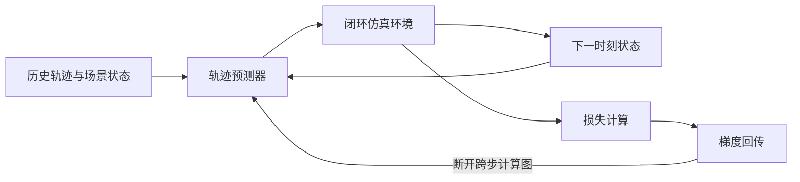
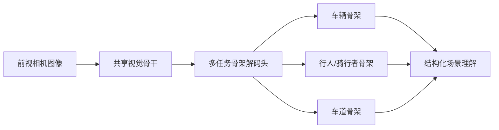
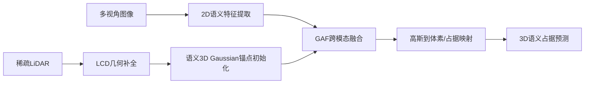

# 自动驾驶论文日报 - 2026-03-25

共收录 4 篇（已过滤无人机相关）。

## 1. Rectify, Don't Regret: Avoiding Pitfalls of Differentiable Simulation in Trajectory Prediction

- arXiv: [arXiv:2603.23393](https://arxiv.org/abs/2603.23393)
- 发布日期：2026-03-24
- 作者：Harsh Yadav, Christian Bohn, Tobias Meisen, et al.

**核心要点**
- 论文指出可微闭环仿真训练会出现“捷径学习”，模型通过反向梯度非因果地“后悔式修正”历史预测。
- 提出 detached receding-horizon rollout，在仿真步之间显式断开计算图，迫使模型学习从漂移状态中真实恢复。
- 在 nuScenes 与 DeepScenario 上，报告碰撞率显著下降并提升轨迹多样性与车道对齐性。

**重点图（方法图）**

图注核验：Fig. 1 illustrates closed-loop sample generation with sequential rollout, contrasting regret-prone differentiable feedback and the detached training path that enforces causal error rectification.

**Mermaid 架构图（根据论文方法整理）**

---

## 2. PoseDriver: A Unified Approach to Multi-Category Skeleton Detection for Autonomous Driving

- arXiv: [arXiv:2603.23215](https://arxiv.org/abs/2603.23215)
- 发布日期：2026-03-24
- 作者：Yasamin Borhani, Taylor Mordan, Yihan Wang, et al.

**核心要点**
- 提出 PoseDriver 统一框架，以底向上方式同时检测多类别骨架（车辆、行人、自行车、动物、车道）。
- 将多类别骨架学习建模为多任务问题，提升结构表示的一致性与可迁移性。
- 给出车道骨架建模方案并在 OpenLane 上取得强表现，同时引入自行车骨架数据用于新类别泛化评估。

**重点图（方法图）**
重点图暂缺（质量门禁未通过）

**Mermaid 架构图（根据论文方法整理）**

---

## 3. Gau-Occ: Geometry-Completed Gaussians for Multi-Modal 3D Occupancy Prediction

- arXiv: [arXiv:2603.22852](https://arxiv.org/abs/2603.22852)
- 发布日期：2026-03-24
- 作者：Chengxin Lv, Yihui Li, Hongyu Yang, et al.

**核心要点**
- 提出 Gau-Occ，用语义 3D Gaussian 锚点替代稠密体素/BEV张量，降低多模态占据预测计算开销。
- 设计 LiDAR Completion Diffuser (LCD) 补全稀疏点云几何，提升高斯锚点初始化完整性。
- 通过 Gaussian Anchor Fusion (GAF) 融合多视角图像语义与几何先验，再映射到占据预测输出。

**重点图（方法图）**

图注核验：Figure 1 overviews Gau-Occ: sparse LiDAR is completed by LCD, initialized into semantic Gaussian anchors, fused with multi-view image semantics via GAF, then rendered to 3D occupancy outputs.

**Mermaid 架构图（根据论文方法整理）**

---

## 4. Traffic Sign Recognition in Autonomous Driving: Dataset, Benchmark, and Field Experiment

- arXiv: [arXiv:2603.23034](https://arxiv.org/abs/2603.23034)
- 发布日期：2026-03-24
- 作者：Guoyang Zhao, Weiqing Qi, Kai Zhang, et al.

**核心要点**
- 提出 TS-1M：超百万真实交通标志图像、454标准类别的跨区域大规模数据集。
- 构建诊断型 benchmark，系统比较监督模型、自监督模型与视觉语言模型在跨区域与长尾类别下的能力边界。
- 给出实车场景验证，将交通标志识别与语义推理、空间定位结合用于决策约束。

**重点图（方法图）**
重点图暂缺（质量门禁未通过）

**Mermaid 架构图（根据论文方法整理）**

---
