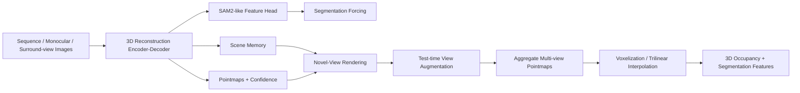

# 自动驾驶论文日报 - 2026-03-26

> 约束校验：仅收录自动驾驶相关论文；无人机/UAV 相关论文 **0** 收录。

共收录 1 篇（按“先下载 PDF 到本地、再基于本地 PDF 阅读与抽图”的流程完成）。

## 1. OccAny: Generalized Unconstrained Urban 3D Occupancy

- arXiv： [arXiv:2603.23502](https://arxiv.org/abs/2603.23502)
- 发布日期：2026-03-24
- 作者：Anh-Quan Cao, Tuan-Hung Vu

**核心问题**
- 现有 3D occupancy 方法通常依赖域内标注、精确传感器外参和固定 rig，泛化到“无标定 / 跨域 / 多输入形态”的城市驾驶场景时明显受限。
- 通用视觉几何基础模型虽然泛化强，但并没有为城市占据预测补齐三个关键能力：**公制度量预测、拥挤场景几何补全、以及对城市驾驶数据分布的适配**。

**方法摘要**
- 论文提出 **OccAny**，目标是训练一次后即可在 **sequence / monocular / surround-view** 三种输入设置下，对跨域、无约束城市场景进行 3D occupancy 预测。
- 训练分两阶段：先做 **3D Reconstruction**，把多帧图像重建成带全局/局部 pointmap、置信度和 scene memory 的几何表示；再做 **Novel-View Rendering**，在重建得到的 scene memory 上渲染新视角几何，用于补全遮挡区域和稀疏监督区域。
- 为缓解 LiDAR 监督稀疏带来的几何不稳定，作者加入 **Segmentation Forcing**：让模型同时预测 SAM2-like segmentation features，用分割一致性去正则几何学习。
- 推理阶段再通过 **Test-time View Augmentation (TTVA)** 在估计轨迹周围采样额外 novel views，进一步补全几何后再体素化生成最终 occupancy。

**结果摘要**
- 在 SemanticKITTI sequence 与 Occ3D-NuScenes surround-view 设置下，OccAny 相比通用视觉几何基线取得明显优势；文中表 1/表 3 显示其 IoU 分别达到 **25.91** 与 **34.15**。
- 消融实验显示，**TTVA / Novel-View Rendering** 是最关键增益来源；去掉 TTVA 会带来最明显退化，说明“沿轨迹生成新视角补全几何”是这篇工作的核心抓手。
- 从论文定位看，它更像是在“通用几何基础模型”与“自动驾驶 occupancy 任务”之间搭桥：不追求只在单一 rig 上榨干上限，而是优先做 **泛化能力 + 输入形态统一**。

**重点图（方法训练框架图）**

图注核验：OccAny training runs in two stages: 3D Reconstruction builds scene geometry from reconstruction frames, then Novel-View Rendering renders new views; SAM2-based Segmentation Forcing regularizes geometry and improves occupancy prediction.

**Mermaid 架构图（根据论文方法整理）**

---

## 发布前自检
- 图标题 / 图注核验 / 核心方法三者语义一致：**通过**
- 全文 arXiv 条目均为完整可点击链接：**通过**
- 重点图来源于本地 PDF，且与核心方法直接对应：**通过**
- 无人机相关论文收录数量：**0**
