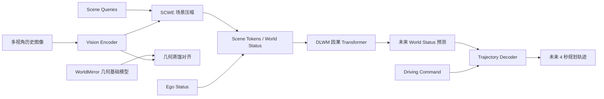
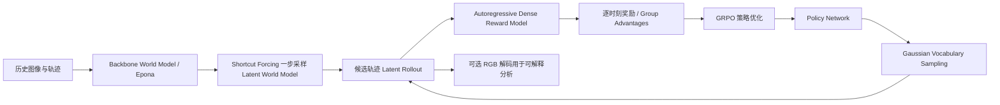
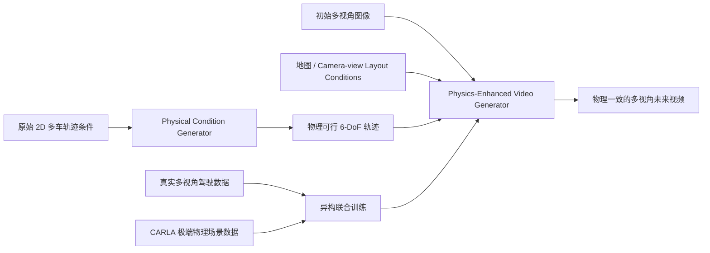

# 自动驾驶论文日报 - 2026-03-27

> 约束校验：仅收录自动驾驶相关论文；无人机/UAV 相关论文 **0** 收录。

共收录 3 篇（按“先下载 PDF 到本地、再基于本地 PDF 阅读与抽图”的流程完成）。

## 1. Latent-WAM: Latent World Action Modeling for End-to-End Autonomous Driving

- arXiv： [arXiv:2603.24581](https://arxiv.org/abs/2603.24581)
- 发布日期：2026-03-25
- 作者：Linbo Wang, Yupeng Zheng, Qiang Chen, Shiwei Li, Yichen Zhang, et al.

**研究问题**
- 端到端自动驾驶里的 world-model 路线，常见问题是：表征压得还不够轻、空间理解不够强、历史动态建模不够充分，导致在数据和算力都有限时，规划效果还是不够理想。
- 现有两类方案各有短板：显式视频生成 world model 计算太重，而且容易把注意力浪费在对规划没那么关键的像素细节上；隐式 latent 预测虽然更轻，但往往只盯着短时 latent 过渡，空间几何与长期动态建模仍然偏弱。

**核心方法总结**
- 论文提出 **Latent-WAM**，把规划前最关键的两件事拆开补强：一是把多视角图像压成**更紧凑、但保留空间结构**的 scene tokens；二是把这些 scene/world status token 连同 ego status 一起送进**因果 Transformer world model**，做自回归未来状态预测，再由轻量轨迹头输出未来 4 秒规划。
- 第一部分是 **Spatial-Aware Compressive World Encoder (SCWE)**：
  - 用 learnable scene queries 与图像 patch token 交互，把多视角输入压缩成少量 scene tokens；
  - 同时引入几何基础模型 **WorldMirror** 做蒸馏，把几何感知能力注入视觉 backbone，提升空间理解，而不在推理期额外增加模块。
- 第二部分是 **Dynamic Latent World Model (DLWM)**：
  - 用 causal Transformer 按时间自回归预测未来 world status；
  - world status 不只含视觉 latent，也显式带上 ego motion/status，因此模型能把“场景变化”和“车自身动作状态”一起建模；
  - 作者还加入 **3D-RoPE** 强化时空跟踪能力。
- 最后由 **Trajectory Decoder** 从 world status 表征直接输出规划轨迹，形成 perception-free 的端到端规划链路。

**关键亮点 / 贡献**
- **高压缩但不瞎压缩**：不是简单做 latent 压缩，而是借助几何蒸馏，把“轻量化”和“空间感”一起保住。
- **动态建模比只看 T→T+1 更完整**：通过因果 Transformer 联合历史 scene latent 与 ego status，显式建模长期世界状态转移。
- **结果很强且数据效率高**：在 NAVSIM v2 上做到 **89.3 EPDMS**，比文中最优 perception-free 基线高 **3.2** 分；在 HUGSIM 上拿到 **28.9 HD-Score / 45.9 RC**。文中 Fig.1 还强调它用更少训练数据和 **104M** 模型规模拿到了更高表现。
- **推理不额外背包袱**：几何知识主要通过训练期蒸馏获得，部署时不必再挂一个大几何模型。

**局限或适用边界**
- 从文中结果看，Latent-WAM 更偏“安全稳健 + 数据效率”的路线，**EP（ego progress）略低于 Epona**，说明它可能会以更保守的方式换取安全性和综合分。
- 方法建立在**多视角相机输入 + latent world model 训练链路**之上，适合已有多相机大规模驾驶数据和 world-model 训练基础设施的团队；若传感器配置、任务形式或训练预算差异很大，迁移成本不会低。
- 论文主要验证在 NAVSIM v2 和 HUGSIM，跨数据集、跨传感器形态的泛化边界仍需要更多外部验证。

**重点图（方法总览图）**

图注核验：Overview of the Latent-WAM architecture: a Spatial-Aware Compressive World Encoder compresses multi-view images with geometric distillation, a Dynamic Latent World Model autoregressively predicts future world status, and a trajectory decoder outputs planning trajectories.

**Mermaid 架构图（根据论文方法整理）**

---

## 2. DreamerAD: Efficient Reinforcement Learning via Latent World Model for Autonomous Driving

- arXiv： [arXiv:2603.24587](https://arxiv.org/abs/2603.24587)
- 发布日期：2026-03-25
- 作者：Pengxuan Yang, Yupeng Zheng, Deheng Qian, Zebin Xing, Qichao Zhang, et al.

**研究问题**
- 自动驾驶里想用强化学习处理 long-tail 场景，最大障碍一直是：真实道路 trial-and-error 成本太高、风险也太大；但现有基于视频扩散 world model 的 imagination 训练又太慢，**100-step diffusion sampling** 很难支持 RL 需要的高频交互。
- 另一个问题是，像素级 world model 更强调“画得像”，不一定天然服务于规划；如果 latent 本身已经含有足够强的空间与语义结构，那直接在 latent 空间里做 RL，可能比反复生成像素更高效。

**核心方法总结**
- 论文提出 **DreamerAD**，核心思路是：把视频生成 world model 里的 **denoised latent features** 当成可想象、可优化的驾驶世界表征，整个 RL 尽量在 latent 空间完成。
- 第一部分是**高效 latent world model**：
  - 以 Epona 为 backbone；
  - 用 **Shortcut Forcing** 把原本约 100 步的 diffusion sampling 压到 **1 步**，文中称可带来约 **80×** 加速；
  - 这样既保留 latent 的空间/语义可解释性，又把 imagination 训练的吞吐拉高到 RL 能接受的级别。
- 第二部分是 **Autoregressive Dense Reward Model**：
  - 不再等整条轨迹 rollout 完才给一个总分；
  - 直接基于每一步对应的 latent 特征做逐时刻 reward 预测，形成 dense credit assignment，更适合安全相关的驾驶决策学习。
- 第三部分是 **Gaussian Vocabulary Sampling + GRPO**：
  - 从轨迹 vocabulary 的邻域里做高斯采样，而不是完全随意地在连续动作空间乱试；
  - 这样能把探索约束在“物理上更 plausible”的轨迹附近，减少无意义甚至极不合理的动作尝试。

**关键亮点 / 贡献**
- **把 RL 真正搬进 latent imagination 空间**：不是把 world model 当可视化玩具，而是直接拿 latent 做 rollout、打分和策略优化。
- **速度问题解决得很实在**：Shortcut Forcing 把采样压到 1 步，是这篇工作能成立的工程关键点；否则扩散式 imagination 很难支撑闭环 RL 训练频率。
- **奖励更细粒度**：dense reward model 直接对 latent rollout 逐步打分，更利于把“避障、风险、舒适度”等时间结构明确地传回策略网络。
- **结果有竞争力**：在 NAVSIM v2 上达到 **87.7 EPDMS**，文中写明比 Epona 提升 **2.6** 分，同时 **NC / TTC / DAC** 等安全指标也有明显提升，说明 latent-space RL 的收益不只是总体分上涨，而是更偏安全能力增长。

**局限或适用边界**
- 文中同样出现了典型的**安全—激进度 trade-off**：EP 有小幅下降，说明模型通过更保守的驾驶风格换来了更好的安全性。
- 方法依赖一个质量足够高、且 latent 结构足够稳定的生成式 world model backbone；如果基础 world model 本身 hallucination 严重，后续 RL 训练的上限也会受限。
- 当前主要验证集中在 NAVSIM 系列 benchmark，关于更复杂真实闭环系统、不同传感器配置或更长时间尺度策略稳定性的结论，还需要额外实验支撑。

**重点图（RL 训练架构图）**

图注核验：Overview of the DreamerAD RL training architecture: policy generation samples candidate trajectories, latent world model rollout imagines future states and dense rewards, then GRPO uses group advantages to optimize the policy.

**Mermaid 架构图（根据论文方法整理）**

---

## 3. Toward Physically Consistent Driving Video World Models under Challenging Trajectories

- arXiv： [arXiv:2603.24506](https://arxiv.org/abs/2603.24506)
- 发布日期：2026-03-25
- 作者：Jiawei Zhou, Zhenxin Zhu, Lingyi Du, Linye Lyu, Lijun Zhou, et al.

**研究问题**
- 现有 driving video world model 大多训练在真实道路的“正常驾驶”分布上，一旦输入变成**挑战性轨迹**、**反事实轨迹**，甚至是物理上不一致的规划轨迹，就容易生成出变形、穿模、物体消失这类明显不物理的结果。
- 这类问题对自动驾驶很致命，因为规划器、仿真器或人工交互给出的轨迹条件未必总是干净可行；如果 world model 只能做“condition-to-pixel 翻译器”，却没有物理一致性约束，那它在高风险场景里的模拟价值会很有限。

**核心方法总结**
- 论文提出 **PhyGenesis**，核心是把“轨迹先纠偏”和“视频再生成”拆成两步：
  1. **Physical Condition Generator**：把原始 2D 轨迹条件（可能反事实、甚至违反物理约束）转换成**物理可行的 6-DoF 运动条件**；
  2. **Physics-Enhanced Video Generator**：再基于这些纠正后的条件，生成高保真且物理一致的多视角驾驶视频。
- 为了让模型学到真正的极端交互规律，作者没有只喂真实道路数据，而是构造了**异构多视角训练集**：
  - 一部分是 nuScenes 等真实世界多视角驾驶数据，负责提供正常城市环境和视觉保真度；
  - 另一部分是基于 **CARLA** 生成的物理挑战场景，包括碰撞、冲出道路等极端情况，用来给模型补上真实数据里极少出现的物理监督。
- 这套训练策略的关键不是单纯“多加点仿真数据”，而是让模型同时学到：**什么轨迹本身就不合理，以及合理世界在极端事件下应该长什么样**。

**关键亮点 / 贡献**
- **把 trajectory feasibility 显式建模了**：相较很多只负责“按条件渲染”的方法，PhyGenesis 先处理轨迹是否物理可行，这一步很关键。
- **视频世界模型第一次更系统地覆盖 physics-violating 条件**：它不是只在正常驾驶上卷画质，而是明确面向“高风险 / 极端 / 反事实轨迹”场景做增强。
- **异构训练数据设计很有针对性**：真实数据保真，CARLA 极端数据补物理交互先验，这比只在 nominal data 上硬训更符合自动驾驶仿真的需求。
- **实验收益明显**：在表 1 里，PhyGenesis 在 nuScenes、CARLA Ego、CARLA ADV 三组数据上都拿到最优或并列最优结果，尤其在物理挑战场景下提升很明显；例如在 **CARLA ADV** 上做到 **FID 9.28 / FVD 77.83 / PHY 0.87 / 人偏 0.66**，显著优于基线。

**局限或适用边界**
- 这篇工作的主战场是**视频世界模型的物理一致性**，并不是直接优化闭环规划分数；所以它更适合作为仿真/生成模块，而不是即插即用的 planner。
- 方法对**异构数据构建成本**有要求：需要真实多视角数据，也需要比较认真地搭建 CARLA 极端场景生成与监督提取流程。
- 论文证明了在挑战轨迹下的生成更物理一致，但“更好的生成世界模型”能在多大程度上稳定转化为下游规划/强化学习收益，还要看后续系统级整合实验。

**重点图（方法总览图）**

图注核验：Overview of PhyGenesis: a heterogeneous multi-view dataset combines real and physically challenging simulated data; the physical condition generator rectifies arbitrary 2D trajectories into plausible 6-DoF motions, then the physics-enhanced video generator synthesizes physically consistent multi-view videos.

**Mermaid 架构图（根据论文方法整理）**

---

## 发布前自检
- 图标题 / 图注核验 / 核心方法三者语义一致：**通过**
- 全文 arXiv 条目均为完整可点击链接：**通过**
- 重点图均来源于本地 PDF，且与核心方法直接对应：**通过**
- 无人机相关论文收录数量：**0**
