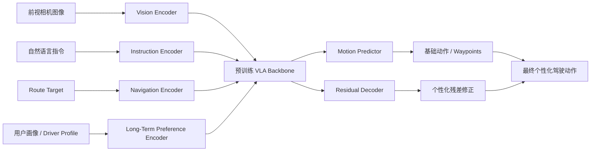
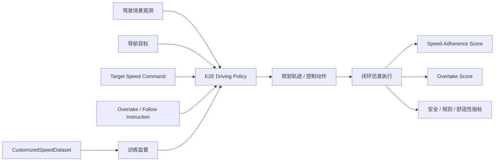
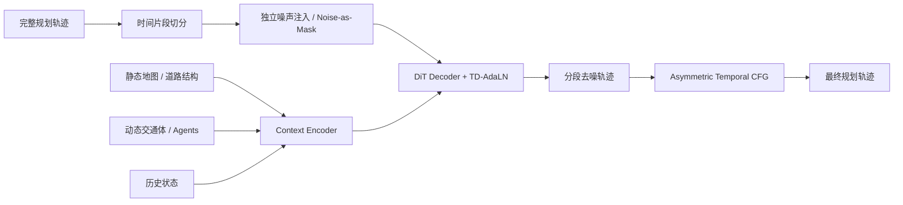

# 自动驾驶论文日报 - 2026-03-28

> 约束校验：仅收录自动驾驶相关论文；无人机/UAV 相关论文 **0** 收录。

## 1. Drive My Way: Preference Alignment of Vision-Language-Action Model for Personalized Driving

- arXiv： [arXiv:2603.25740](https://arxiv.org/abs/2603.25740)
- 发布日期：2026-03-26

**研究问题**
- 现有端到端自动驾驶系统大多只学“通用驾驶风格”，即便有风格控制，也往往只是固定模式切换，难以同时建模**长期驾驶习惯**与**实时语言指令**。
- 对真实用户来说，驾驶偏好是个体化且情境化的：有人更激进、有人更谨慎，同一个人也会因为“赶时间”“车上有人晕车”等短期意图而改变策略。论文要解决的就是：如何让 VLA 驾驶模型既像“这个人平时会怎么开”，又能听懂当前的自然语言要求。

**核心方法总结**
- 论文提出 **Drive My Way (DMW)**，在预训练 VLA 驾驶骨干之上加入**长期偏好建模 + 短期语言对齐**两条链路。
- 长期偏好部分：作者先构建 **Personal Driving Dataset (PDD)**，采集 30 位真实驾驶者在 CARLA 中的行为、轨迹与结构化画像信息，再通过 **Long-Term Preference Encoder** 学习用户 embedding，把驾驶背景、经验、风格等信息压成个体偏好向量。
- 短期指令部分：模型接收前视图像、导航目标点、用户画像以及自然语言 instruction，经 VLA 主干联合编码后，由 **motion predictor** 生成基础动作，再由 **residual decoder** 输出个性化残差修正，得到最终转向/油门/制动动作。
- 为了让模型真正响应“保守/激进”等自然语言风格要求，论文还用强化学习微调，把安全、效率、舒适性与风格一致性一起纳入优化。

**关键亮点 / 贡献**
- **把长期人格化驾驶与短期口头指令合并进一个统一框架**：不是只做静态 profile-conditioned policy，也不是只做一句话临时控制，而是两者同时成立。
- **构建了个性化驾驶数据集 PDD**：包含驾驶数据与结构化司机画像，为个性化自动驾驶提供了更直接的训练监督。
- **行为可辨识**：论文报告用户研究中，模型生成的行为能被识别出对应驾驶者风格，说明它学到的不是抽象标签，而是更细粒度的个体习惯。
- **闭环表现有实用意义**：在 Bench2Drive 上，DMW 对保守/激进指令的响应更明显，尤其在安全关键场景里能做出风格分化决策，而不是所有 instruction 最后都收敛成同一种驾驶动作。

**局限或适用边界**
- 这篇工作的个性化能力建立在**司机画像 + 个体历史数据**之上，现实部署时要持续采集用户数据，冷启动与隐私治理都会是门槛。
- 论文主要验证于 CARLA / Bench2Drive 闭环环境，距离真实道路上的长期个性化适应还有 domain gap。
- 自然语言个性化带来额外自由度，也意味着系统需要在“听用户话”和“保持安全边界”之间持续平衡，极端指令下的安全保障仍需工程兜底。

**重点图（方法总览图）**

图注核验：Overview of the DMW framework with a pretrained VLA backbone: front-view images, instructions, route targets, and user profile are fused, then a motion predictor and residual decoder produce personalized driving actions.

**Mermaid 架构图（根据论文方法整理）**

---

## 2. Can Users Specify Driving Speed? Bench2Drive-Speed: Benchmark and Baselines for Desired-Speed Conditioned Autonomous Driving

- arXiv： [arXiv:2603.25672](https://arxiv.org/abs/2603.25672)
- 发布日期：2026-03-26

**研究问题**
- 端到端自动驾驶这几年进步很快，但一个很现实的能力一直没被认真评测：**用户能不能明确指定目标车速，以及是否允许超车**。
- 传统 E2E 模型里的“快一点 / 慢一点”通常只是隐含在风格里，不是显式、可量化、可闭环验证的控制目标。更麻烦的是，想训练这类模型，理论上需要大量严格遵守目标速度的专家示范，现实采集成本很高。

**核心方法总结**
- 论文提出 **Bench2Drive-Speed**，把“期望车速 + 超车/跟车指令”正式引入自动驾驶闭环 benchmark。
- 在任务定义上，模型除了常规感知与导航输入外，还要接收两类用户控制信号：
  - **target-speed command**：期望速度；
  - **overtake / follow instruction**：在前车干扰场景下，是主动超车还是保持跟随。
- 在评测层，作者设计了 **Speed-Adherence Score** 和 **Overtake Score**，并与常规安全、规则遵守、任务完成度、舒适性指标联评，避免模型为了“听话”而牺牲基本驾驶质量。
- 在训练数据层，论文构建 **CustomizedSpeedDataset**（2100 个 clip），同时比较两种监督来源：
  1. 严格按目标速度执行的专家示范；
  2. 从常规驾驶数据重标注/虚拟生成目标速度信号。
  结果表明，只要重标注策略合理，后者也能训练出接近专家示范质量的速度条件控制模型。

**关键亮点 / 贡献**
- **把“用户指定速度”从模糊风格控制变成了显式 benchmark 问题**，而且是闭环评测，不只是离线统计。
- **评测设计比较完整**：不仅看速度跟随，还看超车命令执行、常规驾驶分数和舒适性，能更真实地暴露 controllability 与 safety 的 trade-off。
- **数据构建思路很实用**：论文的重要结论之一是，速度条件监督不一定非得重新大规模采集专家数据，基于常规驾驶数据做合理重标注，也能得到接近效果。
- **揭示了真正困难点**：论文发现，目标速度跟随可以在不明显损害常规驾驶表现的情况下实现，但**超车指令执行**仍然明显更难，因为它涉及交互式决策而不只是纵向调速。

**局限或适用边界**
- 这篇工作主要是 benchmark + dataset + baseline，核心价值在“把问题定义清楚”，不是直接提出一个压倒性更强的新驾驶策略。
- 实验依赖 CARLA/Bench2Drive 体系，真实道路中的社会互动复杂度更高，尤其是超车博弈行为，现实迁移难度不会低。
- 显式速度控制本身也有天然边界：用户要求不能凌驾于安全规则之上，因此系统最终仍要保留安全约束优先级。

**重点图（Benchmark 总览图）**

图注核验：Bench2Drive-Speed introduces target-speed and overtake/follow commands, plus controllability metrics, a customized dataset, and closed-loop evaluation to measure whether autonomous driving policies follow user-specified speed behaviors.

**Mermaid 架构图（根据论文方法整理）**

---

## 3. Temporally Decoupled Diffusion Planning for Autonomous Driving

- arXiv： [arXiv:2603.25462](https://arxiv.org/abs/2603.25462)
- 发布日期：2026-03-26

**研究问题**
- 城市动态环境里的轨迹规划天然存在时域异质性：**近时刻**更受瞬时动力学和局部避险约束，**远时刻**更受导航目标和全局意图约束。
- 现有扩散式规划方法往往把整条轨迹当成一个统一对象一起加噪/去噪，忽略了不同时间段的信息密度和约束类型并不一样，结果是模型对长短期依赖的建模不够细。

**核心方法总结**
- 论文提出 **Temporally Decoupled Diffusion Model (TDDM)**，核心思想是把完整轨迹切成多个时间片段，并对不同片段施加**独立噪声等级**，把高噪声片段视作信息缺失区、把低噪声片段视作上下文提示。
- 在训练阶段，这种“noise-as-mask”机制逼着模型利用保存较好的远期/上下文片段，去恢复受损更严重的近期规划状态，从而学习更明确的时序相关性。
- 在结构上，作者设计 **TD-AdaLN**，把片段级 diffusion timestep 注入解码器，使同一条轨迹的不同时间段可以带着不同噪声条件进入模型。
- 在推理阶段，论文进一步提出 **Asymmetric Temporal Classifier-Free Guidance**：让较干净的远期轨迹先验去引导近期轨迹生成，从而兼顾短期安全可行性与长期导航一致性。

**关键亮点 / 贡献**
- **把“整条轨迹统一扩散”改成“按时间段分治扩散”**，这比直接堆更大的生成模型更贴近驾驶规划本身的结构特征。
- **训练与推理设计是配套的**：TD-AdaLN 负责让网络接收分段 timestep，Asymmetric Temporal CFG 则把这个能力真正用在推理引导上，不是只在训练时做花活。
- **长尾难场景更有优势**：论文在 nuPlan 上报告，TDDM 整体表现接近或超过已有 SOTA，尤其在 **Test14-hard** 这类高难闭环子集上更强，说明它对复杂交互和困难时序决策更稳。
- **消融结果支持核心设计有效**：表格中完整 TDDM 配置在 Test14-hard 达到 **77.95**，高于去掉关键模块的多个变体，说明独立噪声、TD-AdaLN 和非对称时序引导都在起作用。

**局限或适用边界**
- 作为扩散式规划器，TDDM 的推理复杂度通常仍高于一次前向就出结果的回归式 planner，部署时要考虑时延预算。
- 论文验证主要集中在 nuPlan 基准，真实车端面对更复杂传感器误差、控制延迟和闭环反馈时，收益幅度还需要进一步确认。
- 该方法更适合“规划器本身就是生成式/扩散式”的技术栈；如果系统已经是强规则或优化器主导，接入成本未必低。

**重点图（方法总览图）**

图注核验：Overview of TDDM: environmental context is encoded once, trajectories are partitioned into temporal segments with independent diffusion timesteps, and the decoder generates plans under temporally decoupled denoising conditions.

**Mermaid 架构图（根据论文方法整理）**

---

## 发布前自检
- 图标题 / 图注核验 / 核心方法三者语义一致：**通过**
- 全文 arXiv 条目均为完整可点击链接：**通过**
- 重点图均来源于本地 PDF，且与核心方法直接对应：**通过**
- 报告按“逐篇处理、逐篇落盘、最后总校验”流程完成：**通过**
- 无人机相关论文收录数量：**0**
