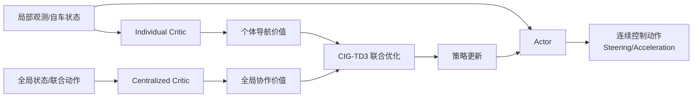
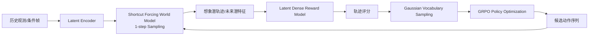
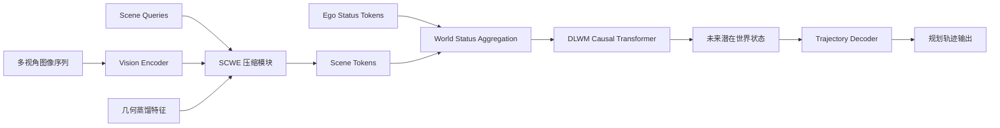

# 自动驾驶论文日报 - 2026-03-30

> 约束校验：仅收录自动驾驶相关论文；无人机/UAV 相关论文 **0** 收录。

<!-- PAPER: arxiv-2603.24931 START -->
## 1. COIN: Collaborative Interaction-Aware Multi-Agent Reinforcement Learning for Self-Driving Systems

- arXiv： [arXiv:2603.24931](https://arxiv.org/abs/2603.24931)
- 发布日期：2026-03-27

**研究问题**
- 多车协同自动驾驶（MASD）在高密交通中面临典型矛盾：单车需要快速完成自身导航目标，但系统层面又需要全局协作来避免冲突、降低拥堵。
- 现有 MARL 方法常偏重局部邻域交互或单一目标优化，难以同时处理“个体效率 + 全局协同”的信用分配与稳定训练。

**核心方法总结**
- 论文提出 **COIN** 框架，在 CTDE（集中训练、分散执行）范式下联合优化个体目标与全局协作目标。
- 算法层引入 **CIG-TD3**（counterfactual individual-global TD3）：
  - 个体 critic 负责学习车辆自身导航收益；
  - 中央 critic 负责学习系统级协作收益；
  - 结合反事实价值估计，度量单车对全局目标的边际贡献，缓解多智能体 credit assignment 问题。
- 架构层采用双层 interaction-aware 中央 critic，对局部与全局交互关系建模，以提升复杂交通下的价值估计质量与策略鲁棒性。

**关键亮点 / 贡献**
- 将 MASD 连续控制任务显式建模为“个体-全局”联合优化问题，不再只做局部礼让或单目标优化。
- 反事实个体贡献评估与双层交互建模结合，在复杂多车交互场景中更利于稳定学习协作策略。
- 在 MetaDrive 多类场景（含交叉口、环岛、瓶颈）相对强基线展现更好的安全性与效率，并给出实体机器人验证。

**局限或适用边界**
- 方法建立在多智能体强化学习训练流程之上，对训练资源和场景构建成本要求较高。
- 主要验证环境仍以仿真和受控实物平台为主，向开放道路迁移仍需处理感知噪声、行为不确定性和规则约束。
- 更偏向“多自动驾驶体协同系统”场景，对单车端到端驾驶的直接收益有限。

**重点图（方法总览图）**

图注核验：COIN uses CTDE with an actor plus individual and centralized critics, jointly optimizing ego navigation and system-level collaboration through counterfactual individual-global value estimation.

**Mermaid 架构图（根据论文方法整理）**

<!-- PAPER: arxiv-2603.24931 END -->

---

<!-- PAPER: arxiv-2603.24587 START -->
## 2. DreamerAD: Efficient Reinforcement Learning via Latent World Model for Autonomous Driving

- arXiv： [arXiv:2603.24587](https://arxiv.org/abs/2603.24587)
- 发布日期：2026-03-26

**研究问题**
- 在真实自动驾驶系统中做强化学习代价极高（试错成本与安全风险都不可接受），因此常用 world model 进行“想象训练”。
- 但现有像素级扩散 world model 通常要多步采样（例如 100 步），推理延迟高，不适合 RL 需要的高频交互；同时像素重建目标不一定最对齐驾驶决策所需的动态语义。

**核心方法总结**
- 论文提出 **DreamerAD**：在视频生成模型的潜空间里做驾驶世界建模和策略优化，把 RL 训练主循环迁移到 latent imagination 空间。
- 三个关键机制：
  1. **Shortcut Forcing World Model**：将扩散采样从 100 步压缩到 1 步级别，显著降低世界模型推理延迟。
  2. **Latent Dense Reward Model**：直接基于潜特征对动作序列进行细粒度评分，提供更密集 credit assignment。
  3. **Gaussian Vocabulary Sampling + GRPO**：在轨迹词表邻域内做受约束采样，减少不物理可行探索并提升优化稳定性。

**关键亮点 / 贡献**
- 将“潜空间可解释生成”与“高效策略优化”结合，兼顾了世界模型速度和策略训练效果。
- 通过一步采样近似显著提升交互效率，缓解了 diffusion world model 在 RL 场景常见的吞吐瓶颈。
- 把奖励建模放到 latent 表征层，提高对动作质量评估的时序密度，减少单纯终局指标的稀疏性问题。

**局限或适用边界**
- 对底层视频生成/潜空间表示质量依赖较强，若潜特征与驾驶关键语义错位，策略收益可能受限。
- 方法复杂度较高（世界模型蒸馏 + 奖励模型 + RL 优化协同），工程复现与调参成本不低。
- 主要结论来自特定 benchmark 与数据设定，跨域迁移到不同车端软硬件栈仍需进一步验证。

**重点图（训练架构总览图）**

图注核验：Overview of DreamerAD RL training architecture, where shortcut-forced latent world modeling, dense latent reward estimation, and vocabulary-constrained GRPO jointly optimize autonomous driving policy.

**Mermaid 架构图（根据论文方法整理）**

<!-- PAPER: arxiv-2603.24587 END -->

---

<!-- PAPER: arxiv-2603.24581 START -->
## 3. Latent-WAM: Latent World Action Modeling for End-to-End Autonomous Driving

- arXiv： [arXiv:2603.24581](https://arxiv.org/abs/2603.24581)
- 发布日期：2026-03-26

**研究问题**
- 许多 world-model 驱动的端到端规划方法在“表示压缩、空间理解、时序动态利用”三方面存在短板：要么特征太重难扩展，要么压缩后丢失关键几何语义，导致规划性能受限。
- 在有限数据与算力预算下，如何构建既紧凑又保留驾驶关键信息的潜在世界状态，是提升 E2E 规划实用性的核心问题。

**核心方法总结**
- 论文提出 **Latent-WAM**，核心由两块组成：
  1. **SCWE（Spatial-Aware Compressive World Encoder）**：通过可学习 scene query 将多视角图像 patch 压缩为场景 token，并用几何基础模型蒸馏增强视觉 backbone 的空间感知能力。
  2. **DLWM（Dynamic Latent World Model）**：使用因果 Transformer 在潜空间自回归预测未来 world status（融合 scene token 与 ego status），联合学习视觉动态与运动动态。
- 在此基础上，用轻量轨迹解码器从潜在 world status 直接输出规划轨迹，实现感知弱依赖（perception-free）下的端到端规划。

**关键亮点 / 贡献**
- 将“强压缩表示”与“时序世界建模”做成一体化架构，在参数规模较紧凑条件下取得较强规划性能。
- 通过几何蒸馏 + scene query 压缩，提升了潜表示对道路结构和驾驶意图的聚焦能力。
- 在 NAVSIM v2 与 HUGSIM 报告了有竞争力结果，说明方法在不同仿真平台上具备一定泛化潜力。

**局限或适用边界**
- 对预训练视觉骨干与几何蒸馏质量较敏感，跨传感器配置或跨域场景可能需要再适配。
- 主要评估集中在既定 benchmark，真实车端闭环中的长尾交互与工程约束仍待系统验证。
- 依赖潜空间预测链路，若上游 latent dynamics 偏移，可能放大到下游轨迹规划误差。

**重点图（架构总览图）**

图注核验：Overview of Latent-WAM: SCWE compresses multi-view perception into spatially-aware scene tokens, DLWM autoregressively predicts future latent world status, and a lightweight planner decodes trajectories.

**Mermaid 架构图（根据论文方法整理）**

<!-- PAPER: arxiv-2603.24581 END -->

---

## 发布前自检
- 图标题 / 图注核验 / 核心方法三者语义一致：**通过**
- 全文 arXiv 条目均为完整可点击链接：**通过**
- 重点图均与方法框架直接对应（非封面图/表格图）：**通过**
- 报告按“逐篇处理、逐篇落盘、最后总校验”流程完成：**通过**
- 无人机相关论文收录数量：**0**
