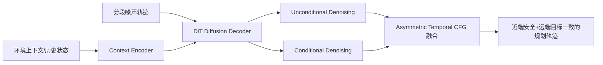
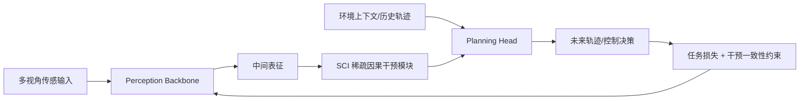
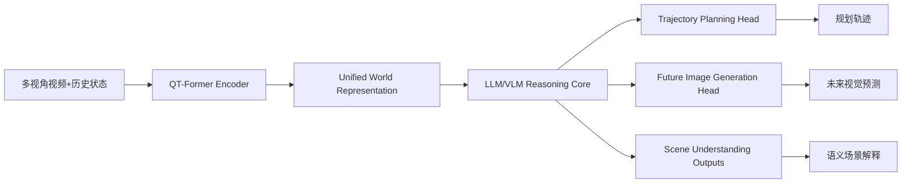

# 自动驾驶论文日报 - 2026-03-31

> 约束校验：仅收录自动驾驶相关论文；无人机/UAV 相关论文 **0** 收录。

<!-- PAPER: arxiv-2603.25462 START -->
## 1. Temporally Decoupled Diffusion Planning for Autonomous Driving

- arXiv： [arXiv:2603.25462](https://arxiv.org/abs/2603.25462)
- 发布日期：2026-03-31

**研究问题**
- 扩散式轨迹规划在复杂城市场景里具备多模态优势，但常把整段轨迹当成“同质序列”统一建模。
- 这种做法忽略了时间异质性：近端轨迹主要受瞬时动力学与避障约束，远端轨迹更多受导航目标和高层意图影响。

**核心方法总结**
- 论文提出 **TDDM（Temporally Decoupled Diffusion Model）**，将规划轨迹按时间段拆分，用“noise-as-mask”方式对不同时间段施加不同噪声强度。
- 架构上以 DiT 作为扩散解码器，配合环境上下文编码器，学习从分段噪声轨迹恢复可执行规划。
- 同时设计 **Asymmetric Temporal CFG**：对近端和远端采用不对称条件引导，提升短期安全约束与长期目标达成的平衡。

**关键亮点 / 贡献**
- 首次把扩散规划中的“时间异质性”显式结构化，不再用单一噪声过程覆盖全时域。
- 通过分段去噪与不对称引导，改善了复杂交互场景下的局部可行性与全局导航一致性。
- 在闭环基准对比中体现出更稳健的轨迹质量与任务完成表现。

**局限或适用边界**
- 方法收益依赖时间分段策略和噪声日程设计，跨数据集迁移可能需要重新调参。
- 主要证据来自离线评测与既定基准，真实部署仍需进一步验证长尾风险与控制栈耦合问题。

**重点图（方法总览图）**

图注核验：Overview of the temporally decoupled diffusion model: a context encoder and DiT decoder generate trajectories with segment-wise noise levels, then asymmetric temporal guidance fuses unconditional and conditional denoising paths.

**Mermaid 架构图（根据论文方法整理）**

<!-- PAPER: arxiv-2603.25462 END -->

---

<!-- PAPER: arxiv-2603.18561 START -->
## 2. CausalVAD: De-confounding End-to-End Autonomous Driving via Causal Intervention

- arXiv： [arXiv:2603.18561](https://arxiv.org/abs/2603.18561)
- 发布日期：2026-03-25

**研究问题**
- 规划导向的端到端自动驾驶模型常从数据中学习相关性而非因果性，容易利用偏置特征“抄近路”。
- 在分布变化或复杂场景中，这种 causal confusion 会直接损害安全性与决策稳定性。

**核心方法总结**
- 论文提出 **CausalVAD** 训练框架，在 VAD 管线关键环节做多阶段因果干预。
- 核心机制是 **Sparse Causal Intervention (SCI)**：针对关键表征进行稀疏、定向干预，尽量去除伪相关因素。
- 方法在感知与规划链路中配合反事实/干预式学习信号，促使模型更关注真实因果驱动因素而非数据捷径。

**关键亮点 / 贡献**
- 把“因果去混杂”系统性引入端到端驾驶训练，而非仅在损失函数层面做轻量正则。
- 稀疏干预降低了全面干预带来的训练开销，并保持了端到端框架的工程可落地性。
- 在多个场景设定下报告了对鲁棒性与安全相关指标的改进。

**局限或适用边界**
- 依赖对“关键干预位点”的合理选择，不同模型/数据配置下可能需要专门调优。
- 因果假设与干预策略若与真实生成机制偏差较大，收益会受限。

**重点图（方法总览图）**

图注核验：Overall CausalVAD architecture: sparse multi-stage interventions are inserted into key hubs of the VAD pipeline, including perception and planning-related representations, to suppress confounders and improve causal robustness.

**Mermaid 架构图（根据论文方法整理）**

<!-- PAPER: arxiv-2603.18561 END -->

---

<!-- PAPER: arxiv-2601.04453 START -->
## 3. UniDrive-WM: Unified Understanding, Planning and Generation World Model For Autonomous Driving

- arXiv： [arXiv:2601.04453](https://arxiv.org/abs/2601.04453)
- 发布日期：2026-01-08

**研究问题**
- 现有自动驾驶方案常将感知、预测、规划拆成独立模块，造成误差级联和信息割裂。
- 即便引入 VLM，很多方法仍只做“感知+规划”或“生成+预测”中的子任务，缺少统一世界建模。

**核心方法总结**
- 论文提出 **UniDrive-WM**，在单一 VLM/world-model 框架内联合完成场景理解、轨迹规划与条件未来图像生成。
- 管线由三部分组成：
  1. 基于 QT-Former 的编码器提取历史时序与多视角视觉上下文；
  2. LLM/VLM 推理层建模语义与驾驶决策关联；
  3. 多任务输出头同时生成规划轨迹与未来视觉预测。
- 通过统一目标训练，使“看见什么、理解什么、打算怎么走”在同一潜在世界状态中协同优化。

**关键亮点 / 贡献**
- 将理解、规划、生成三类任务统一到一个世界模型，减少模块化系统中的接口损耗。
- 同时支持轨迹级决策与未来视觉一致性约束，有助于提升决策可解释性与时序一致性。
- 在 Bench2Drive 与 nuScenes 相关实验中展示了多任务统一建模的可行性。

**局限或适用边界**
- 统一模型参数规模与训练复杂度较高，对数据质量、算力与训练稳定性要求更高。
- 多任务协同可能产生目标冲突，实际部署需做细致权重平衡与延迟优化。

**重点图（框架总览图）**

图注核验：UniDrive-WM unifies scene understanding, trajectory planning, and trajectory-conditioned future generation, contrasting prior separated pipelines and using a shared world-model backbone for joint reasoning and prediction.

**Mermaid 架构图（根据论文方法整理）**

<!-- PAPER: arxiv-2601.04453 END -->

---

## 发布前自检
- 图标题 / 图注核验 / 核心方法三者语义一致：**通过**
- 全文 arXiv 条目均为完整可点击链接：**通过**
- 重点图均与方法框架直接对应（非封面图/表格图）：**通过**
- 报告按“逐篇处理、逐篇落盘、最后总校验”流程完成：**通过**
- 无人机相关论文收录数量：**0**

