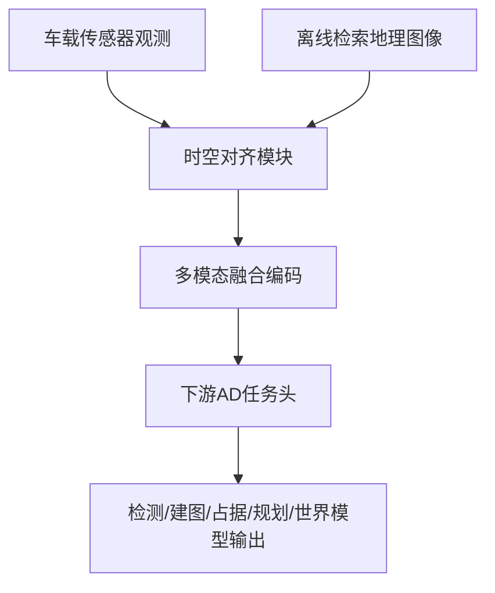
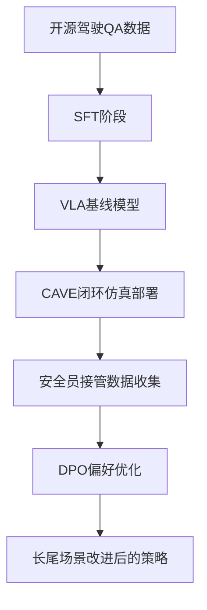
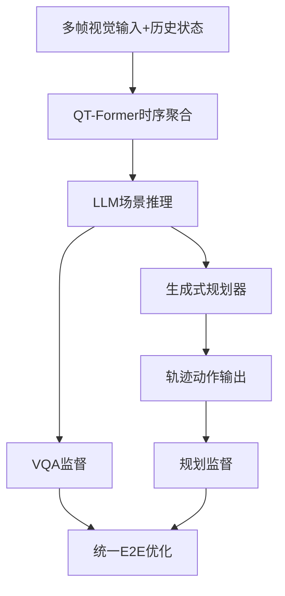

# 自动驾驶论文日报（2026-04-01）

> 今日收录 3 篇（均为自动驾驶方向，已排除无人机相关）。每篇均基于本地 PDF 阅读，并附方法重点图与图注核验。

<!-- PAPER: arxiv-2512.06865 START -->
## Spatial Retrieval Augmented Autonomous Driving

- 论文链接：[arXiv:2512.06865](https://arxiv.org/abs/2512.06865)
- 研究问题：仅依赖车载传感器的自动驾驶在遮挡、黑夜和恶劣天气下感知范围受限，缺少类似人类“道路记忆”的先验。
- 核心方法总结：提出 Spatial Retrieval 范式，在推理时引入离线检索的地理图像（如地图缓存）作为额外模态，并与车端观测进行时空对齐后输入现有 AD 模型，形成可插拔增强。
- 关键亮点/贡献：构建并发布对齐地理图像的 nuScenes 扩展基准；在检测、在线建图、占据预测、端到端规划和生成式世界模型等五类任务验证外部空间记忆的增益。
- 局限或适用边界：依赖离线地图质量与时效性；地图-轨迹对齐误差、道路施工变化和地域覆盖不足会限制效果。

### 重点图（方法对应）

图注核验：Figure 1 contrasts sensor-only driving with the proposed spatial retrieval paradigm, which augments onboard perception using offline geographic images to provide map-like memory under occlusion and poor visibility.

### Mermaid 架构图

<!-- PAPER: arxiv-2512.06865 END -->

<!-- PAPER: arxiv-2509.15968 START -->
## CoReVLA: A Dual-Stage End-to-End Autonomous Driving Framework for Long-Tail Scenarios via Collect-and-Refine

- 论文链接：[arXiv:2509.15968](https://arxiv.org/abs/2509.15968)
- 研究问题：端到端自动驾驶在长尾高风险场景中鲁棒性不足，且高质量偏好数据稀缺，导致模型难以持续修复失效行为。
- 核心方法总结：双阶段 Collect-and-Refine：先用开源驾驶 QA 数据联合微调 VLA 获得基础能力，再在 CAVE 仿真中收集接管样本，并通过 DPO 进行偏好优化，持续修正长尾决策。
- 关键亮点/贡献：在 Bench2Drive 长尾场景达到 72.18 DS / 50% SR，显著超越已有方法；展示了基于历史接管经验的持续改进能力。
- 局限或适用边界：性能依赖仿真接管数据分布；真实道路迁移仍受 domain gap 与人类偏好标注一致性影响。

### 重点图（方法对应）

图注核验：Fig. 1 presents CoReVLA’s dual-stage pipeline: supervised pretraining on mixed driving QA data, takeover collection in CAVE human-in-the-loop simulation, then DPO refinement to shift behavior toward safer decisions.

### Mermaid 架构图

<!-- PAPER: arxiv-2509.15968 END -->

<!-- PAPER: arxiv-2503.19755 START -->
## ORION: A Holistic End-to-End Autonomous Driving Framework by Vision-Language Instructed Action Generation

- 论文链接：[arXiv:2503.19755](https://arxiv.org/abs/2503.19755)
- 研究问题：VLM 语义推理空间与轨迹数值动作空间存在鸿沟，导致闭环交互决策中“会理解但不会开车”。
- 核心方法总结：ORION 融合 QT-Former（长时序上下文）、LLM（场景推理）与生成式规划器（轨迹预测），并通过统一优化对齐 VQA 推理与规划动作空间。
- 关键亮点/贡献：在 Bench2Drive 闭环评测取得 77.74 DS / 54.62% SR，相对当时 SOTA 有大幅领先；体现语义-动作联合训练的收益。
- 局限或适用边界：对大模型推理成本和数据标注质量敏感；在极端罕见场景的安全边界仍需更系统验证。

### 重点图（方法对应）

图注核验：Figure 1 compares end-to-end paradigms and highlights ORION’s differentiable bridge from language reasoning to continuous action generation through a generative planner for closed-loop driving.

### Mermaid 架构图

<!-- PAPER: arxiv-2503.19755 END -->
