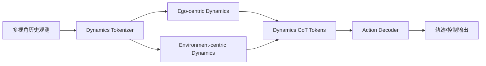
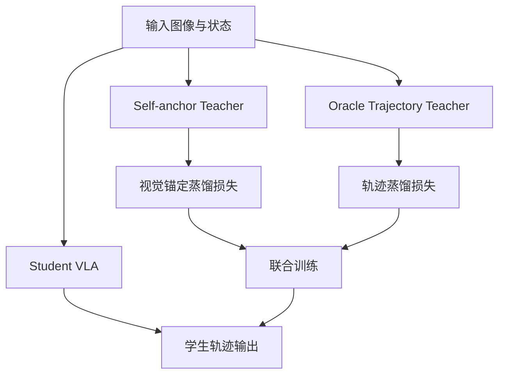
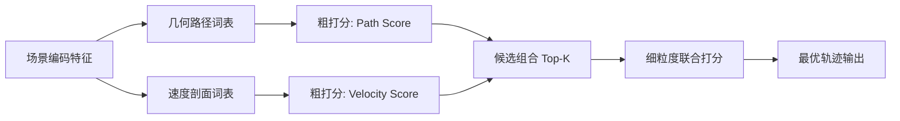

# 自动驾驶论文日报（2026-04-02）

> 主题：端到端自动驾驶 / VLA / 规划打分
> 过滤：已排除无人机（UAV）相关论文

---

<!-- PAPER: arxiv-2603.11041 START -->
## DynVLA: Learning World Dynamics for Action Reasoning in Autonomous Driving

- 链接：[arXiv:2603.11041](https://arxiv.org/abs/2603.11041)
- 研究问题：现有自动驾驶 VLA 在复杂交互场景中，文本 CoT 缺乏细粒度时空建模，视觉 CoT 又存在冗余与高延迟，导致动作推理质量不足。
- 核心方法：提出 **Dynamics CoT**，先预测紧凑“世界动态 token”再生成动作；用 Dynamics Tokenizer 压缩未来演化，并将动态拆分为 ego-centric 与 environment-centric 两支路；结合 SFT + RFT 训练以提升决策质量与推理效率。
- 亮点：
  - 在“可解释性-紧凑性-效率”间做了折中，不走纯文本或纯像素未来预测；
  - 明确把动态先验前置到动作生成前，改善物理一致性；
  - 在 NAVSIM / Bench2Drive / in-house 数据上相对 Textual/Visual CoT 均有稳定提升（按作者报告）。
- 局限：
  - 方法依赖 dynamics token 学习质量，跨域迁移时可能出现 token 语义漂移；
  - 训练链路（SFT+RFT）较复杂，复现成本与算力成本偏高；
  - 当前公开信息仍以基准分数为主，安全边界与失败案例披露有限。

### 重点图（方法对应）
- 重点图暂缺（质量门禁未通过）。

### Mermaid 架构图

<!-- PAPER: arxiv-2603.11041 END -->

<!-- PAPER: arxiv-2603.09465 START -->
## EvoDriveVLA: Evolving Autonomous Driving Vision-Language-Action Model via Collaborative Perception-Planning Distillation

- 链接：[arXiv:2603.09465](https://arxiv.org/abs/2603.09465)
- 研究问题：VLA 在解冻视觉编码器后易出现感知退化，同时长时规划存在误差累积，导致闭环驾驶稳定性不足。
- 核心方法：提出协同感知-规划蒸馏框架 **EvoDriveVLA**：
  1) Self-anchored Visual Distillation：通过自锚教师 + 轨迹引导关键区域约束稳住视觉表征；
  2) Oracle-guided Trajectory Distillation：未来感知 oracle 教师进行 coarse-to-fine 轨迹优化，并用 MC dropout 采样候选后选优监督学生网络。
- 亮点：
  - 同时处理“感知漂移”和“长时规划不稳”两类瓶颈；
  - 轨迹教师带未来信息，给学生提供更高质量规划监督；
  - 作者报告在 open-loop 与 closed-loop 评估均达到 SOTA 水平。
- 局限：
  - 多教师蒸馏依赖教师质量与训练配方，迁移时鲁棒性待验证；
  - 未来信息 oracle 在真实在线部署不可直接获得，训练-部署存在鸿沟；
  - 论文公开摘要层面对失效场景与实时开销细节披露有限。

### 重点图（方法对应）
- 重点图暂缺（质量门禁未通过）。

### Mermaid 架构图

<!-- PAPER: arxiv-2603.09465 END -->

<!-- PAPER: arxiv-2603.29163 START -->
## SparseDriveV2: Scoring is All You Need for End-to-End Autonomous Driving

- 链接：[arXiv:2603.29163](https://arxiv.org/abs/2603.29163)
- 研究问题：端到端多模态规划中，“静态轨迹词表打分”常被认为不如“动态提案生成”，但后者复杂度更高；核心问题是静态打分是否在足够稠密时也能逼近甚至超越动态方案。
- 核心方法：提出 **SparseDriveV2**，通过两项可扩展设计提升纯打分式规划上限：
  1) 因子化词表：将轨迹拆成几何路径 × 速度剖面，实现组合式动作空间覆盖；
  2) 因子化打分：先对路径/速度粗打分，再对少量组合轨迹做细粒度精排。
- 亮点：
  - 用系统性 scaling study 支撑“更密词表仍持续提升”的结论；
  - 以较轻骨干网络（ResNet-34）在 NAVSIM / Bench2Drive 报告高分；
  - 架构清晰，工程上易于并行化与分层检索优化。
- 局限：
  - 表示能力上界仍受词表设计与组合策略影响；
  - 候选规模继续增大时，检索与打分延迟可能再度成为瓶颈；
  - 对极端长尾交互（罕见博弈行为）的泛化能力有待更多实车证据。

### 重点图（方法对应）
- 重点图暂缺（质量门禁未通过）。

### Mermaid 架构图

<!-- PAPER: arxiv-2603.29163 END -->
