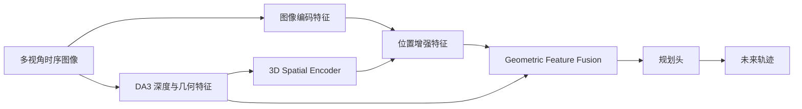

# 自动驾驶论文日报（2026-04-03）

> 主题：端到端自动驾驶 / 视角鲁棒性 / 空间检索增强
> 过滤：已排除无人机（UAV）相关论文

---

<!-- PAPER: arxiv-2503.19755 START -->
## ORION: A Holistic End-to-End Autonomous Driving Framework by Vision-Language Instructed Action Generation

- 链接：[arXiv:2503.19755](https://arxiv.org/abs/2503.19755)
- 研究问题：VLM 在自动驾驶中具备语义推理能力，但难以直接输出高质量数值轨迹；“语义推理空间”和“动作空间”存在鸿沟，导致闭环表现不足。
- 核心方法：提出 ORION 三段式框架：
  1) **QT-Former** 聚合长时序多视角上下文；
  2) **LLM** 做场景推理并生成 planning token；
  3) **Generative Planner（VAE/可替换扩散）** 将 planning token 映射到多模态轨迹，实现 reasoning→action 对齐。
- 亮点：
  - 用生成式规划器把语言推理与轨迹生成端到端打通；
  - 显式引入长时记忆查询，增强历史依赖建模；
  - 作者报告在 Bench2Drive 闭环指标上相对既有方法有显著提升。
- 局限：
  - 训练链路复杂（视觉编码+LLM+生成规划器+多任务损失），工程复现门槛高；
  - 对高质量 VQA/驾驶推理标注依赖较强；
  - 计算开销和部署实时性仍需在量产侧验证。

### 重点图（方法对应）
- 图：Figure 2（ORION 总体架构，QT-Former + LLM + Generative Planner）
- 图注核验：Pipeline aligns vision, reasoning, and action spaces using QT-Former for temporal context, LLM for reasoning/planning token, and generative planner for multimodal trajectory generation.

### Mermaid 架构图

<!-- PAPER: arxiv-2503.19755 END -->

<!-- PAPER: arxiv-2604.00597 START -->
## Towards Viewpoint-Robust End-to-End Autonomous Driving with 3D Foundation Model Priors

- 链接：[arXiv:2604.00597](https://arxiv.org/abs/2604.00597)
- 研究问题：端到端自动驾驶模型对训练期相机外参分布敏感，在跨车型/跨安装位部署时容易因视角变化导致规划性能下滑。
- 核心方法：在不做视角增强的前提下，引入 3D foundation model 几何先验：
  1) **3D Spatial Encoder**：基于深度估计构建逐像素 3D 位置并注入位置编码；
  2) **Geometric Feature Fusion**：通过 cross-attention 融合 DA3 中间几何特征到规划网络。
- 亮点：
  - 明确聚焦“相机视角变化鲁棒性”这一可部署痛点；
  - augmentation-free 路线，减少为新平台重采数据/重训练成本；
  - 在 VR-Drive 扰动基准下对 pitch/height 扰动有稳定收益（按作者报告）。
- 局限：
  - 对纵向平移（depth translation）增益有限；
  - 3D 位置编码仍直接依赖外参，分布漂移未被彻底消除；
  - 对 3D foundation model 的质量与域泛化能力有依赖。

### 重点图（方法对应）
- 图：Figure 2（3D Spatial Encoder + Geometric Feature Fusion 模块）
- 图注核验：Architecture injects depth-derived 3D positional embeddings and fuses DA3 intermediate geometric features via cross-attention to improve robustness under viewpoint perturbations.

### Mermaid 架构图

<!-- PAPER: arxiv-2604.00597 END -->

<!-- PAPER: arxiv-2512.06865 START -->
## Spatial Retrieval Augmented Autonomous Driving

- 链接：[arXiv:2512.06865](https://arxiv.org/abs/2512.06865)
- 研究问题：仅依赖车载在线传感器时，感知地平线受限，在遮挡、夜晚、恶劣天气下易退化，影响检测/建图/占据/规划与世界模型一致性。
- 核心方法：提出 **Spatial Retrieval** 范式，将离线地理图像（如街景/缓存地图）作为额外模态接入 AD：
  1) 构建 nuScenes-Geography 扩展与检索 API；
  2) 设计可插拔 **Spatial Retrieval Adapter**（Geo cross-attention）；
  3) 引入 **Reliability Estimation Gate**，对缺失/错配检索自适应降权。
- 亮点：
  - 把“离线地理先验”系统化引入多类自动驾驶任务；
  - 对在线建图、占据、规划安全性与生成世界模型一致性均给出基线验证；
  - 模块化改造，便于在既有 BEV/生成框架中做增量接入。
- 局限：
  - 对地理数据覆盖率、时效性、坐标对齐质量高度敏感；
  - 错检索场景下仍可能引入误导先验；
  - 外部地理数据接入在隐私、合规、成本侧需额外评估。

### 重点图（方法对应）
- 图：Figure 2（Spatial Retrieval Adapter 的 Geo Cross-Attention 融合）
- 图注核验：Spatial Retrieval Adapter uses BEV features as queries and retrieved geographic features plus 3D positional encodings as keys/values, then applies reliability-gated residual fusion.

### Mermaid 架构图

<!-- PAPER: arxiv-2512.06865 END -->
