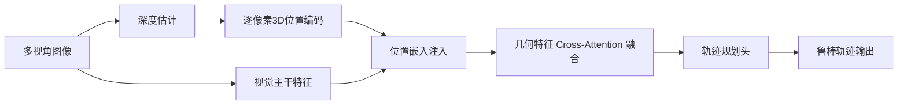
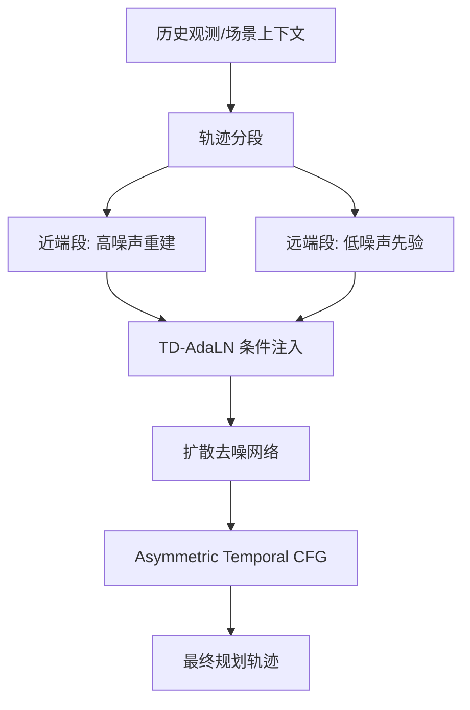

# 自动驾驶论文日报（2026-04-04）

> 更新时间：2026-04-04

<!-- PAPER: arxiv-2603.18561 START -->
## 1) CausalVAD: De-confounding End-to-End Autonomous Driving via Causal Intervention

- arXiv链接：[arXiv:2603.18561](https://arxiv.org/abs/2603.18561)
- 研究问题：端到端自动驾驶模型常把数据集相关性当因果关系，出现“因果混淆”，导致闭环安全性下降。
- 核心方法：提出 CausalVAD，在 VAD 框架中引入稀疏因果干预方案（SCIS）。通过多模态混杂原型字典（对象/地图/智能体）+ 两类去混杂模块（PDM/IDM），把 backdoor adjustment 参数化落地到感知、预测、规划三阶段。
- 亮点：
  - 将因果后门调整做成可插拔训练机制，不依赖额外解释器；
  - 在 nuScenes 上同时提升规划精度与碰撞率指标，并在噪声与分布偏移场景表现更稳；
  - 方法层面强调“分阶段干预关键信息枢纽”，而非单点修补。
- 局限：
  - 依赖离线原型字典构建与聚类超参选择；
  - 主要在 VAD 顺序式架构验证，向并行/迭代交互架构泛化仍待实验；
  - 论文关注开环与部分仿真结果，真实车端闭环泛化仍需更多证据。

**重点图**
- 图2（方法总览）：`重点图暂缺（质量门禁未通过）`
- 图注核验：Figure 2 describes CausalVAD’s full pipeline, with stage-wise de-confounding at perception, prediction, and planning via PDM/IDM modules and confounder dictionaries.

```mermaid
graph TD
  A[多视角图像输入] --> B[BEV表示]
  B --> C[Object/Map/Agent/Ego稀疏Query]
  C --> D[PDM 感知去混杂]
  D --> E[IDM 交互去混杂(预测阶段)]
  E --> F[IDM 交互去混杂(规划阶段)]
  F --> G[轨迹规划输出]
  H[混杂原型字典 Zo/Zm/Za] --> D
  H --> E
  H --> F
```
<!-- PAPER: arxiv-2603.18561 END -->

<!-- PAPER: arxiv-2604.00597 START -->
## 2) Towards Viewpoint-Robust End-to-End Autonomous Driving with 3D Foundation Model Priors

- arXiv链接：[arXiv:2604.00597](https://arxiv.org/abs/2604.00597)
- 研究问题：端到端驾驶模型对训练时相机视角依赖强，视角扰动（俯仰/高度/平移）下规划鲁棒性明显下降。
- 核心方法：使用 3D foundation model 的几何先验，不做数据增强。将深度估计得到的逐像素3D位置注入为位置嵌入，并通过 cross-attention 融合中间几何特征，增强视角变化下的表示稳定性。
- 亮点：
  - 提出“无增强”的几何先验注入路径，工程实现清晰；
  - 在 VR-Drive 视角扰动基准中对 pitch/height 扰动退化更小；
  - 指出 longitudinal translation 仍是薄弱点，分析较诚实。
- 局限：
  - 对纵向平移鲁棒性提升有限；
  - 依赖深度质量与3D先验特征质量；
  - 当前为 workshop 结果，跨数据集泛化与闭环收益仍需补充。

**重点图**
- 方法示意图：`重点图暂缺（质量门禁未通过）`
- 图注核验：The method injects per-pixel 3D positions from depth as positional embeddings and fuses intermediate geometric cues via cross-attention to improve viewpoint robustness.


<!-- PAPER: arxiv-2604.00597 END -->

<!-- PAPER: arxiv-2603.25462 START -->
## 3) Temporally Decoupled Diffusion Planning for Autonomous Driving

- arXiv链接：[arXiv:2603.25462](https://arxiv.org/abs/2603.25462)
- 研究问题：扩散规划通常把整段轨迹同质建模，难以同时兼顾近端安全约束与远端导航目标。
- 核心方法：提出 TDDM（Temporally Decoupled Diffusion Model），把轨迹按时间段解耦并施加不同噪声强度（noise-as-mask）。配套 TD-AdaLN 注入分段时间步，推理时用 Asymmetric Temporal CFG 让远期弱噪声先验引导近期路径生成。
- 亮点：
  - 显式建模“近端/远端异质时序依赖”；
  - 在 nuPlan（尤其 Test14-hard）上取得接近或超过 SOTA 的表现；
  - 训练与推理机制（分段噪声 + 非对称引导）设计完整。
- 局限：
  - 分段策略和噪声调度需要较多调参；
  - 主要验证在指定基准，跨城市场景泛化尚需更多证据；
  - 扩散推理在实时系统中的时延压力仍需工程优化。

**重点图**
- 模型框架图：`重点图暂缺（质量门禁未通过）`
- 图注核验：TDDM partitions trajectory denoising into temporally decoupled segments, combines segment-specific timestep conditioning, and uses asymmetric guidance from weakly noised far-term priors.


<!-- PAPER: arxiv-2603.25462 END -->

