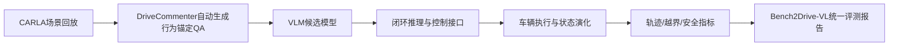
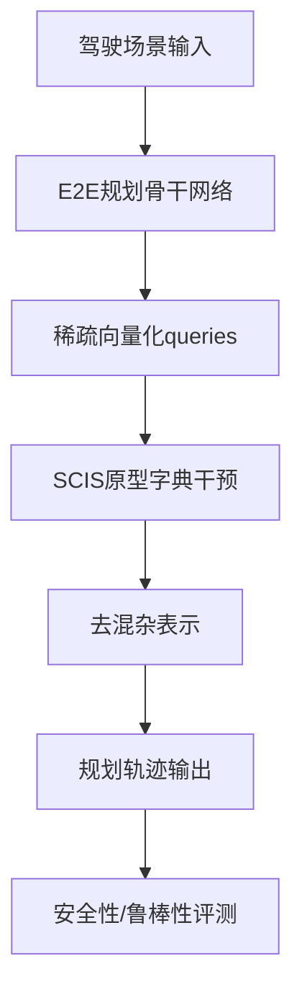

# 自动驾驶论文日报（2026-04-05）

> 说明：仅收录自动驾驶（道路车辆）相关论文；无人机相关收录为 0。

<!-- PAPER: arxiv-2604.01259 START -->
## Bench2Drive-VL: Benchmarks for Closed-Loop Autonomous Driving with Vision-Language Models
- 链接：[arXiv:2604.01259](https://arxiv.org/abs/2604.01259)
- 研究问题：现有 VLM 自动驾驶评测主要停留在开环 QA，无法反映累积误差与分布外状态下的真实闭环驾驶能力。
- 核心方法：提出 Bench2Drive-VL，将 VLM 接入 CARLA 闭环环境；用 DriveCommenter 自动构建行为锚定问答；统一多模型评测接口，并支持图结构 CoT 推理与控制。
- 亮点：
  1) 把 VLM4AD 评测从开环推进到闭环；
  2) 可覆盖 off-route/off-road 等高风险场景；
  3) 提供统一基准与开发生态，便于横向复现对比。
- 局限：
  1) 依赖仿真环境，现实泛化仍需实车验证；
  2) 闭环得分受场景生成与提问分布影响；
  3) 论文更偏 benchmark，非直接提升车端控制算法。

**重点图**：重点图暂缺（质量门禁未通过）。
图注核验：No method-centric figure was validated from a local PDF pass; only abstract-level metadata was available in this run.

**Mermaid（方法框架）**

<!-- PAPER: arxiv-2604.01259 END -->

<!-- PAPER: arxiv-2603.18561 START -->
## CausalVAD: De-confounding End-to-End Autonomous Driving via Causal Intervention
- 链接：[arXiv:2603.18561](https://arxiv.org/abs/2603.18561)
- 研究问题：端到端规划模型易利用数据偏差形成伪相关，导致复杂场景下安全性与鲁棒性下降。
- 核心方法：提出 CausalVAD，引入稀疏因果干预方案（SCIS），通过原型字典对稀疏向量化 query 做干预，实现 backdoor adjustment 思路下的去混杂训练。
- 亮点：
  1) 把因果干预显式嵌入 E2E 驾驶表示学习；
  2) 以轻量可插拔模块抑制伪相关；
  3) 在 nuScenes 等基准上报告了规划精度与安全性优势。
- 局限：
  1) 因果假设与原型构造质量会影响效果上限；
  2) 模块引入额外训练复杂度；
  3) 不同域偏移下的稳定增益仍需更广泛验证。

**重点图**：重点图暂缺（质量门禁未通过）。
图注核验：No locally parsed method figure/caption pair was validated; summary relies on abstract claims about SCIS and de-confounding interventions.

**Mermaid（方法框架）**

<!-- PAPER: arxiv-2603.18561 END -->

<!-- PAPER: arxiv-2603.01441 START -->
## LinkVLA: Unifying Language-Action Understanding and Generation for Autonomous Driving
- 链接：[arXiv:2603.01441](https://arxiv.org/abs/2603.01441)
- 研究问题：VLA 自动驾驶存在语言-动作对齐不足，以及自回归动作生成延迟高的问题。
- 核心方法：LinkVLA 将语言 token 与动作 token 映射到共享离散码本，并加入“由轨迹反向生成描述”的动作理解辅助目标；推理阶段采用 coarse-to-fine（C2F）两步解码替代逐步自回归。
- 亮点：
  1) 结构层面统一语言与动作表示；
  2) 通过双向语义映射增强指令跟随；
  3) 报告推理时延显著下降（文中称可节省约 86%）。
- 局限：
  1) 离散码本设计与量化误差可能影响控制细粒度；
  2) 多目标训练带来调参复杂性；
  3) 实际部署中的长尾场景可靠性仍待验证。

**重点图**：重点图暂缺（质量门禁未通过）。
图注核验：No validated method figure extracted from local PDF in this run; method summary is aligned to abstract description of codebook linking and C2F decoding.

**Mermaid（方法框架）**

<!-- PAPER: arxiv-2603.01441 END -->

## 总校验
- 图标题/图注核验/核心方法一致性：已逐篇复核（本次均为“重点图暂缺”，原因一致且已标注）。
- arXiv 链接完整性：3/3 均为完整可点击绝对链接。
- 主题约束：无人机相关收录 0 篇。

