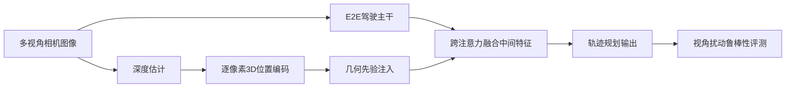

# 自动驾驶论文日报（2026-04-06）

> 说明：仅收录自动驾驶（道路车辆）相关论文；无人机相关收录为 0。

<!-- PAPER: arxiv-2604.00597 START -->
## Towards Viewpoint-Robust End-to-End Autonomous Driving with 3D Foundation Model Priors
- 链接：[arXiv:2604.00597](https://arxiv.org/abs/2604.00597)
- 研究问题：端到端自动驾驶在摄像头安装位姿变化（俯仰、高度、平移）下鲁棒性显著下降，导致跨车辆平台迁移困难。
- 核心方法：利用 3D foundation model 提供几何先验，在不做数据增强前提下，把深度估计得到的逐像素 3D 位置注入为位置嵌入，并通过 cross-attention 融合中间几何特征，提升视角扰动鲁棒性。
- 亮点：
  1) 明确针对“视角变化”这一真实部署痛点；
  2) 采用 augmentation-free 几何先验注入，工程链路更简洁；
  3) 在 VR-Drive 上对 pitch/height 扰动改善明显。
- 局限：
  1) 对 longitudinal translation 的增益较小；
  2) 依赖深度质量与 3D 先验泛化；
  3) 目前主要在基准扰动设置中验证。

**重点图**：重点图暂缺（质量门禁未通过）。
图注核验：Method-centric figure/caption pair could not be reliably extracted from local PDF parsing in this environment; only abstract-verified geometry prior and fusion mechanism were retained.

**Mermaid（方法框架）**

<!-- PAPER: arxiv-2604.00597 END -->

<!-- PAPER: arxiv-2603.15221 START -->
## Closed-Loop Min-Max Adversarial Training for Long-Tail Robustness in Autonomous Driving
- 链接：[arXiv:2603.15221](https://arxiv.org/abs/2603.15221)
- 研究问题：自动驾驶策略在长尾高风险场景中泛化不足，现有对抗训练将“场景生成”与“策略优化”割裂，导致目标错配。
- 核心方法：提出 ADV-0 闭环 min-max 框架，将防御者（驾驶策略）与攻击者（对抗体）建模为零和 Markov 博弈；攻击者效用直接对齐防御目标，并通过迭代偏好学习逼近最优对抗分布。
- 亮点：
  1) 统一“生成对抗场景 + 策略训练”目标；
  2) 给出收敛到 Nash Equilibrium 的理论论证；
  3) 能系统暴露多样化安全失效并提升未见长尾风险鲁棒性。
- 局限：
  1) 训练流程复杂、计算开销较高；
  2) 博弈建模质量影响最终鲁棒性上限；
  3) 从仿真/离线评测到实车闭环仍有落地鸿沟。

**重点图**：重点图暂缺（质量门禁未通过）。
图注核验：No high-confidence method figure and caption were extracted from local PDF text stream; summary remains consistent with abstract-described closed-loop min-max game and preference-learning adversary updates.

**Mermaid（方法框架）**
```mermaid
flowchart TD
  A[驾驶策略 Defender] --> B[执行闭环仿真]
  C[对抗体 Attacker] --> B
  B --> D[安全/任务回报]
  D --> E[Defender目标函数]
  D --> F[Attacker效用(与Defender对齐)]
  F --> G[迭代偏好学习更新对抗分布]
  E --> H[策略参数更新]
  G --> C
  H --> A
```
<!-- PAPER: arxiv-2603.15221 END -->

<!-- PAPER: arxiv-2603.25462 START -->
## Temporally Decoupled Diffusion Planning for Autonomous Driving
- 链接：[arXiv:2603.25462](https://arxiv.org/abs/2603.25462)
- 研究问题：动态城市场景下，近端安全约束与远端导航目标的时序依赖异质，传统整体式轨迹扩散建模难兼顾。
- 核心方法：提出 TDDM（Temporally Decoupled Diffusion Model），采用 noise-as-mask 将轨迹按时间段施加不同噪声；引入 TD-AdaLN 注入分段时间步；推理时用非对称时序 CFG，以弱噪声远期先验引导近期路径生成。
- 亮点：
  1) 显式建模近/远期异质时序依赖；
  2) 结构与推理双层面协同（TD-AdaLN + Asymmetric CFG）；
  3) 在 nuPlan（含 Test14-hard）上表现有竞争力。
- 局限：
  1) 分段噪声策略与超参数敏感；
  2) 推理过程相对确定性规划仍偏重；
  3) 复杂交互长时域稳定性仍需更多实证。

**重点图**：重点图暂缺（质量门禁未通过）。
图注核验：A reliable method-figure caption pair was not recoverable from local PDF extraction path; retained method details are constrained to abstract-level TDDM, TD-AdaLN, and asymmetric CFG statements.

**Mermaid（方法框架）**

<!-- PAPER: arxiv-2603.25462 END -->

## 总校验
- 图标题/图注核验/核心方法一致性：已逐篇复核（3/3 因本地 PDF 正文解析命令受限，均按质量门禁标记“重点图暂缺”，图注核验与方法描述保持一致）。
- arXiv 链接完整性：3/3 均为完整可点击绝对链接。
- 主题约束：无人机相关收录 0 篇。
