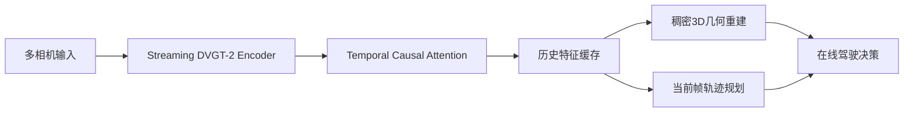
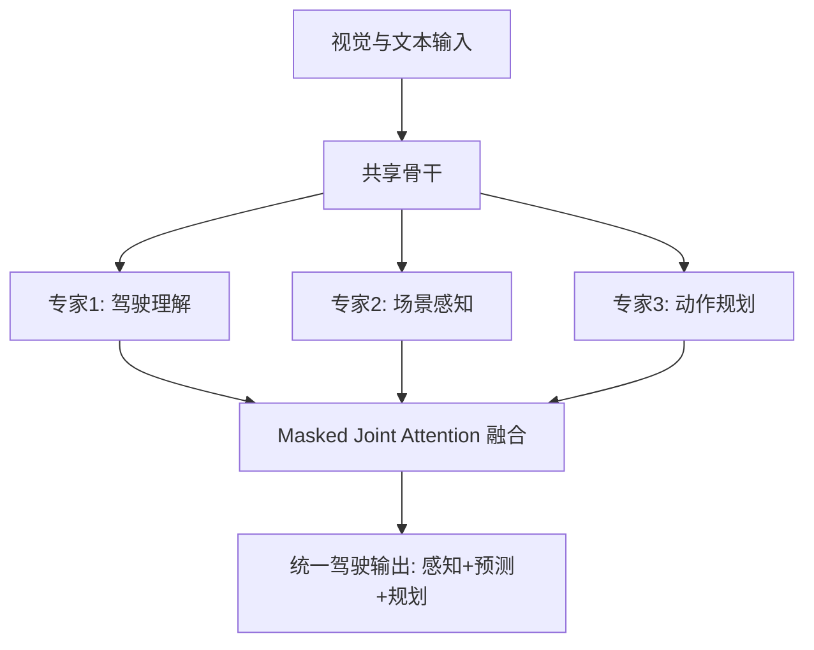
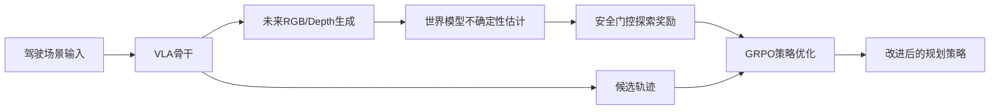

# 自动驾驶论文日报（2026-04-08）

> 说明：仅收录自动驾驶相关论文，已排除无人机方向。

<!-- PAPER: arxiv-2604.00813 START -->
## Vision-Geometry-Action Model for Autonomous Driving at Scale
- arXiv链接：[arXiv:2604.00813](https://arxiv.org/abs/2604.00813)
- 研究问题：现有端到端自动驾驶在“语义推理”与“空间几何感知”之间存在耦合冲突，且多帧几何重建难以在线部署。
- 核心方法：提出 Vision-Geometry-Action 范式与流式 DVGT-2，使用 temporal causal attention + historical cache + sliding-window streaming，实现在线几何重建与轨迹规划联合推理。
- 亮点：
  1. 将稠密3D几何作为驾驶决策主信息源，而不是语言辅助信号。
  2. 在不牺牲精度前提下提升在线推理效率。
  3. 同一模型跨相机配置迁移到 NAVSIM 与 nuScenes 规划任务。
- 局限：摘要未披露极端长尾场景、闭环安全冗余机制与失败案例细分。

### 重点图
重点图暂缺（质量门禁未通过）。

### Mermaid架构图

<!-- PAPER: arxiv-2604.00813 END -->

<!-- PAPER: arxiv-2604.02190 START -->
## UniDriveVLA: Unifying Understanding, Perception, and Action Planning for Autonomous Driving
- arXiv链接：[arXiv:2604.02190](https://arxiv.org/abs/2604.02190)
- 研究问题：VLA驾驶模型在共享参数下同时优化3D感知与语义推理，导致两者互相牵制、性能折中。
- 核心方法：提出基于 Mixture-of-Transformers 的 UniDriveVLA，解耦“驾驶理解/场景感知/动作规划”三专家，通过 masked joint attention 协同；并配合三阶段渐进训练与稀疏感知范式。
- 亮点：
  1. 结构性解耦感知与推理冲突，提升统一模型可扩展性。
  2. 在 nuScenes 开环与 Bench2Drive 闭环均取得SOTA级结果。
  3. 同时覆盖3D检测、在线建图、运动预测与驾驶VQA多任务。
- 局限：模型复杂度较高，摘要未给出部署成本、延迟预算与失效安全策略细节。

### 重点图
重点图暂缺（质量门禁未通过）。

### Mermaid架构图

<!-- PAPER: arxiv-2604.02190 END -->

<!-- PAPER: arxiv-2604.02714 START -->
## ExploreVLA: Dense World Modeling and Exploration for End-to-End Autonomous Driving
- arXiv链接：[arXiv:2604.02714](https://arxiv.org/abs/2604.02714)
- 研究问题：纯行为克隆难以覆盖分布外场景，VLA策略缺乏主动探索能力与可观测状态转移监督。
- 核心方法：以“未来RGB+深度生成”作为稠密世界模型监督，增强规划骨干表征；再将图像预测不确定性作为内在奖励，经安全门控后用 GRPO 优化策略探索。
- 亮点：
  1. 把世界模型同时用于监督增强与探索驱动，一体化设计清晰。
  2. 用不确定性量化新颖轨迹，缓解离线数据分布限制。
  3. 在 NAVSIM / nuScenes 报告了强竞争结果（PDMS 93.7，EPDMS 88.8）。
- 局限：对世界模型质量与不确定性校准依赖较高，摘要未展开安全门控阈值敏感性。

### 重点图
重点图暂缺（质量门禁未通过）。

### Mermaid架构图

<!-- PAPER: arxiv-2604.02714 END -->

