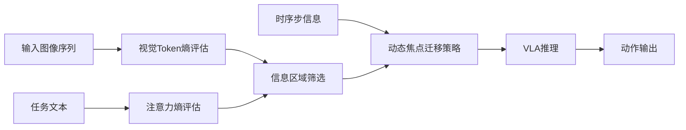

# 自动驾驶论文日报（2026-04-09）

> 说明：仅收录自动驾驶相关论文，已排除无人机方向。

<!-- PAPER: arxiv-2604.05323 START -->
## A Training-Free Vision-Attention Information Entropy Approach for Vision-Language-Action Models Inference Acceleration and Success
- arXiv链接：[arXiv:2604.05323](https://arxiv.org/abs/2604.05323)
- 研究问题：VLA 在自动驾驶等实时场景中推理成本高、延迟大，难以同时兼顾效率与决策质量。
- 核心方法：提出 VLA-InfoEntropy，联合视觉熵（筛选纹理/结构信息密集区域）与注意力熵（筛选文本语义关键 token），并结合时序步信息进行动态焦点迁移，从全局视觉逐步转向任务相关局部区域。
- 亮点：
  1. 训练无关，可直接用于推理阶段加速。
  2. 统一融合空间、语义、时序三类线索，减少冗余计算。
  3. 在论文报告中同时提升推理效率与任务表现。
- 局限：摘要未给出在闭环自动驾驶基准上的细粒度安全指标，且对极端长尾场景的鲁棒性证据有限。

### 重点图
重点图暂缺（质量门禁未通过）。

### Mermaid架构图

<!-- PAPER: arxiv-2604.05323 END -->
