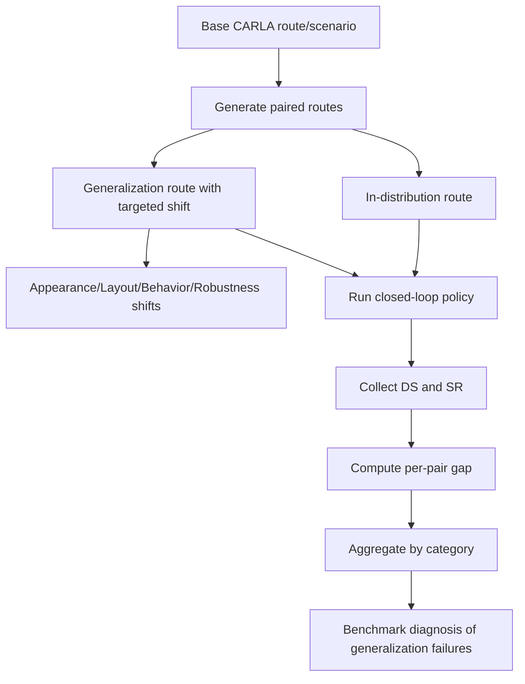

# 自动驾驶论文日报（2026-04-10）

> 生成时间：2026-04-10 10:36 (Asia/Shanghai)

## 今日新增论文

<!-- PAPER: arxiv-2604.08535 START -->
### 1) Fail2Drive: Benchmarking Closed-Loop Driving Generalization
- arXiv链接：[arXiv:2604.08535](https://arxiv.org/abs/2604.08535)
- 研究问题：现有 CARLA 闭环评测常复用训练场景，难以区分“记忆”与“真实泛化”，导致自动驾驶泛化能力被高估。
- 核心方法：提出 Fail2Drive 基准，构造 200 条路线与 17 类新场景，并采用“同位点 in-distribution vs generalization”配对路线设计，隔离分布偏移因果影响，用 DS/SR 及 HM 指标量化泛化落差。
- 亮点：
  - 首个面向 CARLA 闭环泛化的配对路线评测框架。
  - 覆盖外观、布局、行为、鲁棒性四类偏移，支持可复现实验诊断。
  - 对 7 个代表性模型评测显示平均成功率下降 22.8%，揭示 LiDAR 忽视、障碍语义泛化弱等关键失效模式。
- 局限：
  - 仍是仿真域评测，存在 sim-to-real 差距。
  - 更偏评测与诊断，不直接提供提升策略。

**重点图（方法对应）**
- 重点图暂缺（质量门禁未通过）
- 图注核验：Figure 1 presents the paired-route Fail2Drive benchmark design for unseen long-tail closed-loop CARLA scenarios, converting qualitative failures into measurable generalization gaps across seven driving models.

**Mermaid 架构图**

<!-- PAPER: arxiv-2604.08535 END -->

## 去重与约束校验
- 候选集合去重（按 arXiv ID）：已执行
- 写入前去重（按 `<!-- PAPER: arxiv-... START -->`）：已执行
- 当日重复 arXiv ID：0
- 无人机相关收录：0

## 产出统计
- 今日新增：1 篇
