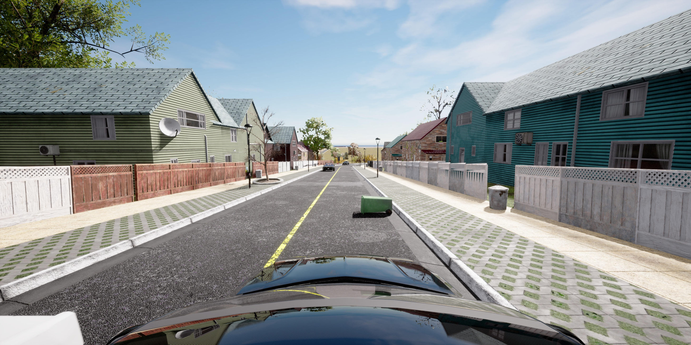
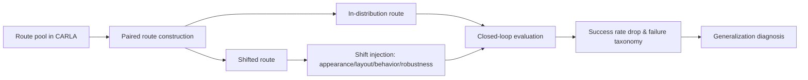

# 自动驾驶论文日报 - 2026-04-11

<!-- PAPER: arxiv-2604.08535 START -->
## Fail2Drive: Benchmarking Closed-Loop Driving Generalization

- arXiv链接: [arXiv:2604.08535](https://arxiv.org/abs/2604.08535)
- 研究问题: 现有闭环自动驾驶评测大量复用训练分布内场景，难以真实衡量分布外泛化能力。
- 核心方法: 构建成对路线基准（ID vs Shifted），在 CARLA 中系统注入外观、布局、行为和鲁棒性四类 shift，并配套可扩展场景工具链与特权专家可解性校验。
- 亮点:
  - 提出首个“配对路线”闭环泛化评测框架，能把失败从定性现象转成可量化诊断。
  - 包含 200 条路线与 17 类新场景 shift，覆盖更真实长尾问题。
  - 多个 SOTA 模型在 shift 下平均成功率下降 22.8%，暴露出可见目标忽略、自由/占用空间概念学习不足等关键短板。
- 局限:
  - 基于 CARLA，现实世界感知噪声、交通参与者博弈复杂度与 sim2real gap 仍未完全覆盖。
  - 指标聚焦闭环成功率与失败分析，对舒适性/社会接受度等维度覆盖有限。

### 重点图（方法对应）

图注核验：Figure 1 presents the Fail2Drive paired-route benchmark, where each in-distribution route is matched with a shifted counterpart to isolate distribution-shift effects and enable quantitative closed-loop generalization diagnosis.

### Mermaid 架构图

<!-- PAPER: arxiv-2604.08535 END -->
