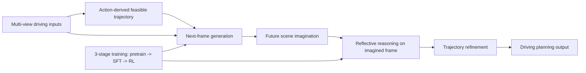

# 自动驾驶论文日报 - 2026-04-13

<!-- PAPER: arxiv-2604.09059 START -->
## Learning Vision-Language-Action World Models for Autonomous Driving

- arXiv链接: [arXiv:2604.09059](https://arxiv.org/abs/2604.09059)
- 研究问题: 端到端 VLA 自动驾驶模型常缺少显式时序世界建模，导致对未来场景的前瞻性与安全性不足。
- 核心方法: 提出 VLA-World，将“未来帧生成（predictive imagination）+ 基于想象结果的轨迹反思推理（reflective reasoning）”统一到同一框架；先用动作引导的可行轨迹生成下一帧，再在生成结果上进行推理并修正规划轨迹，并采用预训练、监督微调、强化学习三阶段训练。
- 亮点:
  - 把 world model 的“会想象”与 VLA 的“会决策”结合，形成闭环前瞻推理。
  - 构建 nuScenes-GR-20K 生成推理数据集，支撑“感知-生成-规划”协同训练。
  - 在规划与未来生成基准上同时超过现有 VLA 与 world-model 基线，兼顾性能与可解释性。
- 局限:
  - 主要验证在 nuScenes 及离线/仿真评测，真实开放道路泛化与长尾安全性仍需进一步验证。
  - 训练流程多阶段且含强化学习，工程复杂度与算力成本较高。

### 重点图（方法对应）

图注核验：Figure 1 shows VLA-World’s three-stage pipeline, first enabling future-frame generation, then coupling perception-generation-planning fine-tuning, and finally refining decisions with reinforcement learning over imagined futures for safer planning.

### Mermaid 架构图

<!-- PAPER: arxiv-2604.09059 END -->
