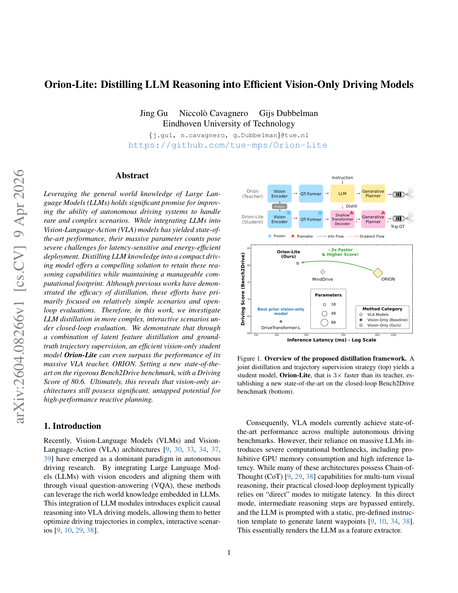
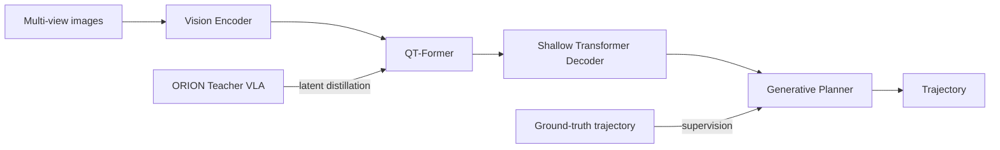
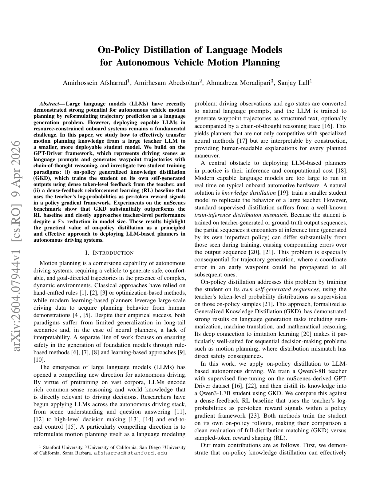
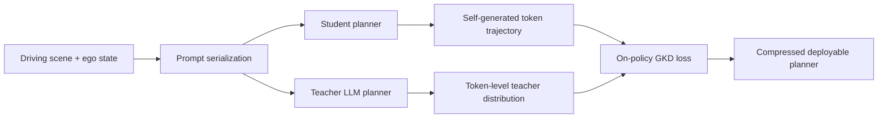

# 自动驾驶论文日报 - 2026-04-14

<!-- PAPER: arxiv-2604.08266 START -->
## Orion-Lite: Distilling LLM Reasoning into Efficient Vision-Only Driving Models

- arXiv链接: [arXiv:2604.08266](https://arxiv.org/abs/2604.08266)
- 研究问题: VLA 自动驾驶模型依赖大规模 LLM，闭环部署时推理延迟和算力开销过高，难以上车。
- 核心方法: 提出 Orion-Lite 学生模型，对 ORION 教师做“潜特征蒸馏 + 轨迹真值监督”的联合训练。学生侧保留视觉编码与查询变换器结构，用浅层解码器替代大语言模块，在闭环场景中学习教师的规划能力。
- 亮点:
  - 在 Bench2Drive 闭环基准上以更小模型取得 SOTA 驾驶分数（论文报告 80.6）。
  - 以视觉主干为核心实现高效部署，同时保留复杂交互场景下的规划性能。
  - 证明“LLM 推理能力可迁移到轻量视觉规划器”，给量产落地更可行路径。
- 局限:
  - 对教师模型与蒸馏数据质量有较强依赖，跨域泛化仍需更多实车验证。
  - 主要证据来自基准与仿真闭环评测，极端长尾交通情境覆盖有限。

### 重点图（方法对应）

图注核验：Figure 1 presents the joint distillation framework where a VLA teacher supervises Orion-Lite with feature distillation and trajectory supervision, yielding a much faster student while maintaining strong closed-loop driving performance.

### Mermaid 架构图

<!-- PAPER: arxiv-2604.08266 END -->

<!-- PAPER: arxiv-2604.07944 START -->
## On-Policy Distillation of Language Models for Autonomous Vehicle Motion Planning

- arXiv链接: [arXiv:2604.07944](https://arxiv.org/abs/2604.07944)
- 研究问题: LLM 规划器在自动驾驶运动规划上表现强，但车端部署受限于模型规模与时延，传统离线蒸馏还存在训练-推理分布偏移。
- 核心方法: 基于 GPT-Driver 表达，把场景转为文本并生成 waypoint；提出 on-policy GKD，让学生在“自生成序列”上接受教师 token 级密集反馈，并与 dense-feedback RL 基线对比，验证 on-policy 蒸馏更稳定有效。
- 亮点:
  - 明确针对序列生成误差累积问题，采用 on-policy 训练缓解 exposure bias。
  - 在 nuScenes 规划实验中，5× 模型压缩下仍接近教师性能，并显著优于 RL 式蒸馏基线。
  - 为 LLM 规划器上车提供了更工程化的轻量化训练范式。
- 局限:
  - 仍以离线数据集评估为主，真实闭环交通互动与安全冗余机制讨论较少。
  - 方法依赖语言化场景表示质量，感知噪声与多模态缺失时的鲁棒性待验证。

### 重点图（方法对应）

图注核验：The paper formulates motion planning as language generation and compares on-policy generalized knowledge distillation against dense-feedback reinforcement learning, showing student training on self-generated trajectories improves deployment-oriented planning quality.

### Mermaid 架构图

<!-- PAPER: arxiv-2604.07944 END -->

