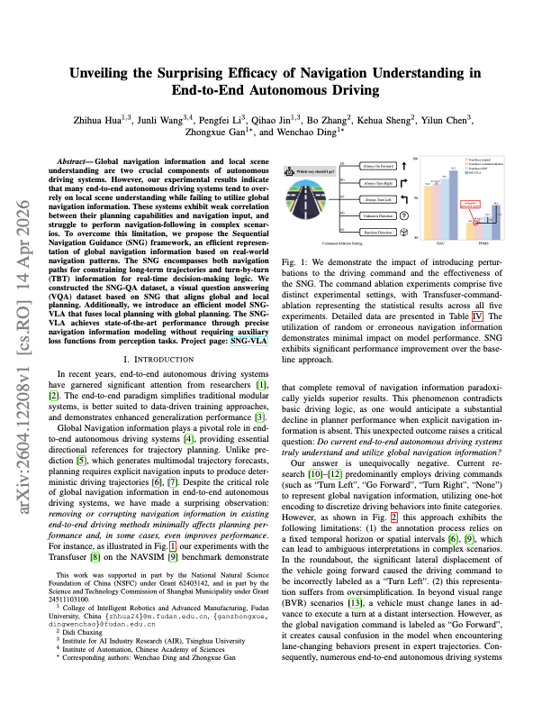
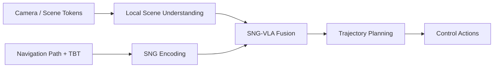
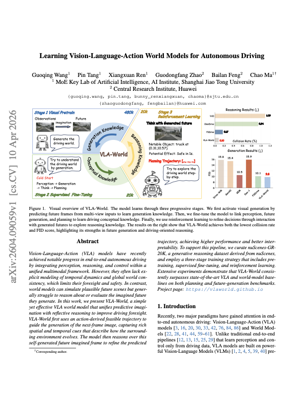
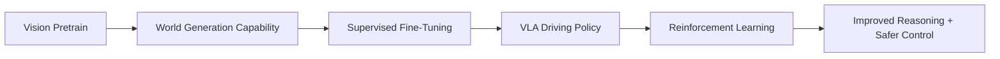
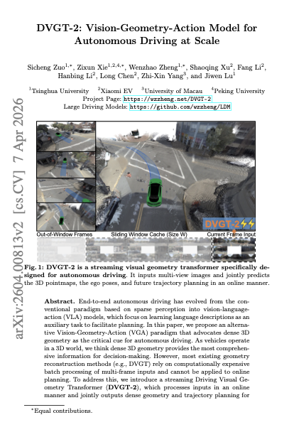
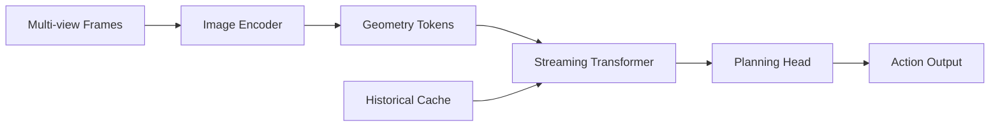

# 自动驾驶论文日报 - 2026-04-16

> 数据来源：arXiv（abs + PDF）
> 说明：同一 arXiv ID 当日仅保留一篇；无人机相关论文已过滤。

<!-- PAPER: arxiv-2604.12208 START -->
## Unveiling the Surprising Efficacy of Navigation Understanding in End-to-End Autonomous Driving

- arXiv： [arXiv:2604.12208](https://arxiv.org/abs/2604.12208)
- 研究问题：端到端自动驾驶模型在复杂路况中对全局导航信息利用不足，导致“看得见路况但跟不住导航”的规划偏差。
- 核心方法：提出 Sequential Navigation Guidance (SNG)，把导航路径与 turn-by-turn 指令统一编码，并通过 SNG-QA 对齐全局导航与局部视觉，再用 SNG-VLA 融合两类信息进行规划。
- 亮点：在不依赖额外感知辅助损失的前提下，强化导航-规划相关性；对导航扰动和复杂转向场景表现更稳健。
- 局限：方法依赖高质量导航先验与标注构建，跨城市地图样式、导航噪声分布变化时仍可能退化。

图注核验：The figure demonstrates command-selection perturbations for navigation-following, comparing deterministic and random action settings and showing their impact on driving performance under different planning backbones.

<!-- PAPER: arxiv-2604.12208 END -->

<!-- PAPER: arxiv-2604.09059 START -->
## Learning Vision-Language-Action World Models for Autonomous Driving

- arXiv： [arXiv:2604.09059](https://arxiv.org/abs/2604.09059)
- 研究问题：现有 VLA 驾驶模型缺乏显式时序世界建模，前瞻能力与长时一致性不足。
- 核心方法：提出 VLA-World，采用三阶段训练（视觉预训练、监督微调、强化学习），把视觉生成能力与驾驶决策统一到 world modeling 框架中。
- 亮点：把“可生成世界表征”与“可执行驾驶策略”联动，兼顾 reasoning、generation 与控制，提升复杂场景下的稳定驾驶表现。
- 局限：训练链路长、资源开销高；多阶段目标之间的权重与迁移策略对最终性能敏感。

图注核验：The visual overview presents a three-stage learning pipeline, activating visual generation first, then supervised driving alignment, and finally reinforcement learning to improve reasoning and collision-related outcomes.

<!-- PAPER: arxiv-2604.09059 END -->

<!-- PAPER: arxiv-2604.00813 START -->
## DVGT-2: Vision-Geometry-Action Model for Autonomous Driving at Scale

- arXiv： [arXiv:2604.00813](https://arxiv.org/abs/2604.00813)
- 研究问题：VLA 路线强调语言辅助，但对几何约束与在线推理效率兼顾不足，影响端到端驾驶的可扩展性。
- 核心方法：提出 Vision-Geometry-Action 范式与 DVGT-2 流式 Transformer，通过滑动窗口缓存与显式几何建模实现高效在线推理。
- 亮点：在保持端到端统一建模的同时强化几何一致性，并降低历史序列重复计算开销，更适合大规模部署。
- 局限：对多视角标定质量和几何重建质量敏感，极端遮挡/长尾天气场景仍有潜在性能瓶颈。

图注核验：The figure illustrates DVGT-2 streaming inference with out-of-window frames, a sliding-window cache, and current multi-view input, emphasizing efficient temporal reuse instead of full-sequence recomputation.

<!-- PAPER: arxiv-2604.00813 END -->

