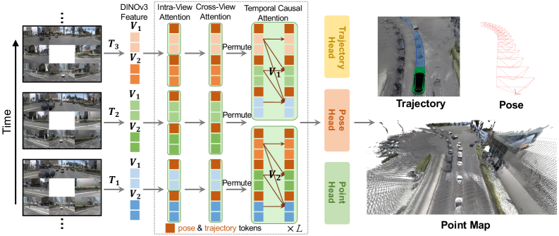
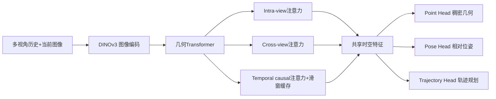
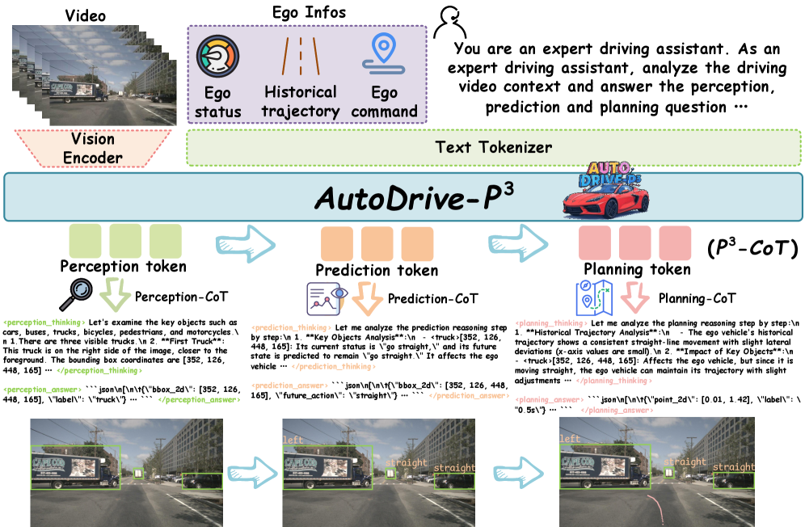
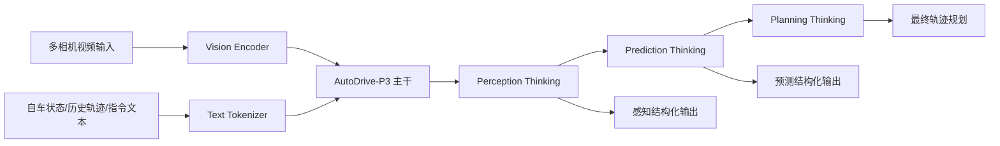

# 自动驾驶论文日报（2026-04-18）

> 数据源：arXiv（abs + 本地PDF）
> 去重键：arXiv ID（候选去重 + 写入前去重）
> 过滤：已排除无人机/UAV相关论文

<!-- PAPER: arxiv-2604.00813 START -->
## DVGT-2: Vision-Geometry-Action Model for Autonomous Driving at Scale

- 论文链接：[arXiv:2604.00813](https://arxiv.org/abs/2604.00813)
- 研究问题：现有几何驱动自动驾驶方法常依赖多帧批处理，在线推理时重复计算历史帧，延迟高，难以实时规划。
- 核心方法：提出流式 DVGT-2，在固定长度滑窗缓存上做 temporal causal attention，同时联合输出点云几何、位姿与轨迹规划，避免全历史重算。
- 亮点：
  1. 提出 Vision-Geometry-Action（VGA）范式，把稠密几何作为规划中介。
  2. 固定窗口流式推理，复杂度从随历史增长变为常数级窗口开销。
  3. 同一模型可跨多数据集与相机配置迁移到规划任务。
- 局限：高度依赖高质量多视角视觉输入与缓存机制设计，弱纹理/极端天气下几何重建质量仍可能影响规划鲁棒性。

**重点图（方法对应）**

图注核验：DVGT-2 combines image encoder, temporal-causal geometry transformer, and prediction heads to output dense pointmaps, ego poses, and trajectory planning online under a fixed-size sliding-window cache.

<!-- PAPER: arxiv-2604.00813 END -->

<!-- PAPER: arxiv-2603.28116 START -->
## AutoDrive-P3: Unified Chain of Perception-Prediction-Planning Thought via Reinforcement Fine-Tuning

- 论文链接：[arXiv:2603.28116](https://arxiv.org/abs/2603.28116)
- 研究问题：VLM端到端驾驶要么直接给规划缺少推理链，要么感知/预测/规划分离导致协同不足，最终规划性能受限。
- 核心方法：提出 AutoDrive-P3，将感知-预测-规划（P3）组织成统一 CoT 推理链；先用 P3-CoT 数据集做 SFT，再用分层强化学习 P3-GRPO 对三模块渐进监督。
- 亮点：
  1. 把三阶段任务以结构化推理串联，增强可解释性与模块协同。
  2. RL监督不只看最终规划，同时约束感知与预测质量。
  3. 在 open-loop（nuScenes）与 closed-loop（NAVSIM）均报告强性能。
- 局限：对高质量 CoT 标注与奖励设计依赖较强，训练成本高；推理链较长时部署延迟和稳定性需要额外工程优化。

**重点图（方法对应）**

图注核验：AutoDrive-P3 encodes visual and ego-state inputs, then performs structured Perception-Prediction-Planning chain-of-thought reasoning to produce interpretable intermediate outputs and final trajectory decisions.

<!-- PAPER: arxiv-2603.28116 END -->

