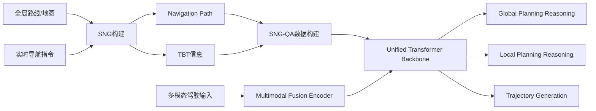
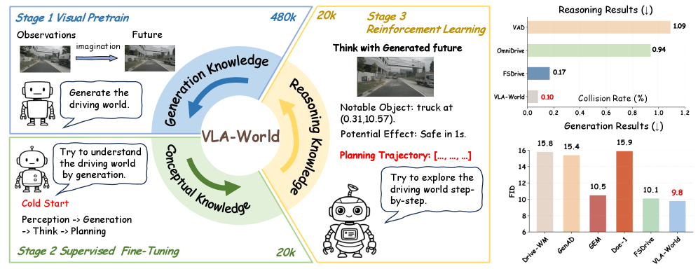
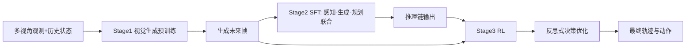
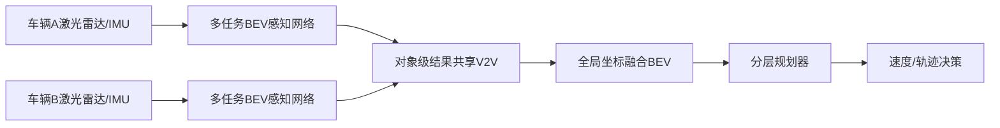

# 自动驾驶论文日报（2026-04-19）

> 数据源：arXiv（abs + 本地PDF）
> 去重键：arXiv ID（候选去重 + 写入前去重）
> 过滤：已排除无人机/UAV相关论文

<!-- PAPER: arxiv-2604.12208 START -->
## Unveiling the Surprising Efficacy of Navigation Understanding in End-to-End Autonomous Driving

- 论文链接：[arXiv:2604.12208](https://arxiv.org/abs/2604.12208)
- 研究问题：现有端到端自动驾驶模型常把全局导航当弱条件，移除或扰动导航后性能几乎不降，说明“会开车但不真懂导航”。
- 核心方法：提出 Sequential Navigation Guidance（SNG），把导航拆成“导航路径 + 实时TBT转向指令”；并构建 SNG-QA（10万级）将全局规划、局部规划、轨迹规划串联监督，配合 SNG-VLA 统一生成推理与轨迹。
- 亮点：
  1. 明确证明传统 command 形式导航表达不足，并给出结构化替代表示。
  2. SNG 同时提供长程轨迹约束与近程决策语义，减少复杂路口歧义。
  3. 在 NAVSIM 与 Bench2Drive 上报告 SOTA/强竞争性能，且不依赖额外感知辅助损失。
- 局限：方法依赖导航路径与TBT信息质量；SNG-QA构建成本较高，跨城市泛化仍受地图与导航服务差异影响。

**重点图（方法对应）**

图注核验：Overview of the pipeline: Sequential Navigation Guidance combines navigation path and TBT information; SNG-QA decomposes global planning, local planning, and trajectory planning; model uses multimodal fusion encoder plus unified transformer backbone.

<!-- PAPER: arxiv-2604.12208 END -->

<!-- PAPER: arxiv-2604.09059 START -->
## Learning Vision-Language-Action World Models for Autonomous Driving

- 论文链接：[arXiv:2604.09059](https://arxiv.org/abs/2604.09059)
- 研究问题：VLA模型擅长多模态推理但缺少显式时序世界建模，world model能“想象未来”却缺少驾驶决策反思，导致前瞻性和安全性不足。
- 核心方法：提出 VLA-World，把“未来帧生成”与“基于生成未来的反思推理”闭环结合；采用三阶段训练（视觉生成预训练、SFT、RL），并构建 nuScenes-GR-20K 生成式推理数据集。
- 亮点：
  1. 把感知-生成-思考-规划统一到单模型流程，提升可解释性。
  2. 用可行动轨迹引导未来帧生成，再反向优化规划，形成自我校正。
  3. 同时提升规划指标与生成质量（文中报告更低碰撞率与更优生成指标）。
- 局限：训练链路长、算力与数据需求高；生成未来误差可能级联影响后续推理稳定性。

**重点图（方法对应）**

图注核验：VLA-World learns in three stages, activating visual future generation, then linking perception-generation-planning via supervised fine-tuning, and finally refining decisions with reinforcement learning through interaction with generated futures.

<!-- PAPER: arxiv-2604.09059 END -->

<!-- PAPER: arxiv-2604.14454 START -->
## CooperDrive: Enhancing Driving Decisions Through Cooperative Perception

- 论文链接：[arXiv:2604.14454](https://arxiv.org/abs/2604.14454)
- 研究问题：单车感知在遮挡和NLOS路口容易“看不见、反应晚”，现有协同感知多数只做检测评测，缺少对真实闭环规划收益的验证。
- 核心方法：提出 CooperDrive，多车共享对象级结果并在统一世界坐标融合；前端以多任务BEV网络联合3D检测与语义定位，后端无缝接入传统分层规划器实现预测式决策。
- 亮点：
  1. 强调“不改原生规划栈”的可落地协同接口，工程迁移成本低。
  2. 通过共享对象集提前感知潜在冲突，规划从被动刹停转向主动减速/让行。
  3. 给出真实车辆闭环结果，文中报告低带宽（约90 kbps）与低时延（约89 ms）下的安全收益。
- 局限：效果依赖V2V通信稳定性与多车渗透率；在高丢包或稀疏协同参与者场景下收益可能下降。

**重点图（方法对应）**

图注核验：Reconstructed cooperative BEV where each vehicle contributes localization and detection outputs from the multi-task BEV perception network, producing shared situational awareness for safer path planning.

<!-- PAPER: arxiv-2604.14454 END -->

