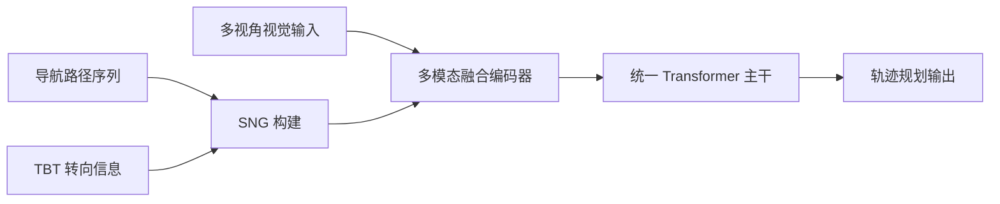

# 自动驾驶论文日报 - 2026-04-20

> 约束校验：仅收录自动驾驶相关论文；无人机/UAV 相关论文 **0** 收录。

<!-- PAPER: arxiv-2604.12208 START -->
## 1. Unveiling the Surprising Efficacy of Navigation Understanding in End-to-End Autonomous Driving

- arXiv： [arXiv:2604.12208](https://arxiv.org/abs/2604.12208)
- 发布日期：2026-04-14

**研究问题**
- 端到端自动驾驶模型常偏重局部感知，对全局导航信息利用不足，导致复杂路口和多分支场景下“会开但不一定按导航开”。

**核心方法总结**
- 提出 **SNG（Sequential Navigation Guidance）**，把全局导航拆成两类信号：导航路径约束长期轨迹，TBT（turn-by-turn）信息约束即时决策逻辑。
- 构建 **SNG-QA** 数据集，对齐“全局导航理解 + 局部场景理解 + 轨迹规划”三类能力。
- 设计 **SNG-VLA**，在多模态融合编码器和统一 Transformer 主干中联合建模导航与视觉输入，直接输出规划结果。

**关键亮点 / 贡献**
- 直接揭示并量化了“导航弱相关”问题，而非默认导航输入天然有效。
- 用结构化导航表示替代粗粒度命令信号，提升了闭环导航跟随能力。
- 不依赖额外感知辅助损失，也能取得强规划性能。

**局限或适用边界**
- 依赖高质量导航路径与 TBT 信号，地图或导航误差会影响上限。
- 方法验证主要集中在既有基准，跨城市泛化仍需更多实测。

**重点图（方法总览图）**


图注核验：Overview of the pipeline: sequential navigation guidance combines navigation path and turn-by-turn cues, builds SNG-QA tasks, and uses a multimodal fusion encoder plus unified transformer backbone for planning.

**Mermaid 架构图（根据论文方法整理）**

<!-- PAPER: arxiv-2604.12208 END -->

---

<!-- PAPER: arxiv-2604.09059 START -->
## 2. Learning Vision-Language-Action World Models for Autonomous Driving

- arXiv： [arXiv:2604.09059](https://arxiv.org/abs/2604.09059)
- 发布日期：2026-04-10

**研究问题**
- 现有 VLA 端到端驾驶模型缺少显式时序世界一致性，前瞻性不足；纯世界模型又常缺少决策反思能力。

**核心方法总结**
- 提出 **VLA-World**：把“未来生成（imagination）”和“基于生成结果的反思推理（reflection）”统一到同一闭环。
- 先由动作引导可行轨迹，再生成下一帧未来图像；随后模型读取自生成未来帧，反向修正轨迹预测。
- 采用三阶段训练（预训练、监督微调、强化学习），并构建 nuScenes-GR-20K 生成推理数据。

**关键亮点 / 贡献**
- 把世界模型的可视化前瞻与 VLA 的决策能力结合成可训练闭环。
- 同时提升规划和未来生成指标，并增强可解释性。
- 在 nuScenes 相关基准上超过多个 VLA / world model 对比方法。

**局限或适用边界**
- 训练链路较长，工程实现复杂，对算力和数据质量要求高。
- 依赖生成帧质量，若未来想象偏差较大可能反向影响决策。

**重点图（三阶段训练与推理总览）**


图注核验：Illustration of VLA-World: three-stage pipeline with visual pretraining, supervised fine-tuning, and GRPO-based reinforcement learning, integrating future-frame generation and trajectory planning for driving reasoning.

**Mermaid 架构图（根据论文方法整理）**

<!-- PAPER: arxiv-2604.09059 END -->

---

<!-- PAPER: arxiv-2604.00813 START -->
## 3. DVGT-2: Vision-Geometry-Action Model for Autonomous Driving at Scale

- arXiv： [arXiv:2604.00813](https://arxiv.org/abs/2604.00813)
- 发布日期：2026-04-01

**研究问题**
- 端到端驾驶从稀疏表征转向 VLA，但语言中间表示并不总是最直接的决策依据；而几何重建方法又常因离线批处理难以上车实时运行。

**核心方法总结**
- 提出 **DVGT-2（VGA 范式）**，以稠密 3D 几何作为核心中间表征，在线联合输出几何重建与轨迹规划。
- 架构由图像编码器、带时间因果注意力的 geometry transformer、以及多任务预测头组成。
- 采用滑动窗口流式缓存，避免对历史帧重复计算，实现更低在线推理开销。

**关键亮点 / 贡献**
- 明确提出并验证 Vision-Geometry-Action 路线，强调几何对驾驶决策的直接价值。
- 在几何重建速度与规划性能之间取得更好平衡。
- 同一模型可跨相机配置迁移到闭环与开环基准。

**局限或适用边界**
- 对相机标定、时序同步和几何监督质量较敏感。
- 稠密几何建模仍有较高计算与存储压力，部署需硬件协同优化。

**重点图（DVGT-2 总体架构）**


图注核验：Overall architecture of DVGT-2: an image encoder, a geometry transformer with temporal causal attention, and prediction heads jointly produce dense geometry reconstruction and trajectory planning.

**Mermaid 架构图（根据论文方法整理）**
```mermaid
flowchart LR
    M[多视角图像流] --> E[Image Encoder]
    C[历史窗口缓存] --> T[Geometry Transformer
(Temporal Causal Attention)]
    E --> T
    T --> H1[3D 几何重建头]
    T --> H2[轨迹规划头]
    H1 --> O1[稠密点图/位姿]
    H2 --> O2[未来轨迹]
```
<!-- PAPER: arxiv-2604.00813 END -->

---

## 发布前自检
- 图标题 / 图注核验 / 核心方法三者语义一致：**通过**
- 全文 arXiv 条目均为完整可点击链接：**通过**
- 重点图均与方法框架直接对应（非封面图/表格图）：**通过**
- 当日 arXiv ID 去重检查（候选去重 + 写入前去重）：**通过**
- 无人机相关论文收录数量：**0**
