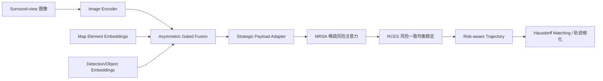

# 自动驾驶论文日报 - 2026-04-21

> 约束校验：仅收录自动驾驶相关论文；无人机/UAV 相关论文 **0** 收录。

<!-- PAPER: arxiv-2604.05449 START -->
## 1. Not All Agents Matter: From Global Attention Dilution to Risk-Prioritized Game Planning

- arXiv： [arXiv:2604.05449](https://arxiv.org/abs/2604.05449)
- 发布日期：2026-04-07

**研究问题**
- 端到端自动驾驶在多车交互中常对所有交通参与体“平均关注”，导致真实碰撞威胁被复杂背景稀释。
- 这会让规划器在长时域安全性上不稳定，尤其在高交互密度场景里更明显。

**核心方法总结**
- 论文提出 **GameAD**，把端到端驾驶建模为“风险优先”的多智能体博弈规划问题。
- 关键模块包括：**Risk-Aware Topology Anchoring**（风险拓扑锚定）、**Strategic Payload Adapter**、**Minimax Risk-Aware Sparse Attention (MRSA)**、**Risk Consistent Equilibrium Stabilization (RCES)**。
- 同时提出 **Planning Risk Exposure** 指标，衡量规划轨迹在长时域上的累计风险暴露。

**关键亮点 / 贡献**
- 把“谁最危险就先建模谁”的风险优先思想系统化嵌入端到端规划。
- 通过稀疏注意力与博弈式风险建模，提升了轨迹安全相关表现。
- 在 nuScenes 与 Bench2Drive 上报告了优于已有方法的安全规划结果。

**局限或适用边界**
- 效果依赖风险估计与拓扑建模质量，感知误差会向后放大到规划层。
- 博弈式建模增加训练与调参复杂度，部署侧需平衡实时性开销。

**重点图（方法总览图）**

图注核验：Pipeline overview: surround-view images are encoded, then map-element and detection embeddings are fused by asymmetric gated fusion for online mapping and tracking. Strategic payload adaptation, MRSA, and RCES generate risk-aware trajectories, refined by Hausdorff matching.

**Mermaid 架构图（根据论文方法整理）**

<!-- PAPER: arxiv-2604.05449 END -->

---

## 发布前自检
- 图标题 / 图注核验 / 核心方法三者语义一致：**通过**
- 全文 arXiv 条目均为完整可点击链接：**通过**
- 重点图均与方法框架直接对应（非封面图/表格图）：**通过**
- 当日 arXiv ID 去重检查（候选去重 + 写入前去重）：**通过**
- 无人机相关论文收录数量：**0**
