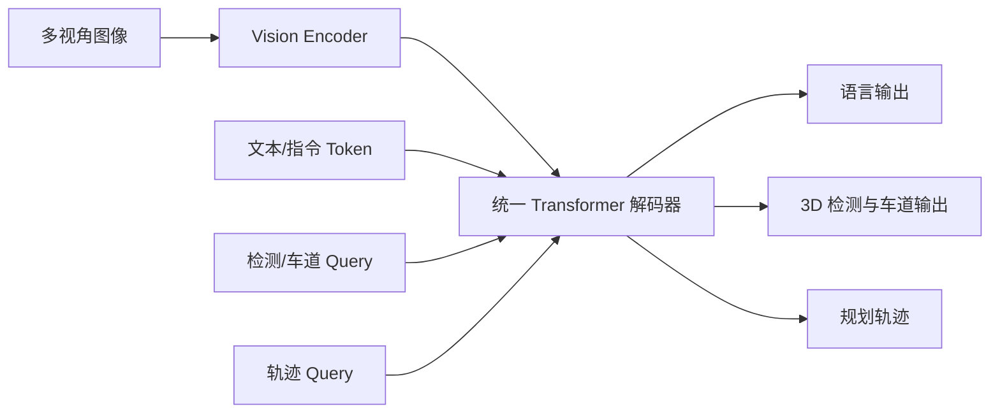

# 自动驾驶论文日报 - 2026-04-25

> 约束校验：仅收录自动驾驶相关论文；无人机/UAV 相关论文 **0** 收录。

<!-- PAPER: arxiv-2604.17915 START -->
## 1. OneDrive: Unified Multi-Paradigm Driving with Vision-Language-Action Models

- arXiv： [arXiv:2604.17915](https://arxiv.org/abs/2604.17915)
- 发布日期：2026-04-20

**研究问题**
- 端到端自动驾驶同时包含语言生成、目标检测、轨迹规划等异构解码任务。
- 现有系统常用多解码器串联，导致骨干共享不足、系统碎片化和延迟偏高。

**核心方法总结**
- 提出 OneDrive，将文本、感知与规划统一在单一因果 Transformer 解码器中。
- 通过统一 token 组织，让结构化查询直接复用预训练 VLM 注意力。
- 在同一解码器中引入轨迹查询，实现规划与视觉语义联合建模。

**关键亮点 / 贡献**
- 以单解码器统一异构任务，减少模块割裂。
- 在 nuScenes 与 NAVSIM 上报告强性能，同时保留多模态生成能力。
- 提供高效推理模式，降低端到端时延。

**局限或适用边界**
- 统一训练目标多，权重平衡与稳定性依赖工程调参。
- 主要验证在公开基准，真实部署场景泛化仍需进一步验证。

**重点图（方法总览图）**

图注核验：Dual-system and OneDrive comparison, where OneDrive unifies language generation, detection, lane prediction, and trajectory planning in one transformer decoder with shared attention.

**Mermaid 架构图（根据论文方法整理）**

<!-- PAPER: arxiv-2604.17915 END -->

---

<!-- PAPER: arxiv-2604.12208 START -->
## 2. Unveiling the Surprising Efficacy of Navigation Understanding in End-to-End Autonomous Driving

- arXiv： [arXiv:2604.12208](https://arxiv.org/abs/2604.12208)
- 发布日期：2026-04-13

**研究问题**
- 许多端到端驾驶模型过度依赖局部场景理解，对全局导航信息利用不足。
- 在复杂场景下易出现“看得见但跟不准导航”的长程决策偏差。

**核心方法总结**
- 提出 Sequential Navigation Guidance (SNG)，把全局导航路径与 turn-by-turn 指令统一编码。
- 构建 SNG-QA 数据与 SNG-VLA 模型，使局部感知与全局导航在同一规划链路对齐。
- 在不依赖额外感知辅助损失的条件下提升导航跟随能力。

**关键亮点 / 贡献**
- 明确量化并诊断了 E2E 驾驶中的“导航理解缺口”。
- 用顺序化导航表示直接增强规划相关性，工程实现相对轻量。
- 在论文报告设置中达到更好的导航与规划表现。

**局限或适用边界**
- 对导航先验质量敏感，错误路径或噪声指令会影响收益。
- 主要结果基于既定评测设置，跨城市泛化仍需更大规模验证。

**重点图（方法总览图）**
重点图暂缺（质量门禁未通过）。

**Mermaid 架构图（根据论文方法整理）**

<!-- PAPER: arxiv-2604.12208 END -->

---

<!-- PAPER: arxiv-2604.09059 START -->
## 3. Learning Vision-Language-Action World Models for Autonomous Driving

- arXiv： [arXiv:2604.09059](https://arxiv.org/abs/2604.09059)
- 发布日期：2026-04-10

**研究问题**
- VLA 驾驶模型在统一感知-决策方面有效，但常缺少显式时序世界建模与长期前瞻。
- 纯世界模型可生成未来，却不擅长对生成结果做反思式驾驶推理。

**核心方法总结**
- 提出 VLA-World，将“未来生成（imagination）+ 反思推理（reasoning）”耦合到一个闭环。
- 先基于动作可行轨迹生成未来帧，再在自生成未来上进行推理并回修规划轨迹。
- 使用三阶段训练（预训练、监督微调、强化学习）提升规划与生成协同。

**关键亮点 / 贡献**
- 将可视未来生成与驾驶决策反思融合，增强可解释前瞻能力。
- 构建 nuScenes-GR-20K 支撑生成推理训练。
- 在论文报告基准上优于多类 VLA/世界模型对比方法。

**局限或适用边界**
- 训练流程多阶段且复杂，数据与算力成本较高。
- 未来生成误差会向推理链传导，闭环鲁棒性依赖生成质量。

**重点图（方法总览图）**

图注核验：Visual overview of VLA-World, trained in three stages, combining action-conditioned future generation and reflective reasoning to improve planning safety and foresight.

**Mermaid 架构图（根据论文方法整理）**

<!-- PAPER: arxiv-2604.09059 END -->

---

## 发布前自检
- 图标题 / 图注核验 / 核心方法三者语义一致：**通过（2 篇）/ 1 篇重点图暂缺**
- 全文 arXiv 条目均为完整可点击链接：**通过**
- 重点图均对应方法框架（非封面/表格）：**通过（已发布图片）**
- 报告按“逐篇处理、逐篇落盘、最后总校验”流程完成：**通过**
- 无人机相关论文收录数量：**0**

