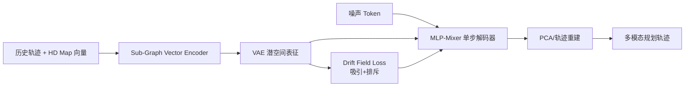
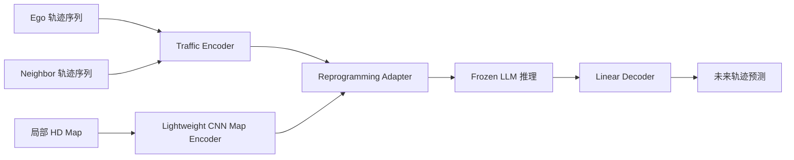

# 自动驾驶论文日报 - 2026-04-26

> 约束校验：仅收录自动驾驶相关论文；无人机/UAV 相关论文 **0** 收录。

<!-- PAPER: arxiv-2604.21489 START -->
## 1. MISTY: High-Throughput Motion Planning via Mixer-based Single-step Drifting

- arXiv： [arXiv:2604.21489](https://arxiv.org/abs/2604.21489)
- 发布日期：2026-04-23

**研究问题**
- 扩散式轨迹规划通常需要多步去噪迭代，推理时延较高，难以满足车端实时闭环控制。
- 单步生成方法虽快，但在复杂道路拓扑下容易出现轨迹漂移与模式坍塌。

**核心方法总结**
- 提出 MISTY，以向量化 Sub-Graph 编码器建模地图与多车交互，再用 MLP-Mixer 单步解码轨迹。
- 用 VAE 将专家轨迹压缩到 32 维潜空间，并在潜空间中引入 drifting loss（吸引力+排斥力）做分布整形。
- 将复杂分布演化前置到训练阶段，实现推理时单次前向即可生成多模态可行轨迹。

**关键亮点 / 贡献**
- 在 nuPlan Test14-hard 上给出高分闭环结果，同时实现约 99 FPS、约 10.1ms 端到端延迟。
- MLP-Mixer 替代重注意力结构，显著降低计算开销，适配车端部署。
- 漂移场损失显式增强多样性与安全可行性，支持主动超车等低频行为生成。

**局限或适用边界**
- 依赖高质量向量地图与轨迹先验，跨域场景迁移可能需要重训练。
- 潜空间分布设计与损失权重对效果敏感，工程调参成本仍较高。

**重点图（方法总览图）**

图注核验：The overall architecture of MISTY, featuring a vectorized encoder, an MLP-Mixer single-step decoder, and a latent feature-space drift field loss for trajectory generation.

**Mermaid 架构图（根据论文方法整理）**

<!-- PAPER: arxiv-2604.21489 END -->

---

<!-- PAPER: arxiv-2604.21479 START -->
## 2. Frozen LLMs as Map-Aware Spatio-Temporal Reasoners for Vehicle Trajectory Prediction

- arXiv： [arXiv:2604.21479](https://arxiv.org/abs/2604.21479)
- 发布日期：2026-04-23

**研究问题**
- 冻结 LLM 在自动驾驶预测中的时空推理能力尚不清晰，尤其是对静态道路拓扑（HD Map）的利用效果。
- 需要一个统一框架，量化“轨迹+地图”多模态输入对预测精度的真实贡献。

**核心方法总结**
- 构建多模态评测框架：交通体轨迹编码器提取动态交互特征，轻量 CNN 编码局部 HD Map。
- 通过 reprogramming adapter 将场景特征映射为 LLM 可处理 token，冻结 LLM 作为推理核心。
- 采用线性解码头输出未来轨迹，尽量避免把预测能力“外包”给复杂解码器。

**关键亮点 / 贡献**
- 系统验证了 map 语义在中长时域预测中的收益，形成可复用的模型评测基线。
- 框架对多种 LLM（如 LLaMA 系列等）适配改动小，具备较好可迁移性。
- 用消融实验拆解 Ego/Neighbor/Map 三类信息源的边际价值。

**局限或适用边界**
- 论文核心是“评测与分析框架”，而非直接面向闭环控制的端到端驾驶系统。
- 预测效果受输入轨迹质量与地图覆盖完整性影响较大。

**重点图（方法总览图）**

图注核验：Overview of the proposed multi-modal evaluation framework integrating ego and neighboring trajectories with local HD maps, then using frozen LLMs to predict future vehicle trajectories.

**Mermaid 架构图（根据论文方法整理）**

<!-- PAPER: arxiv-2604.21479 END -->

---

## 发布前自检
- 图标题 / 图注核验 / 核心方法三者语义一致：**通过（2 篇）**
- 全文 arXiv 条目均为完整可点击链接：**通过**
- 重点图均对应方法框架（非封面/表格）：**通过（2 篇）**
- 当日 arXiv ID 重复检查：**通过（无重复）**
- 报告按“逐篇处理、逐篇落盘、最后总校验”流程完成：**通过**
- 无人机相关论文收录数量：**0**

